Experiment
================

- [Description](#description)
- [Results](#results)
  - [Network Tests](#network-tests)
  - [Evolution of Hardware](#evolution-of-hardware)
    - [Frames per Second](#frames-per-second)
    - [Frame Time](#frame-time)
    - [CPU](#cpu)
    - [GPU](#gpu)
    - [Battery Usage](#battery-usage)
    - [Network Use](#network-use)
  - [Bandwidth Limits](#bandwidth-limits)
  - [Performance Variability](#performance-variability)
    - [Local Apps](#local-apps)

# Description

# Results

``` r
library(tidyverse)
theme_set(theme_bw())
library(knitr)
library(forcats)
library(data.table)
library(cowplot)
library(gghighlight)
library(zoo)
library(RColorBrewer)
library(stringr)
library(fBasics)
library(here)
here::i_am("./Results.rmd")

saveplot <- function(filename, ...) {
  ggsave2(filename, ...)
  knitr::plot_crop(filename)
}

traces_replays <- list.files(".", pattern="[0-9]+-trace-[a-z]+-mq[23p]-16m-replay-n[0-9]")

# 20240222-trace-beatsaber-mqp-bw_10
bandwidth_replays <- list.files(".", pattern="[0-9]+-trace-[a-z]+-mq[23p]-n[0-9]-bw_[0-9]")

to_human_name <- function(name) {
  if (str_split_i(name, "-", 4) == "mq3") {
    "MQ3"
  } else if (str_split_i(name, "-", 4) == "mqp") {
    "MQP"
  } else if (str_split_i(name, "-", 4) == "mq2") {
    "MQ2"
  } else {
    name
  }
}

g_moss <- "Moss"
g_explorevr <- "Nat. Geo. Explore VR"
g_gorillatag <- "Gorilla Tag"
g_vrchat <- "VRChat"

game_to_human_name <- function(name) {
  if (name == "moss") {
    g_moss
  } else if (name == "explorevr") {
    g_explorevr
  } else if (name == "gorillatag") {
    g_gorillatag
  } else if (name == "vrchat") {
    g_vrchat
  } else {
    name
  }
}

give_stats <- function(tb, colname, by = c("game", "config", "i")) {
  tb %>%
    mutate(v = {{colname}}) %>%
    summarise(mean = mean(v),
              stdev = sd(v),
              min = min(v),
              q25 = quantile(v, 0.25),
              median = median(v),
              q75 = quantile(v, 0.75),
              q90 = quantile(v, 0.90),
              q95 = quantile(v, 0.95),
              q99 = quantile(v, 0.99),
              max = max(v),
              iqr = q75 - q25,
              .by = by) %>%
    mutate(mean_maxd = max(mean) - min(mean)) %>%
    mutate(stdev_maxd = max(stdev) - min(stdev)) %>%
    mutate(min_maxd = max(min) - min(min)) %>%
    mutate(q25_maxd = max(q25) - min(q25)) %>%
    mutate(median_maxd = max(median) - min(median)) %>%
    mutate(q75_maxd = max(q75) - min(q75)) %>%
    mutate(max_maxd = max(max) - min(max))
}

data_host_sys_metrics <- NULL
for (f in traces_replays) {
  y <- read_csv(here(f, "host_sys_metrics.log"), col_types = cols(.default = "c"))
  stop_for_problems(y)
  x <- y %>%
    mutate(game = str_split_i(f, "-", 3)) %>%
    mutate(i = str_split_i(f, "-", -1) %>% str_split_i("n", 2)) %>%
    mutate(bwlimit = NA) %>%
    mutate(ts = as.numeric(timestamp)) %>%
    mutate(ts = ts - min(ts)) %>%
    mutate(ts_m = ts / 60) %>%
    mutate(config = f)
  data_host_sys_metrics <- x %>%
    bind_rows(data_host_sys_metrics, .)
}
for (f in bandwidth_replays) {
  data_host_sys_metrics <- read_csv(here(f, "host_sys_metrics.log"), col_types = cols(.default = "c")) %>%
    mutate(game = str_split_i(f, "-", 3)) %>%
    mutate(i = str_split_i(f, "-", -2) %>% str_split_i("n", 2)) %>%
    mutate(bwlimit = str_split_i(f, "_", 2)) %>%
    mutate(ts = as.numeric(timestamp)) %>%
    mutate(ts = ts - min(ts)) %>%
    mutate(ts_m = ts / 60) %>%
    mutate(config = f) %>%
    bind_rows(data_host_sys_metrics, .)
}
```

    ## Warning: There was 1 warning in `mutate()`.
    ## ℹ In argument: `ts = as.numeric(timestamp)`.
    ## Caused by warning:
    ## ! NAs introduced by coercion

``` r
data_host_sys_metrics <- data_host_sys_metrics %>%
  type.convert(as.is = TRUE)

data_host_gpu_metrics <- NULL
for (f in traces_replays) {
  data_host_gpu_metrics <- read_csv(here(f, "host_gpu_metrics.log"), col_types = cols(.default = "c")) %>%
    mutate(game = str_split_i(f, "-", 3)) %>%
    mutate(i = str_split_i(f, "-", -1) %>% str_split_i("n", 2)) %>%
    mutate(bwlimit = NA) %>%
    mutate(ts = as.numeric(timestamp)) %>%
    mutate(ts = ts - min(ts)) %>%
    mutate(ts_m = ts / 60) %>%
    mutate(config = f) %>%
    bind_rows(data_host_gpu_metrics, .)
}
for (f in bandwidth_replays) {
  data_host_gpu_metrics <- read_csv(here(f, "host_gpu_metrics.log"), col_types = cols(.default = "c")) %>%
    mutate(game = str_split_i(f, "-", 3)) %>%
    mutate(i = str_split_i(f, "-", -2) %>% str_split_i("n", 2)) %>%
    mutate(bwlimit = str_split_i(f, "_", 2)) %>%
    mutate(ts = as.numeric(timestamp)) %>%
    mutate(ts = ts - min(ts)) %>%
    mutate(ts_m = ts / 60) %>%
    mutate(config = f) %>%
    bind_rows(data_host_gpu_metrics, .)
}
```

    ## Warning: There was 1 warning in `mutate()`.
    ## ℹ In argument: `ts = as.numeric(timestamp)`.
    ## Caused by warning:
    ## ! NAs introduced by coercion

``` r
data_host_gpu_metrics <- data_host_gpu_metrics %>%
  type.convert(as.is = TRUE)

pattern <- c(month="-?\\d+", "-", day="-?\\d+", "\\s+", hour="-?\\d+", ":", minute="-?\\d+", ":", second="-?\\d+", "\\.", millisecond="-?\\d+", "\\s+", pid="-?\\d+", "\\s+", tid="-?\\d+", "\\s+", level="\\w", "\\s+VrApi\\s+:\\s+FPS=",fps_render="-?\\d+", "/", fps_refresh="-?\\d+", ",Prd=", prd="-?\\d+", "ms,Tear=", tear="-?\\d+", ",Early=", early="-?\\d+", ",Stale=", stale="-?\\d+", ",Stale2/5/10/max=", stale2="-?\\d+", "/", stale5="-?\\d+", "/", stale10="-?\\d+", "/", stalemax="-?\\d+", ",VSnc=", vsnc="-?\\d+", ",Lat=", lat="-?-?\\d+", ",Fov=", fov="-?\\d+\\w*", ",CPU", cpun="\\d", "/GPU=", cpu_level="-?\\d+", "/", gpu_level="-?\\d+", ",", cpu_freq="-?\\d+", "/", gpu_freq="-?\\d+", "MHz,OC=", oc=".+", ",TA=", ta_atw="-?\\d+\\w*", "/", ta_main="-?\\d+\\w*", "/", ta_render="-?\\d+\\w*", ",SP=", sp_atw="\\w", "/", sp_main="\\w", "/", sp_render="\\w", ",Mem=", mem="-?\\d+", "MHz,Free=", free="-?\\d+", "MB,PLS=", pls="-?\\d+", ",Temp=", temp_bat="-?\\d+\\.\\d+", "C/", temp_sens="-?\\d+\\.\\d+", "C,TW=", tw="-?\\d+\\.\\d+", "ms,App=", app="-?\\d+\\.\\d+", "ms,GD=", gd="-?\\d+\\.\\d+", "ms,CPU&GPU=", cpu_gpu="-?\\d+\\.\\d+", "ms,LCnt=", lcnt="-?\\d+", "\\(DR", dr="-?\\d+", ",LM", lm="-?\\d+", "\\),GPU%=", gpu_percent="-?\\d+\\.\\d+", ",CPU%=", cpu_percent="-?\\d+\\.\\d+", "\\(W", cpu_percent_worst="-?\\d+\\.\\d+", "\\),DSF=", dsf="-?\\d+\\.\\d+", ",CFL=", cfl_min="-?\\d+\\.\\d+", "/", cfl_max="-?\\d+\\.\\d+", ",ICFLp95=", icflp95="-?\\d+\\.\\d+", ",LD=", ld="-?\\d+", ",SF=", sf="-?\\d+\\.\\d+", ",LP=", lp="-?\\d+", ",DVFS=", dvfs="-?\\d+")

data_logcat_vrapi <- NULL
for (f in traces_replays) {
  data_logcat_vrapi <- readLines(here(f, "logcat_VrApi.log")) %>%
    tibble(line = .) %>%
    mutate(game = str_split_i(f, "-", 3)) %>%
    mutate(i = str_split_i(f, "-", -1) %>% str_split_i("n", 2)) %>%
    mutate(bwlimit = NA) %>%
    filter(grepl("^.+\\s+VrApi\\s+:\\s+FPS=", line)) %>%
    separate_wider_regex(line, pattern) %>%
    mutate(ts = as.numeric(second) + (60*as.numeric(minute)) + (60*60*as.numeric(hour))) %>%
    mutate(ts = ts - min(ts)) %>%
    mutate(ts_m = ts / 60) %>%
    mutate(cpu_util = 100 * as.numeric(cpu_percent)) %>%
    mutate(cpu_freq_ghz = as.numeric(cpu_freq) / 1000) %>%
    mutate(cpu_freq_rel = (as.numeric(cpu_freq) - min(as.numeric(cpu_freq))) / max(as.numeric(cpu_freq))) %>%
    rowwise() %>%
    mutate(cpu_freq_rel = max(0.01, cpu_freq_rel)) %>%
    ungroup() %>%
    mutate(cpu_usage_ltp = as.numeric(cpu_level) * as.numeric(cpu_percent)) %>%
    mutate(cpu_usage_ftp = as.numeric(cpu_freq) * as.numeric(cpu_percent)) %>%
    mutate(cpu_usage_ftp_rel = as.numeric(cpu_freq_rel) * as.numeric(cpu_percent)) %>%
    mutate(cpu_util_worst = 100 * as.numeric(cpu_percent_worst)) %>%
    mutate(gpu_util = 100 * as.numeric(gpu_percent)) %>%
    mutate(gpu_usage_ltp = as.numeric(gpu_level) * as.numeric(gpu_percent)) %>%
    mutate(gpu_usage_ftp = as.numeric(gpu_freq) * as.numeric(gpu_percent)) %>%
    mutate(config = f) %>%
    bind_rows(data_logcat_vrapi, .)
}
for (f in bandwidth_replays) {
  data_logcat_vrapi <- readLines(here(f, "logcat_VrApi.log")) %>%
    tibble(line = .) %>%
    mutate(game = str_split_i(f, "-", 3)) %>%
    mutate(i = str_split_i(f, "-", -2) %>% str_split_i("n", 2)) %>%
    mutate(bwlimit = str_split_i(f, "_", 2)) %>%
    filter(grepl("^.+\\s+VrApi\\s+:\\s+FPS=", line)) %>%
    separate_wider_regex(line, pattern) %>%
    mutate(ts = as.numeric(second) + (60*as.numeric(minute)) + (60*60*as.numeric(hour))) %>%
    mutate(ts = ts - min(ts)) %>%
    mutate(ts_m = ts / 60) %>%
    mutate(cpu_util = 100 * as.numeric(cpu_percent)) %>%
    mutate(cpu_freq_ghz = as.numeric(cpu_freq) / 1000) %>%
    mutate(cpu_freq_rel = (as.numeric(cpu_freq) - min(as.numeric(cpu_freq))) / max(as.numeric(cpu_freq))) %>%
    rowwise() %>%
    mutate(cpu_freq_rel = max(0.01, cpu_freq_rel)) %>%
    ungroup() %>%
    mutate(cpu_usage_ltp = as.numeric(cpu_level) * as.numeric(cpu_percent)) %>%
    mutate(cpu_usage_ftp = as.numeric(cpu_freq) * as.numeric(cpu_percent)) %>%
    mutate(cpu_usage_ftp_rel = as.numeric(cpu_freq_rel) * as.numeric(cpu_percent)) %>%
    mutate(cpu_util_worst = 100 * as.numeric(cpu_percent_worst)) %>%
    mutate(gpu_util = 100 * as.numeric(gpu_percent)) %>%
    mutate(gpu_usage_ltp = as.numeric(gpu_level) * as.numeric(gpu_percent)) %>%
    mutate(gpu_usage_ftp = as.numeric(gpu_freq) * as.numeric(gpu_percent)) %>%
    mutate(config = f) %>%
    bind_rows(data_logcat_vrapi, .)
}
data_logcat_vrapi <- data_logcat_vrapi %>%
  type.convert(as.is = TRUE) %>%
  mutate(config = map_chr(config, to_human_name)) %>%
  mutate(game_h = map_chr(game, game_to_human_name))

#Inter-|   Receive                                                |  Transmit
# face |bytes    packets errs drop fifo frame compressed multicast|bytes    packets errs drop fifo colls carrier compressed
#  wlan0: 334462961  517107    0    0    0     0          0         0 110016326  375001    0    0    0     0       0          0
pattern <- c("\\s+wlan0:\\s+", rx_bytes="\\d+", "\\s+", rx_packets="\\d+", "\\s+", rx_errs="\\d+", "\\s+", rx_drop="\\d+", "\\s+", rx_fifo="\\d+", "\\s+", rx_frame="\\d+", "\\s+", rx_compressed="\\d+", "\\s+", rx_multicast="\\d+", "\\s+", tx_bytes="\\d+", "\\s+", tx_packets="\\d+", "\\s+", tx_errs="\\d+", "\\s+", tx_drop="\\d+", "\\s+", tx_fifo="\\d+", "\\s+", tx_colls="\\d+", "\\s+", tx_carrier="\\d+", "\\s+", tx_compressed="\\d+")

data_net_dev <- NULL
for (f in traces_replays) {
  data_net_dev <- readLines(here(f, "net_dev.log")) %>%
    tibble(line = .) %>%
    mutate(game = str_split_i(f, "-", 3)) %>%
    mutate(i = str_split_i(f, "-", -1) %>% str_split_i("n", 2)) %>%
    mutate(bwlimit = NA) %>%
    filter(grepl("^\\s+wlan0:\\s+", line)) %>%
    separate_wider_regex(line, pattern) %>%
    mutate(ts = 0:(n() - 1)) %>%
    select(ts, everything()) %>%
    mutate(ts_m = ts / 60) %>%
    mutate(config = f) %>%
    bind_rows(data_net_dev, .)
}
for (f in bandwidth_replays) {
  data_net_dev <- readLines(here(f, "net_dev.log")) %>%
    tibble(line = .) %>%
    mutate(game = str_split_i(f, "-", 3)) %>%
    mutate(i = str_split_i(f, "-", -2) %>% str_split_i("n", 2)) %>%
    mutate(bwlimit = str_split_i(f, "_", 2)) %>%
    filter(grepl("^\\s+wlan0:\\s+", line)) %>%
    separate_wider_regex(line, pattern) %>%
    mutate(ts = 0:(n() - 1)) %>%
    select(ts, everything()) %>%
    mutate(ts_m = ts / 60) %>%
    mutate(config = f) %>%
    bind_rows(data_net_dev, .)
}
data_net_dev <- data_net_dev %>%
  type.convert(as.is = TRUE) %>%
  mutate(config = map_chr(config, to_human_name)) %>%
  mutate(game_h = map_chr(game, game_to_human_name)) %>%
  group_by(config, game, i) %>%
  mutate(bps_tx = 8 * (tx_bytes - lag(tx_bytes))) %>%
  mutate(kbps_tx = bps_tx / 1000) %>%
  mutate(Mbps_tx = bps_tx / 1000000) %>%
  mutate(Gbps_tx = bps_tx / 1000000000) %>%
  mutate(bps_rx = 8 * (rx_bytes - lag(rx_bytes))) %>%
  mutate(kbps_rx = bps_rx / 1000) %>%
  mutate(Mbps_rx = bps_rx / 1000000) %>%
  mutate(Gbps_rx = bps_rx / 1000000000) %>%
  drop_na() %>%
  ungroup()

# 01-18 18:54:21.709  6038  6148 I BatteryMgr:DataCollectionService: stats => 1705600461709,-1312532,3835
pattern <- c(month="\\d+", "-", day="\\d+", "\\s+", hour="\\d+", ":", minute="\\d+", ":", second="\\d+", "\\.", millisecond="\\d+", "\\s+", pid="\\d+", "\\s+", tid="\\d+", "\\s+I\\s+BatteryMgr:DataCollectionService:\\s+stats\\s+=>\\s+", ts_milli="\\d+", ",", current="-?\\d+", ",", voltage="\\d+")

data_batterymanager_companion <- NULL
for (f in traces_replays) {
  data_batterymanager_companion <- readLines(here(f, "batterymanager-companion.log")) %>%
    tibble(line = .) %>%
    mutate(game = str_split_i(f, "-", 3)) %>%
    mutate(i = str_split_i(f, "-", -1) %>% str_split_i("n", 2)) %>%
    mutate(bwlimit = NA) %>%
    filter(grepl("\\WBatteryMgr:DataCollectionService:\\s+stats\\s+=>", line)) %>%
    separate_wider_regex(line, pattern) %>%
    mutate(config = f) %>%
    bind_rows(data_batterymanager_companion, .)
}
for (f in bandwidth_replays) {
  fname <- here(f, "batterymanager-companion.log")
  if (!file.exists(fname)) {
    next
  }
  data_batterymanager_companion <- readLines(fname) %>%
    tibble(line = .) %>%
    mutate(game = str_split_i(f, "-", 3)) %>%
    mutate(i = str_split_i(f, "-", -2) %>% str_split_i("n", 2)) %>%
    mutate(bwlimit = str_split_i(f, "_", 2)) %>%
    filter(grepl("\\WBatteryMgr:DataCollectionService:\\s+stats\\s+=>", line)) %>%
    separate_wider_regex(line, pattern) %>%
    mutate(config = f) %>%
    bind_rows(data_batterymanager_companion, .)
}
data_batterymanager_companion <- data_batterymanager_companion %>%
  type.convert(as.is = TRUE) %>%
  mutate(config = map_chr(config, to_human_name)) %>%
  mutate(game_h = map_chr(game, game_to_human_name)) %>%
  group_by(config, game, i) %>%
  mutate(ts_milli = ts_milli - min(ts_milli)) %>%
  ungroup() %>%
  mutate(ts = ts_milli / 1000) %>%
  mutate(ts_m = ts / 60) %>%
  mutate(current_ma = current / 1000) %>%
  mutate(current_a = current / 1000000) %>%
  mutate(voltage_v = voltage / 1000) %>%
  mutate(power_w = current_a * voltage_v)

game_colors <- c(g_moss = "#ccbb44",
                 g_gorillatag="#66ccee",
                 g_explorevr="#ee6677",
                 g_vrchat = "#aa3377")

device_colors <- c("MQ2" = "#bbbbbb",
                 "MQ3"="#4477aa",
                 "MQP"="#228833")

c_alert <- "red"
c_warn <- "orange"
c_norm <- "black"
c_emph <- "#06bd55"
c_demph <- "gray"
```

## Network Tests

``` r
iperfMQP <- '[  5]   0.00-1.00   sec  92.2 MBytes   773 Mbits/sec    0    935 KBytes
[  5]   1.00-2.00   sec  96.2 MBytes   807 Mbits/sec    0    935 KBytes
[  5]   2.00-3.00   sec  96.2 MBytes   807 Mbits/sec    0    935 KBytes
[  5]   3.00-4.00   sec  93.8 MBytes   786 Mbits/sec    0    935 KBytes
[  5]   4.00-5.00   sec  95.0 MBytes   797 Mbits/sec    0    935 KBytes
[  5]   5.00-6.00   sec  96.2 MBytes   807 Mbits/sec    0    935 KBytes
[  5]   6.00-7.00   sec  96.2 MBytes   807 Mbits/sec    0    935 KBytes
[  5]   7.00-8.00   sec  95.0 MBytes   797 Mbits/sec    0    935 KBytes
[  5]   8.00-9.00   sec  96.2 MBytes   807 Mbits/sec    0    935 KBytes
[  5]   9.00-10.00  sec  97.5 MBytes   818 Mbits/sec    0    935 KBytes
[  5]  10.00-11.00  sec  93.8 MBytes   786 Mbits/sec    0    935 KBytes
[  5]  11.00-12.00  sec  95.0 MBytes   797 Mbits/sec    0    935 KBytes
[  5]  12.00-13.00  sec  88.8 MBytes   744 Mbits/sec    0    935 KBytes
[  5]  13.00-14.00  sec  88.8 MBytes   744 Mbits/sec    0    935 KBytes
[  5]  14.00-15.00  sec  92.5 MBytes   776 Mbits/sec    0    935 KBytes
[  5]  15.00-16.00  sec  92.5 MBytes   776 Mbits/sec    0    935 KBytes
[  5]  16.00-17.00  sec  91.2 MBytes   765 Mbits/sec    0    935 KBytes
[  5]  17.00-18.00  sec  96.2 MBytes   807 Mbits/sec    0    935 KBytes
[  5]  18.00-19.00  sec  93.8 MBytes   786 Mbits/sec    0    935 KBytes
[  5]  19.00-20.00  sec  93.8 MBytes   786 Mbits/sec    0    935 KBytes
[  5]  20.00-21.00  sec  95.0 MBytes   797 Mbits/sec    0    935 KBytes
[  5]  21.00-22.00  sec  95.0 MBytes   797 Mbits/sec    0    935 KBytes
[  5]  22.00-23.00  sec  95.0 MBytes   797 Mbits/sec    0    935 KBytes
[  5]  23.00-24.00  sec  96.2 MBytes   807 Mbits/sec    0    935 KBytes
[  5]  24.00-25.00  sec  92.5 MBytes   776 Mbits/sec    0    935 KBytes
[  5]  25.00-26.00  sec  93.8 MBytes   786 Mbits/sec    0    935 KBytes
[  5]  26.00-27.00  sec  92.5 MBytes   776 Mbits/sec    0    935 KBytes
[  5]  27.00-28.00  sec  91.2 MBytes   765 Mbits/sec    0    935 KBytes
[  5]  28.00-29.00  sec  91.2 MBytes   765 Mbits/sec    0    935 KBytes
[  5]  29.00-30.00  sec  92.5 MBytes   776 Mbits/sec    0    935 KBytes
[  5]  30.00-31.00  sec  91.2 MBytes   765 Mbits/sec    0    935 KBytes
[  5]  31.00-32.00  sec  96.2 MBytes   807 Mbits/sec    0    935 KBytes
[  5]  32.00-33.00  sec  96.2 MBytes   807 Mbits/sec    0    935 KBytes
[  5]  33.00-34.00  sec  93.8 MBytes   786 Mbits/sec    0    935 KBytes
[  5]  34.00-35.00  sec  97.5 MBytes   818 Mbits/sec    0    935 KBytes
[  5]  35.00-36.00  sec  97.5 MBytes   818 Mbits/sec    0    935 KBytes
[  5]  36.00-37.00  sec  93.8 MBytes   786 Mbits/sec    0    935 KBytes
[  5]  37.00-38.00  sec  97.5 MBytes   818 Mbits/sec    0    935 KBytes
[  5]  38.00-39.00  sec  92.5 MBytes   776 Mbits/sec    0    935 KBytes
[  5]  39.00-40.00  sec  97.5 MBytes   818 Mbits/sec    0    935 KBytes
[  5]  40.00-41.00  sec  93.8 MBytes   786 Mbits/sec    0    935 KBytes
[  5]  41.00-42.00  sec  93.8 MBytes   786 Mbits/sec    0    935 KBytes
[  5]  42.00-43.00  sec  95.0 MBytes   797 Mbits/sec    0    935 KBytes
[  5]  43.00-44.00  sec  92.5 MBytes   776 Mbits/sec    0    935 KBytes
[  5]  44.00-45.00  sec  96.2 MBytes   807 Mbits/sec    1    935 KBytes
[  5]  45.00-46.00  sec  95.0 MBytes   797 Mbits/sec    0    935 KBytes
[  5]  46.00-47.00  sec  95.0 MBytes   797 Mbits/sec    0    935 KBytes
[  5]  47.00-48.00  sec  97.5 MBytes   818 Mbits/sec    0    935 KBytes
[  5]  48.00-49.00  sec  95.0 MBytes   797 Mbits/sec    0    935 KBytes
[  5]  49.00-50.00  sec  96.2 MBytes   807 Mbits/sec    0    935 KBytes
[  5]  50.00-51.00  sec  96.2 MBytes   807 Mbits/sec    0    935 KBytes
[  5]  51.00-52.00  sec  97.5 MBytes   818 Mbits/sec    0    935 KBytes
[  5]  52.00-53.00  sec  93.8 MBytes   786 Mbits/sec    0    935 KBytes
[  5]  53.00-54.00  sec  95.0 MBytes   797 Mbits/sec    0    935 KBytes
[  5]  54.00-55.00  sec  95.0 MBytes   797 Mbits/sec    0    935 KBytes
[  5]  55.00-56.00  sec  96.2 MBytes   807 Mbits/sec    0    935 KBytes
[  5]  56.00-57.00  sec  95.0 MBytes   797 Mbits/sec    0    935 KBytes
[  5]  57.00-58.00  sec  93.8 MBytes   786 Mbits/sec    0    935 KBytes
[  5]  58.00-59.00  sec  85.0 MBytes   713 Mbits/sec    0    935 KBytes
[  5]  59.00-60.00  sec  90.0 MBytes   755 Mbits/sec    0    935 KBytes'

iperfMQP1K <- '[  5]   0.00-1.00   sec  73.9 MBytes   620 Mbits/sec    0    894 KBytes
[  5]   1.00-2.00   sec  76.8 MBytes   644 Mbits/sec    0    894 KBytes
[  5]   2.00-3.00   sec  84.1 MBytes   705 Mbits/sec    0    894 KBytes
[  5]   3.00-4.00   sec  81.2 MBytes   681 Mbits/sec    0    894 KBytes
[  5]   4.00-5.00   sec  84.2 MBytes   707 Mbits/sec    0    894 KBytes
[  5]   5.00-6.00   sec  82.8 MBytes   695 Mbits/sec    0    894 KBytes
[  5]   6.00-7.00   sec  82.9 MBytes   696 Mbits/sec    0    894 KBytes
[  5]   7.00-8.00   sec  84.4 MBytes   708 Mbits/sec    0    894 KBytes
[  5]   8.00-9.00   sec  86.0 MBytes   722 Mbits/sec    0    894 KBytes
[  5]   9.00-10.00  sec  80.3 MBytes   673 Mbits/sec    0    894 KBytes
[  5]  10.00-11.00  sec  79.5 MBytes   667 Mbits/sec    0    894 KBytes
[  5]  11.00-12.00  sec  81.4 MBytes   683 Mbits/sec    0    894 KBytes
[  5]  12.00-13.00  sec  80.9 MBytes   678 Mbits/sec    0    894 KBytes
[  5]  13.00-14.00  sec  82.1 MBytes   689 Mbits/sec    0    894 KBytes
[  5]  14.00-15.00  sec  78.5 MBytes   659 Mbits/sec    0    894 KBytes
[  5]  15.00-16.00  sec  81.5 MBytes   683 Mbits/sec    0    894 KBytes
[  5]  16.00-17.00  sec  78.2 MBytes   656 Mbits/sec    0    894 KBytes
[  5]  17.00-18.00  sec  84.1 MBytes   706 Mbits/sec    0    894 KBytes
[  5]  18.00-19.00  sec  83.6 MBytes   702 Mbits/sec    0    894 KBytes
[  5]  19.00-20.00  sec  85.2 MBytes   715 Mbits/sec    0    894 KBytes
[  5]  20.00-21.00  sec  88.5 MBytes   742 Mbits/sec    0    894 KBytes
[  5]  21.00-22.00  sec  86.0 MBytes   722 Mbits/sec    0    894 KBytes
[  5]  22.00-23.00  sec  84.1 MBytes   706 Mbits/sec    0    894 KBytes
[  5]  23.00-24.00  sec  86.0 MBytes   722 Mbits/sec    0    894 KBytes
[  5]  24.00-25.00  sec  83.4 MBytes   700 Mbits/sec    0    894 KBytes
[  5]  25.00-26.00  sec  86.2 MBytes   724 Mbits/sec    0    894 KBytes
[  5]  26.00-27.00  sec  85.1 MBytes   714 Mbits/sec    0    894 KBytes
[  5]  27.00-28.00  sec  86.4 MBytes   725 Mbits/sec    0    894 KBytes
[  5]  28.00-29.00  sec  82.7 MBytes   694 Mbits/sec    0    894 KBytes
[  5]  29.00-30.00  sec  86.3 MBytes   724 Mbits/sec    0    894 KBytes
[  5]  30.00-31.00  sec  83.8 MBytes   703 Mbits/sec    0    894 KBytes
[  5]  31.00-32.00  sec  83.7 MBytes   702 Mbits/sec    0    894 KBytes
[  5]  32.00-33.00  sec  84.1 MBytes   705 Mbits/sec    0    894 KBytes
[  5]  33.00-34.00  sec  85.0 MBytes   713 Mbits/sec    0    894 KBytes
[  5]  34.00-35.00  sec  84.2 MBytes   706 Mbits/sec    0    894 KBytes
[  5]  35.00-36.00  sec  86.6 MBytes   727 Mbits/sec    0    894 KBytes
[  5]  36.00-37.00  sec  84.4 MBytes   708 Mbits/sec    0    894 KBytes
[  5]  37.00-38.00  sec  87.0 MBytes   730 Mbits/sec    0    894 KBytes
[  5]  38.00-39.00  sec  84.1 MBytes   706 Mbits/sec    0    894 KBytes
[  5]  39.00-40.00  sec  84.6 MBytes   709 Mbits/sec    0    894 KBytes
[  5]  40.00-41.00  sec  83.7 MBytes   702 Mbits/sec    0    894 KBytes
[  5]  41.00-42.00  sec  87.2 MBytes   732 Mbits/sec    0    894 KBytes
[  5]  42.00-43.00  sec  78.9 MBytes   662 Mbits/sec    0    894 KBytes
[  5]  43.00-44.00  sec  80.5 MBytes   675 Mbits/sec    0    894 KBytes
[  5]  44.00-45.00  sec  75.8 MBytes   636 Mbits/sec    0    894 KBytes
[  5]  45.00-46.00  sec  77.2 MBytes   648 Mbits/sec    0    894 KBytes
[  5]  46.00-47.00  sec  81.9 MBytes   687 Mbits/sec    0    894 KBytes
[  5]  47.00-48.00  sec  85.3 MBytes   715 Mbits/sec    0    894 KBytes
[  5]  48.00-49.00  sec  85.2 MBytes   714 Mbits/sec    0    894 KBytes
[  5]  49.00-50.00  sec  80.2 MBytes   673 Mbits/sec    0    894 KBytes
[  5]  50.00-51.00  sec  82.4 MBytes   691 Mbits/sec    0    894 KBytes
[  5]  51.00-52.00  sec  83.8 MBytes   703 Mbits/sec    0    894 KBytes
[  5]  52.00-53.00  sec  84.3 MBytes   707 Mbits/sec    0    894 KBytes
[  5]  53.00-54.00  sec  86.1 MBytes   722 Mbits/sec    0    894 KBytes
[  5]  54.00-55.00  sec  84.2 MBytes   707 Mbits/sec    0    894 KBytes
[  5]  55.00-56.00  sec  86.6 MBytes   726 Mbits/sec    0    894 KBytes
[  5]  56.00-57.00  sec  89.2 MBytes   749 Mbits/sec    0    894 KBytes
[  5]  57.00-58.00  sec  85.9 MBytes   720 Mbits/sec    0    894 KBytes
[  5]  58.00-59.00  sec  85.6 MBytes   718 Mbits/sec    0    894 KBytes
[  5]  59.00-60.00  sec  79.2 MBytes   664 Mbits/sec    0    894 KBytes'

pattern <- c("\\[\\s*", id="\\d+", "\\]\\s+", start = "\\d+\\.\\d+", "-", stop = "\\d+\\.\\d+", "\\s+", unit = "\\w+", "\\s+", transfer = "\\d+\\.\\d+", "\\s+", transfer_unit="\\w+", "\\s+", bitrate="\\d+", "\\s+", bitrate_unit="\\w+/?\\w*", "\\s+", retry="\\d+", "\\s+", cwnd="\\d+", "\\s+", cwnd_unit="\\w+")

iperf_data <- NULL

iperf_data <- tibble(line = iperfMQP) %>%
  mutate(setup = "MQP") %>%
  bind_rows(iperf_data, .)
iperf_data <- tibble(line = iperfMQP1K) %>%
  mutate(setup = "MQP1K") %>%
  bind_rows(iperf_data, .)

iperf_data <- iperf_data %>%
  separate_longer_delim(line, delim = "\n") %>%
  separate_wider_regex(line, pattern) %>%
  type.convert(as.is = TRUE) %>%
  mutate(device = "MQP")

iperf_data
```

    ## # A tibble: 120 × 13
    ##       id start  stop unit  transfer transfer_unit bitrate bitrate_unit retry
    ##    <int> <dbl> <dbl> <chr>    <dbl> <chr>           <int> <chr>        <int>
    ##  1     5     0     1 sec       92.2 MBytes            773 Mbits/sec        0
    ##  2     5     1     2 sec       96.2 MBytes            807 Mbits/sec        0
    ##  3     5     2     3 sec       96.2 MBytes            807 Mbits/sec        0
    ##  4     5     3     4 sec       93.8 MBytes            786 Mbits/sec        0
    ##  5     5     4     5 sec       95   MBytes            797 Mbits/sec        0
    ##  6     5     5     6 sec       96.2 MBytes            807 Mbits/sec        0
    ##  7     5     6     7 sec       96.2 MBytes            807 Mbits/sec        0
    ##  8     5     7     8 sec       95   MBytes            797 Mbits/sec        0
    ##  9     5     8     9 sec       96.2 MBytes            807 Mbits/sec        0
    ## 10     5     9    10 sec       97.5 MBytes            818 Mbits/sec        0
    ## # ℹ 110 more rows
    ## # ℹ 4 more variables: cwnd <int>, cwnd_unit <chr>, setup <chr>, device <chr>

``` r
iperf_data %>%
  ggplot(aes(x = bitrate, y = setup)) +
  geom_boxplot() +
  xlim(0,NA) +
  theme_cowplot(15) +
  background_grid() +
  labs(x = "Bitrate [Mbps]", y = "Setup")
```

<!-- -->

## Evolution of Hardware

### Frames per Second

``` r
data_logcat_vrapi %>%
  ggplot(aes(x = ts_m, y = fps_render, group = game, color = game)) +
  geom_line() +
  ylim(0, NA) +
  theme_cowplot(15) +
  background_grid() +
  labs(x="Time [m]", y="Frame rate [fps]  ") +
  coord_cartesian(clip="off") +
  theme(plot.margin=margin(0,0,0,0, "cm")) +
  facet_grid(cols = vars(config))
```

<!-- -->

``` r
data_logcat_vrapi %>%
  filter(game == "explorevr") %>%
  ggplot(aes(x = ts_m, y = fps_render, color = config)) +
  geom_line() +
  ylim(0, NA) +
  theme_cowplot(15) +
  background_grid() +
  labs(x="Time [m]", y="Frames per second        ") +
  coord_cartesian(clip="off") +
  theme(plot.margin=margin(0,0,0,0, "cm"))
```

<!-- -->

``` r
data_logcat_vrapi %>%
  # filter(ts >= start_time & ts <= end_time) %>%
  ggplot(aes(x = fps_render, y = config)) +
  geom_boxplot() +
  xlim(0, NA) +
  labs(x = "Frames per second", y = "VR Device") +
  theme_half_open() +
  background_grid() +
  theme(legend.position = "bottom") +
  scale_color_viridis_d(begin = 0.3, direction = -1)
```

<!-- -->

### Frame Time

``` r
data_logcat_vrapi %>%
  filter(game != "noapp") %>%
  filter(game != "vrchat") %>%
  filter(game != "explorevr") %>%
  filter(game != "azsq") %>%
  filter(ts > 60) %>%
  filter(app > 0) %>%
  ggplot() +
  geom_vline(xintercept = 11.1, color = "orange", linetype = "dashed") +
  geom_vline(xintercept = 13.9, color = "red") +
  geom_boxplot(aes(x = app, y = config)) +
  xlim(0, NA) +
  labs(x = "Frame time [ms]", y = "Device") +
  theme_half_open() +
  background_grid() +
  theme(legend.position = c(.25,.45), legend.background = element_rect(fill=alpha("white", 0.75))) +
  facet_grid(cols = vars(game))
```

<!-- -->

``` r
data_logcat_vrapi %>%
  filter(game != "noapp") %>%
  filter(game != "vrchat") %>%
  filter(game != "explorevr") %>%
  filter(game != "azsq") %>%
  filter(ts > 60) %>%
  filter(app > 0) %>%
  ggplot() +
  geom_vline(xintercept = 11.1, color = "orange", linetype = "dashed") +
  geom_vline(xintercept = 13.9, color = "red") +
  stat_ecdf(aes(x = app, group = config, color = config), pad=FALSE) +
  xlim(0, NA) +
  labs(x = "Frame time [ms]", y = "Fraction", color = "Device") +
  theme_half_open() +
  background_grid() +
  theme(legend.position = c(.25,.45), legend.background = element_rect(fill=alpha("white", 0.75))) +
  facet_grid(cols = vars(game))
```

<!-- -->

``` r
d <- data_logcat_vrapi %>%
  filter(game != "noapp") %>%
  filter(game != "azsq") %>%
  filter(ts > 60) %>%
  filter(app > 0) %>%
  filter(i == 1)
  
d %>%
  ggplot() +
  geom_vline(xintercept = 11.1, color = "orange", linetype = "dashed") +
  geom_vline(xintercept = 13.9, color = "red") +
  stat_ecdf(aes(x = app, y = log10(1 - after_stat(y)), group = config, color = config), pad=FALSE) +
  scale_y_continuous(breaks = seq(-3, 0), 
                     labels = 10^(seq(-3, 0)),
                     limits = c(-3, 0)) +
  xlim(0, NA) +
  labs(x = "Frame time [ms]", y = "Fraction", color = "Device") +
  theme_half_open() +
  background_grid() +
  theme(legend.position = c(.65,.5), strip.background=element_rect(fill="white"), legend.background = element_rect(fill=alpha("white", 0.9))) +
  facet_grid(~factor(game_h, levels=c(g_gorillatag, g_moss, g_explorevr, g_vrchat)), scales = "free_x") +
  expand_limits(x = c(0,15)) +
  scale_color_manual(values=device_colors)
```

<!-- -->

``` r
d %>%
  give_stats(app)
```

    ## Warning: Using an external vector in selections was deprecated in tidyselect 1.1.0.
    ## ℹ Please use `all_of()` or `any_of()` instead.
    ##   # Was:
    ##   data %>% select(by)
    ## 
    ##   # Now:
    ##   data %>% select(all_of(by))
    ## 
    ## See <https://tidyselect.r-lib.org/reference/faq-external-vector.html>.
    ## This warning is displayed once every 8 hours.
    ## Call `lifecycle::last_lifecycle_warnings()` to see where this warning was
    ## generated.

    ## # A tibble: 13 × 21
    ##    game    config     i   mean  stdev   min   q25 median   q75   q90   q95   q99
    ##    <chr>   <chr>  <int>  <dbl>  <dbl> <dbl> <dbl>  <dbl> <dbl> <dbl> <dbl> <dbl>
    ##  1 gorill… MQP        1  4.42   0.763  2.31  4.03   4.37  4.92  5.42  5.69  6.06
    ##  2 moss    MQP        1  6.74   1.42   0.4   5.89   6.74  7.62  8.16  9.56 10.3 
    ##  3 explor… MQP        1  6.17   2.27   2.91  5.72   6.01  6.39  6.77  7.00  8.23
    ##  4 explor… MQ2        1  5.12   1.15   1.19  4.49   5.02  5.58  6.06  6.29  7.14
    ##  5 explor… MQ3        1  3.06   0.523  1.64  2.76   2.99  3.29  3.64  3.85  4.16
    ##  6 gorill… MQ2        1  3.32   0.763  2.4   2.73   2.98  3.85  4.41  4.85  5.53
    ##  7 gorill… MQ3        1  2.26   0.613  1.38  1.78   2.01  2.7   3.25  3.46  3.82
    ##  8 moss    MQ2        1  6.57   1.20   0.69  6.19   6.72  7     7.42  8.8   9.39
    ##  9 moss    MQ3        1  3.99   0.836  0.37  3.68   3.9   4.1   4.66  5.8   7.39
    ## 10 vrchat  MQ2        1 10.3    9.89   0.18  5.96   8.38 13.7  17.0  17.8  27.9 
    ## 11 vrchat  MQ3        1  5.60   5.44   0.02  2.4    4.04  8.46  9.75 12.0  20.6 
    ## 12 vrchat  MQP        1  8.71  18.3    0.25  5.08   6.56  9.06 11.4  13.5  25.0 
    ## 13 beatsa… MQP        1  0.842  0.333  0.01  0.72   0.83  0.9   1.13  1.51  2.10
    ## # ℹ 9 more variables: max <dbl>, iqr <dbl>, mean_maxd <dbl>, stdev_maxd <dbl>,
    ## #   min_maxd <dbl>, q25_maxd <dbl>, median_maxd <dbl>, q75_maxd <dbl>,
    ## #   max_maxd <dbl>

``` r
data_logcat_vrapi %>%
  filter(game == "explorevr") %>%
  filter(ts > 60) %>%
  filter(app > 0) %>%
  ggplot() +
  geom_vline(xintercept = 11.1, color = "orange", linetype = "dashed") +
  geom_vline(xintercept = 13.9, color = "red") +
  geom_boxplot(aes(x = app, y = config)) +
  xlim(0, NA) +
  labs(x = "Frame time [ms]", y = "Device") +
  theme_half_open() +
  background_grid() +
  theme(legend.position = c(.5,.5))
```

<!-- -->

``` r
data_logcat_vrapi %>%
  filter(game == "explorevr") %>%
  filter(ts > 60) %>%
  filter(app > 0) %>%
  ggplot() +
  geom_vline(xintercept = 11.1, color = "orange", linetype = "dashed") +
  geom_vline(xintercept = 13.9, color = "red") +
  stat_ecdf(aes(x = app, group = config, color = config), pad=FALSE) +
  xlim(0, NA) +
  labs(x = "Frame time [ms]", y = "Fraction", color = "Device") +
  theme_half_open() +
  background_grid() +
  theme(legend.position = c(.5,.5))
```

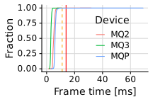<!-- -->

``` r
data_logcat_vrapi %>%
  filter(game == "explorevr") %>%
  filter(ts > 60) %>%
  filter(app > 0) %>%
  ggplot() +
  geom_vline(xintercept = 11.1, color = "orange", linetype = "dashed") +
  geom_vline(xintercept = 13.9, color = "red") +
  stat_ecdf(aes(x = app, y = log10(1 - after_stat(y)), group = config, color = config), pad=FALSE) +
  scale_y_continuous(breaks = seq(-3, 0), 
                     labels = 10^(seq(-3, 0)),
                     limits = c(-3, 0)) +
  xlim(0, NA) +
  labs(x = "Frame time [ms]", y = "Fraction", color = "Device") +
  theme_half_open() +
  background_grid() +
  theme(legend.position = c(.5,.5))
```

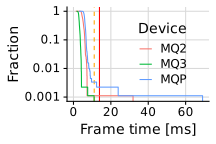<!-- -->

``` r
data_logcat_vrapi %>%
  filter(game == "vrchat") %>%
  filter(ts > 60) %>%
  filter(app > 0) %>%
  ggplot() +
  geom_vline(xintercept = 11.1, color = "orange", linetype = "dashed") +
  geom_vline(xintercept = 13.9, color = "red") +
  geom_boxplot(aes(x = app, y = config)) +
  xlim(0, NA) +
  labs(x = "Frame time [ms]", y = "Device") +
  theme_half_open() +
  background_grid() +
  theme(legend.position = c(.5,.6))
```

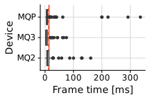<!-- -->

``` r
data_logcat_vrapi %>%
  filter(game == "vrchat") %>%
  filter(ts > 60) %>%
  filter(app > 0) %>%
  ggplot() +
  geom_vline(xintercept = 11.1, color = "orange", linetype = "dashed") +
  geom_vline(xintercept = 13.9, color = "red") +
  stat_ecdf(aes(x = app, group = config, color = config), pad=FALSE) +
  xlim(0, NA) +
  labs(x = "Frame time [ms]", y = "Fraction", color = "Device") +
  theme_half_open() +
  background_grid() +
  theme(legend.position = c(.5,.6))
```

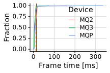<!-- -->

``` r
data_logcat_vrapi %>%
  filter(game == "vrchat") %>%
  filter(ts > 60) %>%
  filter(app > 0) %>%
  ggplot() +
  geom_vline(xintercept = 11.1, color = "orange", linetype = "dashed") +
  geom_vline(xintercept = 13.9, color = "red") +
  stat_ecdf(aes(x = app, y = log10(1 - after_stat(y)), group = config, color = config), pad=FALSE) +
  scale_y_continuous(breaks = seq(-3, 0), 
                     labels = 10^(seq(-3, 0)),
                     limits = c(-3, 0)) +
  xlim(0, NA) +
  labs(x = "Frame time [ms]", y = "Fraction", color = "Device") +
  theme_half_open() +
  background_grid() +
  theme(legend.position = c(.5,.6))
```

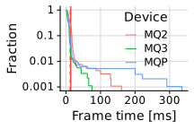<!-- -->

``` r
data_logcat_vrapi %>%
  filter(game == "moss") %>%
  filter(ts > 60) %>%
  filter(app > 0) %>%
  ggplot() +
  geom_vline(xintercept = 11.1, color = "orange", linetype = "dashed") +
  geom_vline(xintercept = 13.9, color = "red") +
  geom_boxplot(aes(x = app, y = config)) +
  xlim(0, NA) +
  labs(x = "Frame time [ms]", y = "Device") +
  theme_half_open() +
  background_grid() +
  theme(legend.position = c(.6,.35))
```

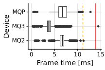<!-- -->

``` r
data_logcat_vrapi %>%
  filter(game == "moss") %>%
  filter(ts > 60) %>%
  filter(app > 0) %>%
  ggplot() +
  geom_vline(xintercept = 11.1, color = "orange", linetype = "dashed") +
  geom_vline(xintercept = 13.9, color = "red") +
  stat_ecdf(aes(x = app, group = config, color = config), pad=FALSE) +
  xlim(0, NA) +
  labs(x = "Frame time [ms]", y = "Fraction", color = "Device") +
  theme_half_open() +
  background_grid() +
  theme(legend.position = c(.6,.35))
```

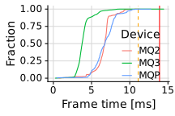<!-- -->

``` r
data_logcat_vrapi %>%
  filter(game == "moss") %>%
  filter(ts > 60) %>%
  filter(app > 0) %>%
  ggplot() +
  geom_vline(xintercept = 11.1, color = "orange", linetype = "dashed") +
  geom_vline(xintercept = 13.9, color = "red") +
  stat_ecdf(aes(x = app, y = log10(1 - after_stat(y)), group = config, color = config), pad=FALSE) +
  scale_y_continuous(breaks = seq(-3, 0), 
                     labels = 10^(seq(-3, 0)),
                     limits = c(-3, 0)) +
  xlim(0, NA) +
  labs(x = "Frame time [ms]", y = "Fraction", color = "Device") +
  theme_half_open() +
  background_grid() +
  theme(legend.position = c(.04,.35))
```

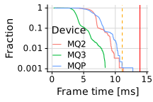<!-- -->

### CPU

``` r
p <- data_logcat_vrapi %>%
  filter(game != "noapp") %>%
  filter(game != "azsq") %>%
  filter(ts > 60) %>%
  ggplot(aes(x = cpu_util, y = config, fill = config)) +
  geom_boxplot() +
  xlim(0, 100) +
  labs(x = "CPU utilization [%]", y = "VR Device") +
  theme_half_open() +
  background_grid()
```

``` r
p
```

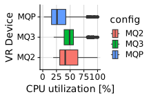<!-- -->

``` r
p +
  theme(legend.position="none", strip.background=element_rect(fill="white")) +
  facet_grid(~factor(game_h, levels=c(g_gorillatag, g_moss, g_explorevr, g_vrchat)), scales = "free_x") +
  scale_fill_manual(values=device_colors)
```

<!-- -->

``` r
p <- data_logcat_vrapi %>%
  ggplot(aes(x = ts, y = cpu_level, color = config)) +
  # geom_vline(xintercept = start_time, color = "black") +
  # geom_vline(xintercept = end_time, color = "black") +
  geom_line() +
  ylim(0, NA) +
  theme_half_open() +
  background_grid() +
  theme(legend.position = "bottom") +
  scale_color_viridis_d(begin = 0.3, direction = -1)
```

``` r
 data_logcat_vrapi %>%
  filter(game != "azsq") %>%
  filter(game != "noapp") %>%
  ggplot(aes(x = ts_m, y = cpu_level)) +
  geom_line() +
  ylim(0, NA) +
  theme_cowplot(15) +
  background_grid() +
  labs(y = "CPU level", x = "Time [m]") +
  theme(legend.position = "bottom") +
  scale_color_viridis_d(begin = 0.3, direction = -1) + 
  facet_grid(cols = vars(game), rows = vars(config)) +
  theme(strip.background=element_rect(fill="white"))
```

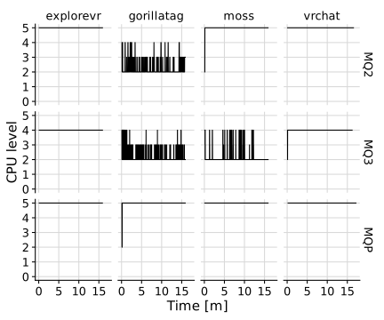<!-- -->

``` r
p <- data_logcat_vrapi %>%
  ggplot(aes(x = ts, y = cpu_freq, color = config)) +
  # geom_vline(xintercept = start_time, color = "black") +
  # geom_vline(xintercept = end_time, color = "black") +
  geom_line() +
  ylim(0, NA) +
  theme_half_open() +
  background_grid() +
  theme(legend.position = "bottom") +
  scale_color_viridis_d(begin = 0.3, direction = -1)
```

``` r
 data_logcat_vrapi %>%
  filter(game != "azsq") %>%
  filter(game != "noapp") %>%
  ggplot(aes(x = ts_m, y = cpu_freq_ghz)) +
  geom_line() +
  ylim(0, NA) +
  theme_cowplot(15) +
  background_grid() +
  labs(y = "CPU frequency [GHz]", x = "Time [m]") +
  theme(legend.position = "bottom") +
  scale_color_viridis_d(begin = 0.3, direction = -1) + 
  facet_grid(cols = vars(game), rows = vars(config)) +
  theme(strip.background=element_rect(fill="white"))
```

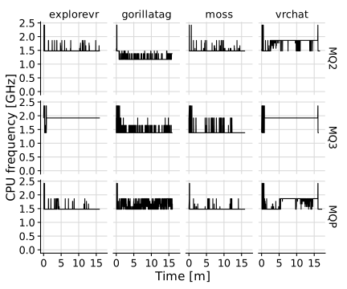<!-- -->

### GPU

``` r
d <- data_logcat_vrapi %>%
  filter(game != "noapp") %>%
  filter(game != "azsq") %>%
  filter(ts > 60) %>%
  filter(i == 1)

p <- d %>%
  ggplot(aes(x = gpu_util, y = config, fill = config)) +
  geom_boxplot() +
  xlim(0, 100) +
  labs(x = "GPU utilization [%]", y = "VR Device") +
  theme_cowplot(15) +
  background_grid()

d %>%
  give_stats(gpu_util)
```

    ## # A tibble: 13 × 21
    ##    game      config     i  mean stdev   min   q25 median   q75   q90   q95   q99
    ##    <chr>     <chr>  <int> <dbl> <dbl> <int> <dbl>  <dbl> <dbl> <dbl> <dbl> <dbl>
    ##  1 gorillat… MQP        1  71.1  9.04    31    69     72  75.2    80  82    83  
    ##  2 moss      MQP        1  61.9 14.5      8    50     57  77      79  81    83  
    ##  3 explorevr MQP        1  76.1  4.80    37    74     76  79      81  82    85.0
    ##  4 explorevr MQ2        1  58.8  5.75    19    55     58  62      66  68    73  
    ##  5 explorevr MQ3        1  35.6  3.53    11    34     35  37      40  41    44  
    ##  6 gorillat… MQ2        1  40.3  6.80    30    35     37  45      50  54    60  
    ##  7 gorillat… MQ3        1  36.8  4.96    29    33     35  40      45  46.0  50.0
    ##  8 moss      MQ2        1  62.7  8.48    19    60     64  66      69  79    82  
    ##  9 moss      MQ3        1  41.2  6.69    13    39     41  43      46  55    65  
    ## 10 vrchat    MQ2        1  59.8 19.8      7    47     58  69      92 100   100  
    ## 11 vrchat    MQ3        1  39.2 15.6      9    28     34  51      58  72.2  81  
    ## 12 vrchat    MQP        1  66.7 13.8     23    57     67  78      83  87    99  
    ## 13 beatsaber MQP        1  41.0  1.20    36    40     41  42      42  43    43  
    ## # ℹ 9 more variables: max <int>, iqr <dbl>, mean_maxd <dbl>, stdev_maxd <dbl>,
    ## #   min_maxd <int>, q25_maxd <dbl>, median_maxd <dbl>, q75_maxd <dbl>,
    ## #   max_maxd <int>

``` r
p
```

<!-- -->

``` r
p +
  theme(legend.position = "none", strip.background=element_rect(fill="white")) +
  facet_grid(~factor(game_h, levels=c(g_gorillatag, g_moss, g_explorevr, g_vrchat)), scales = "free_x") +
  scale_fill_manual(values=device_colors)
```

<!-- -->

``` r
data_logcat_vrapi %>%
  filter(game == "moss") %>%
  filter(ts > 60) %>%
  ggplot(aes(x = gpu_util, y = config)) +
  geom_boxplot() +
  xlim(0, 100) +
  labs(x = "GPU utilization [%]", y = "VR Device") +
  theme_half_open() +
  background_grid()
```

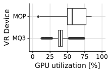<!-- -->

``` r
p <- data_logcat_vrapi %>%
  ggplot(aes(x = ts, y = gpu_level, color = config)) +
  # geom_vline(xintercept = start_time, color = "black") +
  # geom_vline(xintercept = end_time, color = "black") +
  geom_line() +
  ylim(0, NA) +
  theme_half_open() +
  background_grid() +
  theme(legend.position = "bottom") +
  scale_color_viridis_d(begin = 0.3, direction = -1)
```

``` r
data_logcat_vrapi %>%
  filter(game != "noapp") %>%
  filter(game != "azsq") %>%
  ggplot(aes(x = ts_m, y = gpu_level)) +
  geom_line() +
  ylim(0, NA) +
  theme_cowplot(15) +
  background_grid() +
  theme(legend.position = "bottom") +
  labs(x = "Time [m]", y = "GPU level") +
  scale_color_viridis_d(begin = 0.3, direction = -1) +
  facet_grid(cols = vars(game), rows = vars(config))
```

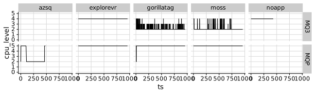<!-- -->

### Battery Usage

``` r
data_battery <- NULL
for (f in traces_replays) {
  data_battery <- system(paste('grep -Po "(?<=level: )[0-9]+"', here(f, "battery.log")), intern = TRUE) %>%
    tibble(battery = .) %>%
    mutate(game = str_split_i(f, "-", 3)) %>%
    mutate(battery = as.numeric(battery)) %>%
    mutate(ts = 0:(n() - 1)) %>%
    select(ts, everything()) %>%
    mutate(config = f) %>%
    bind_rows(data_battery, .)
}
data_battery <- data_battery %>%
  mutate(config = map_chr(config, to_human_name))
```

``` r
colors <- RColorBrewer::brewer.pal(3, "Greens")[2:3]

p <- data_battery %>%
  group_by(config) %>%
  mutate(ts = ts - min(ts)) %>%
  mutate(ts = ts / 60) %>%
  filter(config != "Wired") %>%
  # mutate(rel_battery = battery + 100 - max(battery)) %>%
  ggplot(aes(x = ts, y = battery, color = config)) +
  geom_line() +
  theme_half_open() +
  background_grid() +
  theme(legend.position = c(0.05, 0.40)) +
  ylim(0, NA) +
  labs(x = "Time [m]", y = "Battery charge") 
  # scale_color_manual(name = "Config", values = colors)
```

``` r
data_batterymanager_companion %>%
  filter(ts > 60) %>%
  filter(ts <= 960) %>%
  filter(game != "noapp") %>%
  filter(game != "azsq") %>%
  filter(i == 1) %>%
  ggplot() +
  geom_line(aes(x=ts_m, y=-current_a, color = config)) +
  facet_grid(cols = vars(game)) +
  theme_cowplot(15) +
  background_grid() +
  theme(legend.position=c(0.15,.5)) +
  xlim(0, NA) +
  ylim(0, NA) +
  labs(x = "Time [m]", y = "Current [A]")
```

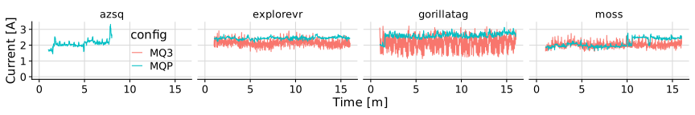<!-- -->

``` r
data_batterymanager_companion %>%
  filter(ts > 60) %>%
  filter(ts <= 960) %>%
  filter(game != "noapp") %>%
  filter(game != "azsq") %>%
  filter(i == 1) %>%
  ggplot() +
  geom_boxplot(aes(x=-current_a, y=config)) +
  facet_grid(cols = vars(game)) +
  theme_cowplot(15) +
  background_grid() +
  theme(legend.position=c(0.15,.5), strip.background=element_rect(fill="white")) +
  xlim(0, NA) +
  labs(y = "VR Device", x = "Current [A]")
```

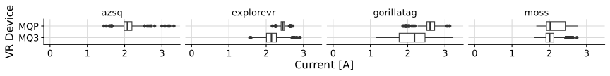<!-- -->

``` r
data_batterymanager_companion %>%
  filter(ts > 60) %>%
  filter(ts <= 960) %>%
  filter(game != "noapp") %>%
  filter(game != "azsq") %>%
  filter(i == 1) %>%
  ggplot() +
  geom_boxplot(aes(x=voltage_v, y=config)) +
  facet_grid(cols = vars(game)) +
  theme_cowplot(15) +
  background_grid() +
  theme(legend.position=c(0.15,.5), strip.background=element_rect(fill="white")) +
  xlim(0, NA) +
  labs(y = "VR Device", x = "Voltage [V]")
```

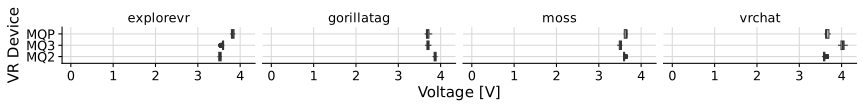<!-- -->

``` r
d <- data_batterymanager_companion %>%
  filter(ts > 60) %>%
  filter(ts <= 960) %>%
  filter(game != "noapp") %>%
  filter(game != "azsq") %>%
  filter(i == 1)

d %>%
  ggplot(aes(x=-power_w, y=config, fill = config)) +
  geom_boxplot() +
  stat_summary(fun=mean, geom="point", shape=21, size=2, color="black", fill="white") +
  theme(strip.background=element_rect(fill="white")) +
  facet_grid(~factor(game_h, levels=c(g_gorillatag, g_moss, g_explorevr, g_vrchat)), scales = "free_x") +
  theme_cowplot(15) +
  background_grid() +
  theme(legend.position="none", strip.background=element_rect(fill="white")) +
  xlim(0, 15) +
  labs(y = "VR Device", x = "Power [W]") +
  scale_fill_manual(values=device_colors)
```

<!-- -->

``` r
d %>%
  filter(config == "MQP") %>%
  give_stats(-power_w)
```

    ## # A tibble: 4 × 21
    ##   game       config     i  mean stdev   min   q25 median   q75   q90   q95   q99
    ##   <chr>      <chr>  <int> <dbl> <dbl> <dbl> <dbl>  <dbl> <dbl> <dbl> <dbl> <dbl>
    ## 1 gorillatag MQP        1  9.62 0.621  7.12  9.30   9.62 10.0  10.3  10.5  10.9 
    ## 2 moss       MQP        1  7.78 0.877  6.06  7.04   7.42  8.73  8.99  9.08  9.57
    ## 3 explorevr  MQP        1  9.35 0.281  8.34  9.18   9.35  9.52  9.70  9.83 10.1 
    ## 4 vrchat     MQP        1  8.80 1.00   6.31  8.15   8.82  9.66  9.89 10.1  10.5 
    ## # ℹ 9 more variables: max <dbl>, iqr <dbl>, mean_maxd <dbl>, stdev_maxd <dbl>,
    ## #   min_maxd <dbl>, q25_maxd <dbl>, median_maxd <dbl>, q75_maxd <dbl>,
    ## #   max_maxd <dbl>

### Network Use

``` r
data_net_dev %>%
  filter(ts <= 960) %>%
  filter(game != "noapp") %>%
  filter(game != "azsq") %>%
  filter(i == 1) %>%
  drop_na() %>%
  group_by(game, config) %>%
  slice(2:n()) %>%
  ungroup() %>%
  ggplot(aes(x = ts_m, y = kbps_rx)) +
  geom_line() +
  theme_cowplot(15) +
  background_grid() +
  xlim(0, NA) +
  coord_cartesian(ylim=c(0, 1200)) +
  labs(y = "Bytes received [Mbps]", x = "Time [m]") +
  facet_grid(cols = vars(game), rows = vars(config))
```

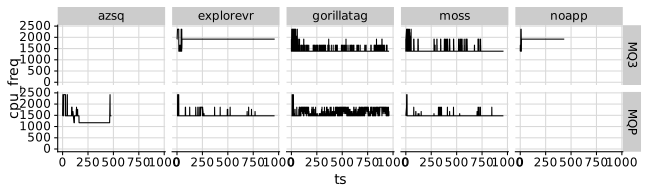<!-- -->

``` r
data_net_dev %>%
  group_by(game, config, i) %>%
  filter(game != "noapp") %>%
  filter(game != "azsq") %>%
  filter(i == 1) %>%
  drop_na() %>%
  ungroup() %>%
  ggplot(aes(x = kbps_rx, y = config)) +
  geom_boxplot() +
  theme_cowplot(15) +
  background_grid() +
  coord_cartesian(xlim=c(0, 1000)) +
  labs(x = "Bytes received [kbps]", y = "Setup") +
  facet_grid(cols = vars(game))
```

<!-- -->

## Bandwidth Limits

``` r
data_net_dev %>%
  # filter(ts > 5) %>%
  # filter(i == 2) %>%
  filter(bwlimit == 70) %>%
  filter(ts > 60) %>%
  filter(ts <= 120) %>%
  drop_na() %>%
  group_by(game, config) %>%
  slice(2:n()) %>%
  ungroup() %>%
  ggplot(aes(x = ts, y = Mbps_rx, color = game)) +
  geom_line() +
  theme_cowplot(15) +
  background_grid() +
  ylim(0, NA) +
  theme(legend.position = c(0.05,0.3), legend.background = element_rect(fill=alpha("white", 0.7))) +
  labs(y = "Bandwidth [Mbps]         ", x = "Time [s]") +
  scale_color_manual("application", values=c(beatsaber=c_emph, noapp=c_norm), labels=c(beatsaber="Oculus", noapp="iperf3")) +
  coord_cartesian(clip="off") +
  theme(plot.margin=margin(0,0.2,0,0, "cm"))
```

<!-- -->

``` r
data_net_dev %>%
  filter(ts > 5) %>%
  drop_na(bwlimit) %>%
  filter(game == "beatsaber") %>%
  filter(i == 2) %>%
  filter(bwlimit <= 100) %>%
  group_by(game, config) %>%
  slice(2:n()) %>%
  ungroup() %>%
  ggplot(aes(x = Mbps_rx, y = factor(bwlimit))) +
  geom_boxplot() +
  stat_summary(fun=mean, geom="point", shape=21, size=2, color="black", fill="white") +
  annotate("rect", fill="white", xmin = 0, xmax = 100, ymin = 0.5, ymax = 1.5) +
  annotate("text", color="red", label="CRASH", x = 50, y = 1) +
  scale_x_continuous(breaks = seq(0, 100, by = 20), limits=c(0,NA)) +
  theme_cowplot(15) +
  background_grid(major = "xy", minor="x") +
  # xlim(0, NA) +
  labs(x = "BW measured [Mbps]", y = "BW limit [Mbps]   ") +
  coord_cartesian(clip="off") +
  theme(plot.margin=margin(0,0.2,0,0, "cm"))
```

<!-- -->

``` r
data_logcat_vrapi %>%
  drop_na() %>%
  filter(ts > 5) %>%
  filter(app > 0) %>%
  ggplot(aes(x = app, y = factor(bwlimit))) +
  # geom_vline(xintercept = 11.1, color = "orange", linetype = "dashed") +
  # geom_vline(xintercept = 13.9, color = "red") +
  geom_boxplot() +
  stat_summary(fun=mean, geom="point", shape=21, size=2, color="black", fill="white") +
  xlim(0, NA) +
  labs(x = "Frame time [ms]", y = "BW limit [Mbps]  ") +
  theme_half_open() +
  background_grid() +
  theme(legend.position = c(.25,.45), legend.background = element_rect(fill=alpha("white", 0.75)))
```

<!-- -->

``` r
  # facet_grid(cols = vars(game))
```

``` r
data_logcat_vrapi %>%
  drop_na(bwlimit) %>%
  filter(game == "beatsaber") %>%
  filter(i == 2) %>%
  filter(bwlimit <= 100) %>%
  ggplot(aes(x = fps_render, y = factor(bwlimit))) +
  geom_vline(xintercept =72, color = "red") +
  geom_boxplot() +
  stat_summary(fun=mean, geom="point", shape=21, size=2, color="black", fill="white") +
  annotate("rect", fill="white", xmin = 0, xmax = 80, ymin = 0.5, ymax = 1.5) +
  annotate("text", color="red", label="CRASH", x = 38, y = 1) +
  xlim(0, NA) +
  theme_cowplot(15) +
  background_grid() +
  labs(x="Frames per second", y="Bandwidth [Mbps]       ") +
  coord_cartesian(clip="off") +
  theme(plot.margin=margin(0,0,0,0, "cm"))
```

<!-- -->

``` r
data_logcat_vrapi %>%
  drop_na(bwlimit) %>%
  ggplot(aes(x = cpu_util, y = factor(bwlimit))) +
  geom_boxplot() +
  xlim(0, 100) +
  labs(x = "CPU utilization [%]", y = "BW Limit [Mbps]  ") +
  theme_half_open() +
  background_grid()
```

<!-- -->

``` r
data_logcat_vrapi %>%
  drop_na(bwlimit) %>%
  filter(game == "beatsaber") %>%
  filter(i == 2) %>%
  filter(bwlimit <= 100) %>%
  ggplot(aes(x = gpu_util, y = factor(bwlimit))) +
  geom_boxplot() +
  stat_summary(fun=mean, geom="point", shape=21, size=2, color="black", fill="white") +
  annotate("rect", fill="white", xmin = 0, xmax = 100, ymin = 0.5, ymax = 1.5) +
  annotate("text", color="red", label="CRASH", x = 48, y = 1) +
  xlim(0, 100) +
  labs(x = "GPU utilization [%]", y = "Bandwidth [Mbps]       ") +
  theme_cowplot(15) +
  background_grid() +
  coord_cartesian(clip="off") +
  theme(plot.margin=margin(0,0.1,0,0, "cm"))
```

<!-- -->

``` r
data_logcat_vrapi %>%
  drop_na(bwlimit) %>%
  ggplot(aes(x = ts_m, y = cpu_level)) +
  geom_line() +
  labs(x = "Time [m]", y = "CPU level") +
  ylim(0, NA) +
  theme_half_open() +
  background_grid() +
  facet_grid(cols = vars(bwlimit))
```

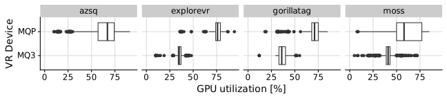<!-- -->

``` r
data_logcat_vrapi %>%
  drop_na(bwlimit) %>%
  ggplot(aes(x = cpu_level, y = factor(bwlimit))) +
  geom_boxplot() +
  labs(x = "Time [m]", y = "CPU level") +
  xlim(0, NA) +
  theme_half_open() +
  background_grid()
```

<!-- -->

``` r
data_logcat_vrapi %>%
  drop_na(bwlimit) %>%
  ggplot(aes(x = ts_m, y = gpu_level)) +
  geom_line() +
  labs(x = "Time [m]", y = "GPU level") +
  ylim(0, NA) +
  theme_half_open() +
  background_grid() +
  facet_grid(cols = vars(bwlimit))
```

<!-- -->

``` r
data_host_sys_metrics %>%
  drop_na() %>%
  ggplot(aes(x = as.numeric(cpu.percent), y = factor(bwlimit))) +
  geom_boxplot() +
  xlim(0, 100) +
  labs(x = "CPU utilization [%]", y = "BW Limit [Mbps]    ") +
  theme_cowplot(15) +
  background_grid()
```

<!-- -->

``` r
data_host_gpu_metrics %>%
  drop_na(bwlimit) %>%
  ggplot(aes(x = as.numeric(load) * 100, y = factor(bwlimit))) +
  geom_boxplot() +
  xlim(0, 100) +
  labs(x = "GPU utilization [%]", y = "BW Limit [Mbps]    ") +
  theme_cowplot(15) +
  background_grid()
```

    ## Warning in FUN(X[[i]], ...): NAs introduced by coercion

    ## Warning: Removed 1 rows containing non-finite values (`stat_boxplot()`).

<!-- -->

``` r
d <- data_batterymanager_companion %>%
  drop_na(bwlimit) %>%
  filter(game == "beatsaber") %>%
  filter(i == 2) %>%
  filter(bwlimit <= 100)

d %>%
  ggplot(aes(x=-power_w, y=factor(bwlimit))) +
  geom_boxplot() +
  stat_summary(fun=mean, geom="point", shape=21, size=2, color="black", fill="white") +
  annotate("rect", fill="white", xmin = 0, xmax = 10, ymin = 0.5, ymax = 1.5) +
  annotate("text", color="red", label="CRASH", x = 5, y = 1) +
  theme(strip.background=element_rect(fill="white")) +
  theme_cowplot(15) +
  background_grid() +
  theme(legend.position="none", strip.background=element_rect(fill="white")) +
  xlim(0, NA) +
  labs(y = "Bandwidth [Mbps]       ", x = "Power [W]") +
  scale_fill_manual(values=device_colors) +
  coord_cartesian(clip="off") +
  theme(plot.margin=margin(0,0.1,0,0, "cm"))
```

<!-- -->

``` r
d %>%
  give_stats(-power_w, by = c("bwlimit"))
```

    ## # A tibble: 10 × 19
    ##    bwlimit  mean stdev   min   q25 median   q75   q90   q95   q99   max   iqr
    ##      <int> <dbl> <dbl> <dbl> <dbl>  <dbl> <dbl> <dbl> <dbl> <dbl> <dbl> <dbl>
    ##  1      10  8.45 0.253  7.01  8.39   8.47  8.58  8.63  8.71  8.85  8.88 0.192
    ##  2     100  9.27 0.369  7.39  9.26   9.34  9.41  9.49  9.53  9.65 10.4  0.158
    ##  3      20  8.98 0.424  7.04  8.87   9.01  9.19  9.39  9.52  9.72 10.0  0.320
    ##  4      30  9.02 0.394  6.98  8.97   9.07  9.18  9.31  9.39  9.63 10.2  0.210
    ##  5      40  8.97 0.353  7.16  8.93   9.03  9.11  9.17  9.22  9.48  9.67 0.180
    ##  6      50  9.12 0.338  7.25  9.10   9.17  9.25  9.35  9.41  9.50  9.53 0.154
    ##  7      60  9.18 0.358  7.32  9.16   9.26  9.33  9.41  9.48  9.68  9.69 0.176
    ##  8      70  9.12 0.392  6.87  9.09   9.19  9.29  9.37  9.40  9.74  9.81 0.204
    ##  9      80  9.21 0.385  7.21  9.14   9.28  9.38  9.46  9.50  9.63 10.0  0.238
    ## 10      90  9.20 0.332  7.56  9.19   9.25  9.33  9.41  9.47  9.63  9.73 0.140
    ## # ℹ 7 more variables: mean_maxd <dbl>, stdev_maxd <dbl>, min_maxd <dbl>,
    ## #   q25_maxd <dbl>, median_maxd <dbl>, q75_maxd <dbl>, max_maxd <dbl>

## Performance Variability

### Local Apps

#### Gorilla Tag

##### Frames

The plot below clearly shows the initialization phase of the experiment
run. Every shade of blue is one run. In each run, the number of frames
per second drops to zero for a brief moment, before maintaining constant
good performance These first few seconds are typically spent in a
loading screen, and do not reflect the performance of the system as
experienced by the user. Therefore, it makes sense to cut out the first
few seconds of the experiments in most plots.

``` r
data_logcat_vrapi %>%
  filter(game == "gorillatag") %>%
  filter(config == "MQ3") %>%
  filter(ts < 60) %>%
  ggplot(aes(x = ts, y = fps_render, group = i, color = i)) +
  geom_line() +
  ylim(0, NA) +
  theme_half_open() +
  background_grid() +
  theme(legend.position = "none") +
  labs(x = "Time [s]", y = "Frame time [ms]  ")
```

<!-- -->

``` r
data_logcat_vrapi %>%
  filter(game == "gorillatag") %>%
  filter(config == "MQ3") %>%
  filter(i <= 8) %>%
  filter(ts > 60) %>%
  ggplot(aes(x = fps_render, group = i, y = i)) +
  geom_boxplot() +
  xlim(0, NA) +
  labs(x = "Frames per second", y = "Iteration") +
  theme_cowplot(15) +
  background_grid() +
  coord_cartesian(clip="off") +
  theme(plot.margin=margin(0,0,0,0, "cm"))
```

<!-- -->

``` r
data_logcat_vrapi %>%
  filter(game == "gorillatag") %>%
  filter(config == "MQ3") %>%
  filter(i <= 8) %>%
  filter(ts > 60) %>%
  ggplot(aes(x = app, group = i, y = i)) +
  geom_boxplot() +
  geom_vline(xintercept = 11.1, color = "orange", linetype = "dashed") +
  geom_vline(xintercept = 13.9, color = "red") +
  xlim(0, NA) +
  theme_cowplot(15) +
  background_grid() +
  labs(x="Frame time [ms]", y="Iteration") +
  coord_cartesian(clip="off") +
  theme(plot.margin=margin(0,0,0,0, "cm"))
```

<!-- -->

##### GPU

``` r
d <- data_logcat_vrapi %>%
  filter(game == "gorillatag") %>%
  filter(config == "MQ3") %>%
  filter(i <= 8) %>%
  filter(ts > 60)

d %>%
  give_stats(gpu_util)
```

    ## # A tibble: 8 × 21
    ##   game       config     i  mean stdev   min   q25 median   q75   q90   q95   q99
    ##   <chr>      <chr>  <int> <dbl> <dbl> <int> <dbl>  <dbl> <dbl> <dbl> <dbl> <dbl>
    ## 1 gorillatag MQ3        1  36.8  4.96    29    33     35    40    45  46.0  50.0
    ## 2 gorillatag MQ3        2  36.5  5.09    28    32     35    40    45  46    49  
    ## 3 gorillatag MQ3        3  36.1  5.17    28    32     34    41    44  45    48  
    ## 4 gorillatag MQ3        4  36.0  4.62    28    32     35    39    43  45    47.0
    ## 5 gorillatag MQ3        5  36.7  4.56    28    33     36    40    43  45    48  
    ## 6 gorillatag MQ3        6  35.4  4.83    27    31     34    39    42  44    48  
    ## 7 gorillatag MQ3        7  36.6  5.04    29    32     35    41    44  46    48  
    ## 8 gorillatag MQ3        8  36.7  4.69    28    33     36    40    43  45    49  
    ## # ℹ 9 more variables: max <int>, iqr <dbl>, mean_maxd <dbl>, stdev_maxd <dbl>,
    ## #   min_maxd <int>, q25_maxd <dbl>, median_maxd <dbl>, q75_maxd <dbl>,
    ## #   max_maxd <int>

``` r
d %>%  
  ggplot(aes(x = gpu_util, group = i, y = i)) +
  geom_boxplot() +
  xlim(0, 100) +
  labs(x = "GPU utilization [%]", y = "Iteration") +
  theme_cowplot(15) +
  background_grid() +
  coord_cartesian(clip="off") +
  theme(plot.margin=margin(0,0.2,0,0, "cm"))
```

<!-- -->

##### CPU

``` r
d <- data_logcat_vrapi %>%
  filter(game == "gorillatag") %>%
  filter(config == "MQ3") %>%
  filter(i <= 8) %>%
  filter(ts > 60)

d %>%
  give_stats(cpu_util)
```

    ## # A tibble: 8 × 21
    ##   game       config     i  mean stdev   min   q25 median   q75   q90   q95   q99
    ##   <chr>      <chr>  <int> <dbl> <dbl> <int> <dbl>  <dbl> <dbl> <dbl> <dbl> <dbl>
    ## 1 gorillatag MQ3        1  51.2  5.41    37    47     51    55    58    60  64.0
    ## 2 gorillatag MQ3        2  56.0  5.23    39    53     56    59    63    65  69  
    ## 3 gorillatag MQ3        3  48.9  5.27    36    45     49    52    56    57  62  
    ## 4 gorillatag MQ3        4  51.5  5.10    37    48     52    55    58    60  63.0
    ## 5 gorillatag MQ3        5  58.3  4.59    43    55     58    61    64    65  71  
    ## 6 gorillatag MQ3        6  53.7  4.27    42    51     54    56    59    61  64  
    ## 7 gorillatag MQ3        7  59.3  4.50    47    56     59    62    65    67  71  
    ## 8 gorillatag MQ3        8  54.3  4.21    44    51     54    57    60    61  66  
    ## # ℹ 9 more variables: max <int>, iqr <dbl>, mean_maxd <dbl>, stdev_maxd <dbl>,
    ## #   min_maxd <int>, q25_maxd <dbl>, median_maxd <dbl>, q75_maxd <dbl>,
    ## #   max_maxd <int>

``` r
d %>%
  ggplot(aes(x = cpu_util, group = i, y = i)) +
  geom_boxplot() +
  xlim(0, 100) +
  labs(x = "CPU utilization [%]", y = "Iteration") +
  theme_cowplot(15) +
  background_grid() +
  coord_cartesian(clip="off") +
  theme(legend.position = "none", plot.margin=margin(0,0.2,0,0, "cm"))
```

<!-- -->

##### Network

Variability of network usage.

``` r
d <- data_net_dev %>%
  filter(game == "gorillatag") %>%
  filter(config == "MQ3") %>%
  filter(i <= 8) %>%
  filter(ts > 60)

d %>%
  give_stats(Mbps_rx)
```

    ## Warning: There were 2 warnings in `summarise()`.
    ## The first warning was:
    ## ℹ In argument: `min = min(v)`.
    ## Caused by warning in `min()`:
    ## ! no non-missing arguments to min; returning Inf
    ## ℹ Run `dplyr::last_dplyr_warnings()` to see the 1 remaining warning.

    ## Warning: There were 2 warnings in `mutate()`.
    ## The first warning was:
    ## ℹ In argument: `mean_maxd = max(mean) - min(mean)`.
    ## Caused by warning in `max()`:
    ## ! no non-missing arguments to max; returning -Inf
    ## ℹ Run `dplyr::last_dplyr_warnings()` to see the 1 remaining warning.

    ## Warning: There were 2 warnings in `mutate()`.
    ## The first warning was:
    ## ℹ In argument: `stdev_maxd = max(stdev) - min(stdev)`.
    ## Caused by warning in `max()`:
    ## ! no non-missing arguments to max; returning -Inf
    ## ℹ Run `dplyr::last_dplyr_warnings()` to see the 1 remaining warning.

    ## Warning: There were 2 warnings in `mutate()`.
    ## The first warning was:
    ## ℹ In argument: `min_maxd = max(min) - min(min)`.
    ## Caused by warning in `max()`:
    ## ! no non-missing arguments to max; returning -Inf
    ## ℹ Run `dplyr::last_dplyr_warnings()` to see the 1 remaining warning.

    ## Warning: There were 2 warnings in `mutate()`.
    ## The first warning was:
    ## ℹ In argument: `q25_maxd = max(q25) - min(q25)`.
    ## Caused by warning in `max()`:
    ## ! no non-missing arguments to max; returning -Inf
    ## ℹ Run `dplyr::last_dplyr_warnings()` to see the 1 remaining warning.

    ## Warning: There were 2 warnings in `mutate()`.
    ## The first warning was:
    ## ℹ In argument: `median_maxd = max(median) - min(median)`.
    ## Caused by warning in `max()`:
    ## ! no non-missing arguments to max; returning -Inf
    ## ℹ Run `dplyr::last_dplyr_warnings()` to see the 1 remaining warning.

    ## Warning: There were 2 warnings in `mutate()`.
    ## The first warning was:
    ## ℹ In argument: `q75_maxd = max(q75) - min(q75)`.
    ## Caused by warning in `max()`:
    ## ! no non-missing arguments to max; returning -Inf
    ## ℹ Run `dplyr::last_dplyr_warnings()` to see the 1 remaining warning.

    ## Warning: There were 2 warnings in `mutate()`.
    ## The first warning was:
    ## ℹ In argument: `max_maxd = max(max) - min(max)`.
    ## Caused by warning in `max()`:
    ## ! no non-missing arguments to max; returning -Inf
    ## ℹ Run `dplyr::last_dplyr_warnings()` to see the 1 remaining warning.

    ## # A tibble: 0 × 21
    ## # ℹ 21 variables: game <chr>, config <chr>, i <int>, mean <dbl>, stdev <dbl>,
    ## #   min <dbl>, q25 <dbl>, median <dbl>, q75 <dbl>, q90 <dbl>, q95 <dbl>,
    ## #   q99 <dbl>, max <dbl>, iqr <dbl>, mean_maxd <dbl>, stdev_maxd <dbl>,
    ## #   min_maxd <dbl>, q25_maxd <dbl>, median_maxd <dbl>, q75_maxd <dbl>,
    ## #   max_maxd <dbl>

``` r
d %>%
  ggplot(aes(x = Mbps_rx, y = i, group = i)) +
  geom_boxplot() +
  labs(x = "Bytes received [Mbps]", y = "Iteration") +
  theme_cowplot(15) +
  background_grid() +
  coord_cartesian(clip="off") +
  theme(legend.position = "none", plot.margin=margin(0,0.2,0,0, "cm"))
```

<!-- -->

``` r
data_net_dev %>%
  filter(game == "gorillatag") %>%
  filter(config == "MQ3") %>%
  filter(i <= 8) %>%
  filter(ts > 60) %>%
  ggplot(aes(x = Mbps_tx, y = i, group = i)) +
  geom_boxplot() +
  labs(x = "Bytes sent [Mbps]", y = "Iteration") +
  theme_cowplot(15) +
  background_grid() +
  coord_cartesian(clip="off") +
  theme(legend.position = "none", plot.margin=margin(0,0.2,0,0, "cm"))
```

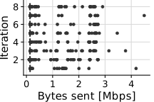<!-- -->

``` r
data_net_dev %>%
  filter(game == "gorillatag") %>%
  filter(config == "MQ3") %>%
  filter(i <= 8) %>%
  filter(ts > 60) %>%
  ggplot(aes(Mbps_rx, group = i, color=i)) +
  stat_ecdf(geom = "step", pad = FALSE) +
  labs(x = "Bytes received [Mbps]", y = "Fraction") +
  theme_cowplot(15) +
  background_grid() +
  coord_cartesian(clip="off") +
  theme(legend.position = "none", plot.margin=margin(0,0.2,0,0, "cm"))
```

<!-- -->

``` r
data_net_dev %>%
  filter(game == "gorillatag") %>%
  filter(config == "MQ3") %>%
  filter(i <= 8) %>%
  filter(ts > 60) %>%
  ggplot() +
  stat_ecdf(aes(x = Mbps_rx, y = log10(1 - after_stat(y)), group = i, color = i), pad=FALSE) +
  scale_y_continuous(breaks = seq(-3, 0), 
                     labels = 10^(seq(-3, 0)),
                     limits = c(-3, 0)) +
  labs(x = "Bytes received [Mbps]   ", y = "Fraction") +
  theme_cowplot(15) +
  background_grid() +
  coord_cartesian(clip="off") +
  theme(legend.position = "none", plot.margin=margin(0,0.2,0,0, "cm"))
```

<!-- -->

``` r
# test_data <- data_net_dev %>%
#   filter(game == "gorillatag") %>%
#   filter(config == "MQ3")
# 
#  # ks2Test(test_data %>% filter(i == 4) %>% pull(Mbps_tx), test_data %>% filter(i == 3) %>% pull(Mbps_tx),321')
#  
#  ks.test(test_data %>% filter(i == 4) %>% pull(Mbps_tx),  test_data %>% filter(i == 3) %>% pull(Mbps_tx), alternative = "two.sided", exact = FALSE, conf.level = 0.1)
```

``` r
data_net_dev %>%
  filter(game == "gorillatag") %>%
  filter(config == "MQ3") %>%
  filter(i <= 8) %>%
  filter(ts > 60) %>%
  ggplot(aes(Mbps_tx, group = i, color=i)) +
  stat_ecdf(geom = "step", pad = FALSE) +
  labs(x = "Bytes sent [Mbps]", y = "Fraction") +
  theme_cowplot(15) +
  background_grid() +
  coord_cartesian(clip="off") +
  theme(legend.position = "none", plot.margin=margin(0,0,0,0, "cm"))
```

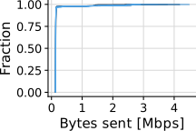<!-- -->

``` r
data_net_dev %>%
  filter(game == "gorillatag") %>%
  filter(config == "MQ3") %>%
  filter(i <= 8) %>%
  filter(ts > 60) %>%
  ggplot() +
  stat_ecdf(aes(x = Mbps_tx, y = log10(1 - after_stat(y)), group = i, color = i), pad=FALSE) +
  scale_y_continuous(breaks = seq(-3, 0), 
                     labels = 10^(seq(-3, 0)),
                     limits = c(-3, 0)) +
  labs(x = "Bytes sent [Mbps]", y = "Fraction") +
  theme_cowplot(15) +
  background_grid() +
  coord_cartesian(clip="off") +
  theme(legend.position = "none", plot.margin=margin(0,0,0,0, "cm"))
```

<!-- -->

Unexpected result: while replaying a trace using wired ADB (so we’re
sure metrics are not being sent to the host PC over wireless network),
there is still significant wireless network activity while playing
Gorilla Tag. Much larger than what I would expect for a game such as
this. Why the \>1Mbps network spikes?S

``` r
data_net_dev %>%
  filter(game == "gorillatag") %>%
  filter(config == "MQ3") %>%
  filter(i <= 8) %>%
  ggplot(aes(x = ts_m, y = Mbps_tx, group = i, color = i)) +
  geom_line() +
  ylim(0, NA) +
  labs(x = "Time [m]", y = "Bytes sent [Mbps]      ") +
  theme_cowplot(15) +
  background_grid() +
  coord_cartesian(clip="off") +
  theme(legend.position = "none", plot.margin=margin(0,0,0,0, "cm"))
```

<!-- -->
