Experiment
================

- [Description](#description)
- [Results](#results)
  - [Network Tests](#network-tests)
  - [Evolution of Hardware](#evolution-of-hardware)
    - [Frames per Second](#frames-per-second)
    - [Frame Time](#frame-time)
    - [CPU](#cpu)
    - [GPU](#gpu)
    - [Battery Usage](#battery-usage)
  - [Bandwidth Limits](#bandwidth-limits)
  - [Local vs Streamed](#local-vs-streamed)
  - [Hand Tracking](#hand-tracking)
  - [Performance Variability](#performance-variability)
    - [Local Apps](#local-apps)

# Description

# Results

``` r
library(tidyverse)
theme_set(theme_bw())
library(knitr)
library(forcats)
library(data.table)
library(cowplot)
library(gghighlight)
library(zoo)
library(RColorBrewer)
library(stringr)
library(fBasics)
library(here)
here::i_am("./Results.rmd")

saveplot <- function(filename, ...) {
  ggsave2(filename, ...)
  knitr::plot_crop(filename)
}

files <- list.files(".", pattern="[0-9]+(.+-.+)+")

# traces_replays <- list.files(".", pattern="[0-9]+-trace-[a-z]+-mq[23p]-16m-replay-n[0-9]")
# 
# # 20240222-trace-beatsaber-mqp-bw_10
# bandwidth_replays <- list.files(".", pattern="[0-9]+-trace-[a-z]+-mq[23p]-n[0-9]-bw_[0-9]")

device_to_human_name <- function(d) {
  if (is.na(d)) {
    "NA"
  } else if (d == "mq3") {
    "MQ3"
  } else if (d == "mqp") {
    "MQP"
  } else if (d == "mq2") {
    "MQ2"
  } else if (d == "pixel6a") {
    "Pixel 6a"
  } else {
    name
  }
}

g_moss <- "Moss"
g_explorevr <- "Nat. Geo. Explore VR"
g_gorillatag <- "Gorilla Tag"
g_vrchat <- "VRChat"

game_to_human_name <- function(name) {
  if (is.na(name)) {
    "NA"
  } else if (name == "moss") {
    g_moss
  } else if (name == "explorevr") {
    g_explorevr
  } else if (name == "gorillatag") {
    g_gorillatag
  } else if (name == "vrchat") {
    g_vrchat
  } else {
    name
  }
}

give_stats <- function(tb, colname, by = c("game_h", "d_h", "i")) {
  tb %>%
    mutate(v = {{colname}}) %>%
    summarise(mean = mean(v),
              stdev = sd(v),
              min = min(v),
              q25 = quantile(v, 0.25),
              median = median(v),
              q75 = quantile(v, 0.75),
              q90 = quantile(v, 0.90),
              q95 = quantile(v, 0.95),
              q99 = quantile(v, 0.99),
              max = max(v),
              iqr = q75 - q25,
              .by = by) %>%
    mutate(mean_maxd = max(mean) - min(mean)) %>%
    mutate(stdev_maxd = max(stdev) - min(stdev)) %>%
    mutate(min_maxd = max(min) - min(min)) %>%
    mutate(q25_maxd = max(q25) - min(q25)) %>%
    mutate(median_maxd = max(median) - min(median)) %>%
    mutate(q75_maxd = max(q75) - min(q75)) %>%
    mutate(max_maxd = max(max) - min(max))
}

add_columns_from_dir_name <- function(df, f) {
  p <- str_split(f, "-")[[1]]
  df <- df %>%
    mutate(date = p[1])
  i <- 2
  while (i <= length(p)) {
    v <- p[i+1]
    df <- df %>%
      mutate("{p[i]}" := v)
    i <- i + 2
  }
  df
}

# Load host system metrics data
data_host_sys_metrics <- NULL
for (f in files) {
  fp <- here(f, "host_sys_metrics.log")
  if (!file.exists(fp)) {
    next
  }
  data_host_sys_metrics <- read_csv(fp, col_types = cols(.default = "c")) %>%
    add_columns_from_dir_name(f) %>%
    mutate(fname = f) %>%
    bind_rows(data_host_sys_metrics, .)
}
data_host_sys_metrics <- data_host_sys_metrics %>%
  filter(timestamp != "timestamp") %>%
  type.convert(as.is = TRUE) %>%
  group_by(fname) %>%
  mutate(ts = timestamp) %>%
  mutate(ts = ts - min(ts)) %>%
  mutate(ts_m = ts / 60) %>%
  ungroup()

# Load host gpu metrics data
data_host_gpu_metrics <- NULL
for (f in files) {
  fp <- here(f, "host_gpu_metrics.log")
  if (!file.exists(fp)) {
    next
  }
  data_host_gpu_metrics <- read_csv(fp, col_types = cols(.default = "c")) %>%
    add_columns_from_dir_name(f) %>%
    mutate(fname = f) %>%
    bind_rows(data_host_gpu_metrics, .)
}
data_host_gpu_metrics <- data_host_gpu_metrics %>%
  filter(timestamp != "timestamp") %>%
  type.convert(as.is = TRUE) %>%
  group_by(fname) %>%
  mutate(ts = as.numeric(timestamp)) %>%
  mutate(ts = ts - min(ts)) %>%
  mutate(ts_m = ts / 60) %>%
  ungroup()

# Load VR logcat system metrics data
pattern <- c(month="-?\\d+", "-", day="-?\\d+", "\\s+", hour="-?\\d+", ":", minute="-?\\d+", ":", second="-?\\d+", "\\.", millisecond="-?\\d+", "\\s+", pid="-?\\d+", "\\s+", tid="-?\\d+", "\\s+", level="\\w", "\\s+VrApi\\s+:\\s+FPS=",fps_render="-?\\d+", "/", fps_refresh="-?\\d+", ",Prd=", prd="-?\\d+", "ms,Tear=", tear="-?\\d+", ",Early=", early="-?\\d+", ",Stale=", stale="-?\\d+", ",Stale2/5/10/max=", stale2="-?\\d+", "/", stale5="-?\\d+", "/", stale10="-?\\d+", "/", stalemax="-?\\d+", ",VSnc=", vsnc="-?\\d+", ",Lat=", lat="-?-?\\d+", ",Fov=", fov="-?\\d+\\w*", ",CPU", cpun="\\d", "/GPU=", cpu_level="-?\\d+", "/", gpu_level="-?\\d+", ",", cpu_freq="-?\\d+", "/", gpu_freq="-?\\d+", "MHz,OC=", oc=".+", ",TA=", ta_atw="-?\\d+\\w*", "/", ta_main="-?\\d+\\w*", "/", ta_render="-?\\d+\\w*", ",SP=", sp_atw="\\w", "/", sp_main="\\w", "/", sp_render="\\w", ",Mem=", mem="-?\\d+", "MHz,Free=", free="-?\\d+", "MB,PLS=", pls="-?\\d+", ",Temp=", temp_bat="-?\\d+\\.\\d+", "C/", temp_sens="-?\\d+\\.\\d+", "C,TW=", tw="-?\\d+\\.\\d+", "ms,App=", app="-?\\d+\\.\\d+", "ms,GD=", gd="-?\\d+\\.\\d+", "ms,CPU&GPU=", cpu_gpu="-?\\d+\\.\\d+", "ms,LCnt=", lcnt="-?\\d+", "\\(DR", dr="-?\\d+", ",LM", lm="-?\\d+", "\\),GPU%=", gpu_percent="-?\\d+\\.\\d+", ",CPU%=", cpu_percent="-?\\d+\\.\\d+", "\\(W", cpu_percent_worst="-?\\d+\\.\\d+", "\\),DSF=", dsf="-?\\d+\\.\\d+", ",CFL=", cfl_min="-?\\d+\\.\\d+", "/", cfl_max="-?\\d+\\.\\d+", ",ICFLp95=", icflp95="-?\\d+\\.\\d+", ",LD=", ld="-?\\d+", ",SF=", sf="-?\\d+\\.\\d+", ",LP=", lp="-?\\d+", ",DVFS=", dvfs="-?\\d+", ".*")
data_logcat_vrapi <- NULL
for (f in files) {
  fp <- here(f, "logcat_VrApi.log")
  if (!file.exists(fp)) {
    next
  }
  data_logcat_vrapi <- readLines(fp) %>%
    tibble(line = .) %>%
    filter(grepl("^.+\\s+VrApi\\s+:\\s+FPS=", line)) %>%
    separate_wider_regex(line, pattern) %>%
    add_columns_from_dir_name(f) %>%
    mutate(fname = f) %>%
    bind_rows(data_logcat_vrapi, .)
}
data_logcat_vrapi <- data_logcat_vrapi %>%
  type.convert(as.is = TRUE) %>%
  group_by(fname) %>%
  mutate(ts = second + (60*minute) + (60*60*hour)) %>%
  mutate(ts = ts - min(ts)) %>%
  ungroup() %>%
  mutate(ts_m = ts / 60) %>%
  mutate(cpu_util = 100 * cpu_percent) %>%
  mutate(cpu_freq_ghz = cpu_freq / 1000) %>%
  mutate(gpu_util = 100 * gpu_percent) %>%
  mutate(d_h = map_chr(d, device_to_human_name)) %>%
  mutate(game_h = map_chr(a, game_to_human_name))
data_logcat_vrapi
```

    ## # A tibble: 81,673 × 80
    ##    month   day  hour minute second millisecond   pid   tid level fps_render
    ##    <int> <int> <int>  <int>  <int>       <int> <int> <int> <chr>      <int>
    ##  1    12    11     2     59     45         524  1975  3146 I             90
    ##  2    12    11     2     59     46         524  1975  3146 I             90
    ##  3    12    11     2     59     47         524  1975  3146 I             90
    ##  4    12    11     2     59     48         524  1975  3146 I             90
    ##  5    12    11     2     59     49         524  1975  3146 I             90
    ##  6    12    11     2     59     50         524  1975  3146 I             90
    ##  7    12    11     2     59     51         524  1975  3146 I             90
    ##  8    12    11     2     59     52         524  1975  3146 I             90
    ##  9    12    11     2     59     53         524  1975  3146 I             90
    ## 10    12    11     2     59     54         524  1975  3146 I             90
    ## # ℹ 81,663 more rows
    ## # ℹ 70 more variables: fps_refresh <int>, prd <int>, tear <int>, early <int>,
    ## #   stale <int>, stale2 <int>, stale5 <int>, stale10 <int>, stalemax <int>,
    ## #   vsnc <int>, lat <int>, fov <chr>, cpun <int>, cpu_level <int>,
    ## #   gpu_level <int>, cpu_freq <int>, gpu_freq <int>, oc <chr>, ta_atw <int>,
    ## #   ta_main <chr>, ta_render <chr>, sp_atw <chr>, sp_main <chr>,
    ## #   sp_render <chr>, mem <int>, free <int>, pls <int>, temp_bat <dbl>, …

``` r
# Load VR network metrics data

#Inter-|   Receive                                                |  Transmit
# face |bytes    packets errs drop fifo frame compressed multicast|bytes    packets errs drop fifo colls carrier compressed
#  wlan0: 334462961  517107    0    0    0     0          0         0 110016326  375001    0    0    0     0       0          0
pattern <- c("\\s+wlan0:\\s+", rx_bytes="\\d+", "\\s+", rx_packets="\\d+", "\\s+", rx_errs="\\d+", "\\s+", rx_drop="\\d+", "\\s+", rx_fifo="\\d+", "\\s+", rx_frame="\\d+", "\\s+", rx_compressed="\\d+", "\\s+", rx_multicast="\\d+", "\\s+", tx_bytes="\\d+", "\\s+", tx_packets="\\d+", "\\s+", tx_errs="\\d+", "\\s+", tx_drop="\\d+", "\\s+", tx_fifo="\\d+", "\\s+", tx_colls="\\d+", "\\s+", tx_carrier="\\d+", "\\s+", tx_compressed="\\d+")

data_net_dev <- NULL
for (f in files) {
  fp <- here(f, "net_dev.log")
  if (!file.exists(fp)) {
    next
  }
  data_net_dev <- readLines(fp) %>%
    tibble(line = .) %>%
    filter(grepl("^\\s+wlan0:\\s+", line)) %>%
    separate_wider_regex(line, pattern) %>%
    add_columns_from_dir_name(f) %>%
    mutate(fname = f) %>%
    mutate(ts = 0:(n() - 1)) %>%
    select(ts, everything()) %>%
    mutate(ts_m = ts / 60) %>%
    bind_rows(data_net_dev, .)
}
data_net_dev <- data_net_dev %>%
  type.convert(as.is = TRUE) %>%
  mutate(d_h = map_chr(d, device_to_human_name)) %>%
  mutate(game_h = map_chr(a, game_to_human_name)) %>%
  group_by(fname) %>%
  mutate(bps_tx = 8 * (tx_bytes - lag(tx_bytes))) %>%
  mutate(kbps_tx = bps_tx / 1000) %>%
  mutate(Mbps_tx = bps_tx / 1000000) %>%
  mutate(Gbps_tx = bps_tx / 1000000000) %>%
  mutate(bps_rx = 8 * (rx_bytes - lag(rx_bytes))) %>%
  mutate(kbps_rx = bps_rx / 1000) %>%
  mutate(Mbps_rx = bps_rx / 1000000) %>%
  mutate(Gbps_rx = bps_rx / 1000000000) %>%
  ungroup()
data_net_dev
```

    ## # A tibble: 75,809 × 44
    ##       ts rx_bytes rx_packets rx_errs rx_drop rx_fifo rx_frame rx_compressed
    ##    <int>    <dbl>      <int>   <int>   <int>   <int>    <int>         <int>
    ##  1     0 22648810      36024       0       0       0        0             0
    ##  2     1 22656042      36077       0       0       0        0             0
    ##  3     2 22659921      36127       0       0       0        0             0
    ##  4     3 22667965      36178       0       0       0        0             0
    ##  5     4 22671728      36223       0       0       0        0             0
    ##  6     5 22673282      36233       0       0       0        0             0
    ##  7     6 22679675      36280       0       0       0        0             0
    ##  8     7 22682726      36323       0       0       0        0             0
    ##  9     8 22691887      36383       0       0       0        0             0
    ## 10     9 22694465      36425       0       0       0        0             0
    ## # ℹ 75,799 more rows
    ## # ℹ 36 more variables: rx_multicast <int>, tx_bytes <dbl>, tx_packets <int>,
    ## #   tx_errs <int>, tx_drop <int>, tx_fifo <int>, tx_colls <int>,
    ## #   tx_carrier <int>, tx_compressed <int>, date <int>, a <chr>, n <chr>,
    ## #   e <chr>, src <chr>, dst <chr>, airline <chr>, fname <chr>, ts_m <dbl>,
    ## #   m <chr>, d <chr>, l <int>, i <dbl>, song <chr>, diff <chr>, b <int>,
    ## #   p <dbl>, d_h <chr>, game_h <chr>, bps_tx <dbl>, kbps_tx <dbl>, …

``` r
# Load VR battery metrics data
# 01-18 18:54:21.709  6038  6148 I BatteryMgr:DataCollectionService: stats => 1705600461709,-1312532,3835
pattern <- c(month="\\d+", "-", day="\\d+", "\\s+", hour="\\d+", ":", minute="\\d+", ":", second="\\d+", "\\.", millisecond="\\d+", "\\s+", pid="\\d+", "\\s+", tid="\\d+", "\\s+I\\s+BatteryMgr:DataCollectionService:\\s+stats\\s+=>\\s+", ts_milli="\\d+", ",", current="-?\\d+", ",", voltage="\\d+")

data_batterymanager_companion <- NULL
for (f in files) {
  fp <- here(f, "batterymanager-companion.log")
  if (!file.exists(fp)) {
    next
  }
  data_batterymanager_companion <- readLines(fp) %>%
    tibble(line = .) %>%
    filter(grepl("\\WBatteryMgr:DataCollectionService:\\s+stats\\s+=>", line)) %>%
    separate_wider_regex(line, pattern) %>%
    add_columns_from_dir_name(f) %>%
    mutate(fname = f) %>%
    bind_rows(data_batterymanager_companion, .)
}
data_batterymanager_companion <- data_batterymanager_companion %>%
  type.convert(as.is = TRUE) %>%
  mutate(d_h = map_chr(d, device_to_human_name)) %>%
  mutate(game_h = map_chr(a, game_to_human_name)) %>%
  group_by(fname) %>%
  mutate(ts_milli = ts_milli - min(ts_milli)) %>%
  ungroup() %>%
  mutate(ts = ts_milli / 1000) %>%
  mutate(ts_m = ts / 60) %>%
  mutate(current_ma = current / 1000) %>%
  mutate(current_a = current / 1000000) %>%
  mutate(voltage_v = voltage / 1000) %>%
  mutate(power_w = current_a * voltage_v)
data_batterymanager_companion
```

    ## # A tibble: 41,890 × 28
    ##    month   day  hour minute second millisecond   pid   tid ts_milli  current
    ##    <int> <int> <int>  <int>  <int>       <int> <int> <int>    <dbl>    <int>
    ##  1     1    16    13     56      7         733  6505  6529        0 -1833983
    ##  2     1    16    13     56      8         740  6505  6529     1007 -2007323
    ##  3     1    16    13     56      9         745  6505  6529     2012 -1681151
    ##  4     1    16    13     56     10         748  6505  6529     3014 -1889647
    ##  5     1    16    13     56     11         750  6505  6529     4017 -1489745
    ##  6     1    16    13     56     12         753  6505  6529     5020 -1476073
    ##  7     1    16    13     56     13         756  6505  6529     6023 -1520507
    ##  8     1    16    13     56     14         758  6505  6529     7025 -1550292
    ##  9     1    16    13     56     15         761  6505  6529     8028 -1501952
    ## 10     1    16    13     56     16         763  6505  6529     9030 -1864256
    ## # ℹ 41,880 more rows
    ## # ℹ 18 more variables: voltage <int>, date <int>, m <chr>, d <chr>, a <chr>,
    ## #   l <int>, i <int>, fname <chr>, b <int>, n <chr>, d_h <chr>, game_h <chr>,
    ## #   ts <dbl>, ts_m <dbl>, current_ma <dbl>, current_a <dbl>, voltage_v <dbl>,
    ## #   power_w <dbl>

``` r
# Load iperf data
pattern <- c("\\[\\s*", id="\\d+", "\\]\\s+", start = "\\d+\\.?\\d*", "-", stop = "\\d+\\.?\\d*", "\\s+", unit = "\\w+", "\\s+", transfer = "\\d+\\.?\\d*", "\\s+", transfer_unit="\\w+", "\\s+", bitrate="\\d+\\.?\\d*", "\\s+", bitrate_unit="\\w+/?\\w*", "\\s+", retry="\\d+", "\\s+", cwnd="\\d+\\.?\\d*", "\\s+", cwnd_unit="\\w+")
data_iperf <- NULL
for (f in files) {
  fp <- here(f, "iperf.txt")
  if (!file.exists(fp)) {
    next
  }
  data_iperf <- readLines(fp) %>%
    tibble(line = .) %>%
    filter(grepl("\\s+\\d+\\s+\\w+/\\w+\\s+\\d+\\s+\\d+(\\.\\d+)?\\s+\\w+", line)) %>%
    separate_wider_regex(line, pattern) %>%
    add_columns_from_dir_name(f) %>%
    mutate(fname = f) %>%
    bind_rows(data_iperf, .)
}
```

    ## Warning in readLines(fp): incomplete final line found on
    ## '/mnt/c/Users/atl_gaming/repos/openxr-librnr/traces/20240224-m-baseline-d-mq2-a-iperf/iperf.txt'

    ## Warning in readLines(fp): incomplete final line found on
    ## '/mnt/c/Users/atl_gaming/repos/openxr-librnr/traces/20240224-m-baseline-d-mq2-a-iperf-n-l1k/iperf.txt'

    ## Warning in readLines(fp): incomplete final line found on
    ## '/mnt/c/Users/atl_gaming/repos/openxr-librnr/traces/20240224-m-baseline-d-mq3-a-iperf/iperf.txt'

    ## Warning in readLines(fp): incomplete final line found on
    ## '/mnt/c/Users/atl_gaming/repos/openxr-librnr/traces/20240224-m-baseline-d-mq3-a-iperf-n-l1k/iperf.txt'

    ## Warning in readLines(fp): incomplete final line found on
    ## '/mnt/c/Users/atl_gaming/repos/openxr-librnr/traces/20240224-m-baseline-d-mqp-a-iperf/iperf.txt'

    ## Warning in readLines(fp): incomplete final line found on
    ## '/mnt/c/Users/atl_gaming/repos/openxr-librnr/traces/20240224-m-baseline-d-mqp-a-iperf-n-l1k/iperf.txt'

    ## Warning in readLines(fp): incomplete final line found on
    ## '/mnt/c/Users/atl_gaming/repos/openxr-librnr/traces/20240224-m-baseline-d-pixel6a-a-iperf/iperf.txt'

    ## Warning in readLines(fp): incomplete final line found on
    ## '/mnt/c/Users/atl_gaming/repos/openxr-librnr/traces/20240224-m-baseline-d-pixel6a-a-iperf-n-l1k/iperf.txt'

``` r
data_iperf <- data_iperf %>%
  type.convert(as.is=TRUE) %>%
  mutate(d_h = map_chr(d, device_to_human_name)) %>%
  mutate(game_h = map_chr(a, game_to_human_name)) %>%
  mutate(bps = NA) %>%
  mutate(bps = ifelse(bitrate_unit == "Gbits/sec", bitrate * 1000000000, bps)) %>%
  mutate(bps = ifelse(bitrate_unit == "Mbits/sec", bitrate * 1000000, bps)) %>%
  mutate(bps = ifelse(bitrate_unit == "kbits/sec", bitrate * 1000, bps)) %>%
  mutate(kbps = bps / 1000) %>%
  mutate(Mbps = bps / 1000000) %>%
  mutate(Gbps = bps / 1000000000)

# Define some nice colors
game_colors <- c(g_moss = "#ccbb44",
                 g_gorillatag="#66ccee",
                 g_explorevr="#ee6677",
                 g_vrchat = "#aa3377")

device_colors <- c("MQ2" = "#bbbbbb",
                 "MQ3"="#4477aa",
                 "MQP"="#228833")

c_alert <- "red"
c_warn <- "orange"
c_norm <- "black"
c_emph <- "#06bd55"
c_demph <- "gray"
```

## Network Tests

``` r
iperfMQP <- '[  5]   0.00-1.00   sec  92.2 MBytes   773 Mbits/sec    0    935 KBytes
[  5]   1.00-2.00   sec  96.2 MBytes   807 Mbits/sec    0    935 KBytes
[  5]   2.00-3.00   sec  96.2 MBytes   807 Mbits/sec    0    935 KBytes
[  5]   3.00-4.00   sec  93.8 MBytes   786 Mbits/sec    0    935 KBytes
[  5]   4.00-5.00   sec  95.0 MBytes   797 Mbits/sec    0    935 KBytes
[  5]   5.00-6.00   sec  96.2 MBytes   807 Mbits/sec    0    935 KBytes
[  5]   6.00-7.00   sec  96.2 MBytes   807 Mbits/sec    0    935 KBytes
[  5]   7.00-8.00   sec  95.0 MBytes   797 Mbits/sec    0    935 KBytes
[  5]   8.00-9.00   sec  96.2 MBytes   807 Mbits/sec    0    935 KBytes
[  5]   9.00-10.00  sec  97.5 MBytes   818 Mbits/sec    0    935 KBytes
[  5]  10.00-11.00  sec  93.8 MBytes   786 Mbits/sec    0    935 KBytes
[  5]  11.00-12.00  sec  95.0 MBytes   797 Mbits/sec    0    935 KBytes
[  5]  12.00-13.00  sec  88.8 MBytes   744 Mbits/sec    0    935 KBytes
[  5]  13.00-14.00  sec  88.8 MBytes   744 Mbits/sec    0    935 KBytes
[  5]  14.00-15.00  sec  92.5 MBytes   776 Mbits/sec    0    935 KBytes
[  5]  15.00-16.00  sec  92.5 MBytes   776 Mbits/sec    0    935 KBytes
[  5]  16.00-17.00  sec  91.2 MBytes   765 Mbits/sec    0    935 KBytes
[  5]  17.00-18.00  sec  96.2 MBytes   807 Mbits/sec    0    935 KBytes
[  5]  18.00-19.00  sec  93.8 MBytes   786 Mbits/sec    0    935 KBytes
[  5]  19.00-20.00  sec  93.8 MBytes   786 Mbits/sec    0    935 KBytes
[  5]  20.00-21.00  sec  95.0 MBytes   797 Mbits/sec    0    935 KBytes
[  5]  21.00-22.00  sec  95.0 MBytes   797 Mbits/sec    0    935 KBytes
[  5]  22.00-23.00  sec  95.0 MBytes   797 Mbits/sec    0    935 KBytes
[  5]  23.00-24.00  sec  96.2 MBytes   807 Mbits/sec    0    935 KBytes
[  5]  24.00-25.00  sec  92.5 MBytes   776 Mbits/sec    0    935 KBytes
[  5]  25.00-26.00  sec  93.8 MBytes   786 Mbits/sec    0    935 KBytes
[  5]  26.00-27.00  sec  92.5 MBytes   776 Mbits/sec    0    935 KBytes
[  5]  27.00-28.00  sec  91.2 MBytes   765 Mbits/sec    0    935 KBytes
[  5]  28.00-29.00  sec  91.2 MBytes   765 Mbits/sec    0    935 KBytes
[  5]  29.00-30.00  sec  92.5 MBytes   776 Mbits/sec    0    935 KBytes
[  5]  30.00-31.00  sec  91.2 MBytes   765 Mbits/sec    0    935 KBytes
[  5]  31.00-32.00  sec  96.2 MBytes   807 Mbits/sec    0    935 KBytes
[  5]  32.00-33.00  sec  96.2 MBytes   807 Mbits/sec    0    935 KBytes
[  5]  33.00-34.00  sec  93.8 MBytes   786 Mbits/sec    0    935 KBytes
[  5]  34.00-35.00  sec  97.5 MBytes   818 Mbits/sec    0    935 KBytes
[  5]  35.00-36.00  sec  97.5 MBytes   818 Mbits/sec    0    935 KBytes
[  5]  36.00-37.00  sec  93.8 MBytes   786 Mbits/sec    0    935 KBytes
[  5]  37.00-38.00  sec  97.5 MBytes   818 Mbits/sec    0    935 KBytes
[  5]  38.00-39.00  sec  92.5 MBytes   776 Mbits/sec    0    935 KBytes
[  5]  39.00-40.00  sec  97.5 MBytes   818 Mbits/sec    0    935 KBytes
[  5]  40.00-41.00  sec  93.8 MBytes   786 Mbits/sec    0    935 KBytes
[  5]  41.00-42.00  sec  93.8 MBytes   786 Mbits/sec    0    935 KBytes
[  5]  42.00-43.00  sec  95.0 MBytes   797 Mbits/sec    0    935 KBytes
[  5]  43.00-44.00  sec  92.5 MBytes   776 Mbits/sec    0    935 KBytes
[  5]  44.00-45.00  sec  96.2 MBytes   807 Mbits/sec    1    935 KBytes
[  5]  45.00-46.00  sec  95.0 MBytes   797 Mbits/sec    0    935 KBytes
[  5]  46.00-47.00  sec  95.0 MBytes   797 Mbits/sec    0    935 KBytes
[  5]  47.00-48.00  sec  97.5 MBytes   818 Mbits/sec    0    935 KBytes
[  5]  48.00-49.00  sec  95.0 MBytes   797 Mbits/sec    0    935 KBytes
[  5]  49.00-50.00  sec  96.2 MBytes   807 Mbits/sec    0    935 KBytes
[  5]  50.00-51.00  sec  96.2 MBytes   807 Mbits/sec    0    935 KBytes
[  5]  51.00-52.00  sec  97.5 MBytes   818 Mbits/sec    0    935 KBytes
[  5]  52.00-53.00  sec  93.8 MBytes   786 Mbits/sec    0    935 KBytes
[  5]  53.00-54.00  sec  95.0 MBytes   797 Mbits/sec    0    935 KBytes
[  5]  54.00-55.00  sec  95.0 MBytes   797 Mbits/sec    0    935 KBytes
[  5]  55.00-56.00  sec  96.2 MBytes   807 Mbits/sec    0    935 KBytes
[  5]  56.00-57.00  sec  95.0 MBytes   797 Mbits/sec    0    935 KBytes
[  5]  57.00-58.00  sec  93.8 MBytes   786 Mbits/sec    0    935 KBytes
[  5]  58.00-59.00  sec  85.0 MBytes   713 Mbits/sec    0    935 KBytes
[  5]  59.00-60.00  sec  90.0 MBytes   755 Mbits/sec    0    935 KBytes'

iperfMQP1K <- '[  5]   0.00-1.00   sec  73.9 MBytes   620 Mbits/sec    0    894 KBytes
[  5]   1.00-2.00   sec  76.8 MBytes   644 Mbits/sec    0    894 KBytes
[  5]   2.00-3.00   sec  84.1 MBytes   705 Mbits/sec    0    894 KBytes
[  5]   3.00-4.00   sec  81.2 MBytes   681 Mbits/sec    0    894 KBytes
[  5]   4.00-5.00   sec  84.2 MBytes   707 Mbits/sec    0    894 KBytes
[  5]   5.00-6.00   sec  82.8 MBytes   695 Mbits/sec    0    894 KBytes
[  5]   6.00-7.00   sec  82.9 MBytes   696 Mbits/sec    0    894 KBytes
[  5]   7.00-8.00   sec  84.4 MBytes   708 Mbits/sec    0    894 KBytes
[  5]   8.00-9.00   sec  86.0 MBytes   722 Mbits/sec    0    894 KBytes
[  5]   9.00-10.00  sec  80.3 MBytes   673 Mbits/sec    0    894 KBytes
[  5]  10.00-11.00  sec  79.5 MBytes   667 Mbits/sec    0    894 KBytes
[  5]  11.00-12.00  sec  81.4 MBytes   683 Mbits/sec    0    894 KBytes
[  5]  12.00-13.00  sec  80.9 MBytes   678 Mbits/sec    0    894 KBytes
[  5]  13.00-14.00  sec  82.1 MBytes   689 Mbits/sec    0    894 KBytes
[  5]  14.00-15.00  sec  78.5 MBytes   659 Mbits/sec    0    894 KBytes
[  5]  15.00-16.00  sec  81.5 MBytes   683 Mbits/sec    0    894 KBytes
[  5]  16.00-17.00  sec  78.2 MBytes   656 Mbits/sec    0    894 KBytes
[  5]  17.00-18.00  sec  84.1 MBytes   706 Mbits/sec    0    894 KBytes
[  5]  18.00-19.00  sec  83.6 MBytes   702 Mbits/sec    0    894 KBytes
[  5]  19.00-20.00  sec  85.2 MBytes   715 Mbits/sec    0    894 KBytes
[  5]  20.00-21.00  sec  88.5 MBytes   742 Mbits/sec    0    894 KBytes
[  5]  21.00-22.00  sec  86.0 MBytes   722 Mbits/sec    0    894 KBytes
[  5]  22.00-23.00  sec  84.1 MBytes   706 Mbits/sec    0    894 KBytes
[  5]  23.00-24.00  sec  86.0 MBytes   722 Mbits/sec    0    894 KBytes
[  5]  24.00-25.00  sec  83.4 MBytes   700 Mbits/sec    0    894 KBytes
[  5]  25.00-26.00  sec  86.2 MBytes   724 Mbits/sec    0    894 KBytes
[  5]  26.00-27.00  sec  85.1 MBytes   714 Mbits/sec    0    894 KBytes
[  5]  27.00-28.00  sec  86.4 MBytes   725 Mbits/sec    0    894 KBytes
[  5]  28.00-29.00  sec  82.7 MBytes   694 Mbits/sec    0    894 KBytes
[  5]  29.00-30.00  sec  86.3 MBytes   724 Mbits/sec    0    894 KBytes
[  5]  30.00-31.00  sec  83.8 MBytes   703 Mbits/sec    0    894 KBytes
[  5]  31.00-32.00  sec  83.7 MBytes   702 Mbits/sec    0    894 KBytes
[  5]  32.00-33.00  sec  84.1 MBytes   705 Mbits/sec    0    894 KBytes
[  5]  33.00-34.00  sec  85.0 MBytes   713 Mbits/sec    0    894 KBytes
[  5]  34.00-35.00  sec  84.2 MBytes   706 Mbits/sec    0    894 KBytes
[  5]  35.00-36.00  sec  86.6 MBytes   727 Mbits/sec    0    894 KBytes
[  5]  36.00-37.00  sec  84.4 MBytes   708 Mbits/sec    0    894 KBytes
[  5]  37.00-38.00  sec  87.0 MBytes   730 Mbits/sec    0    894 KBytes
[  5]  38.00-39.00  sec  84.1 MBytes   706 Mbits/sec    0    894 KBytes
[  5]  39.00-40.00  sec  84.6 MBytes   709 Mbits/sec    0    894 KBytes
[  5]  40.00-41.00  sec  83.7 MBytes   702 Mbits/sec    0    894 KBytes
[  5]  41.00-42.00  sec  87.2 MBytes   732 Mbits/sec    0    894 KBytes
[  5]  42.00-43.00  sec  78.9 MBytes   662 Mbits/sec    0    894 KBytes
[  5]  43.00-44.00  sec  80.5 MBytes   675 Mbits/sec    0    894 KBytes
[  5]  44.00-45.00  sec  75.8 MBytes   636 Mbits/sec    0    894 KBytes
[  5]  45.00-46.00  sec  77.2 MBytes   648 Mbits/sec    0    894 KBytes
[  5]  46.00-47.00  sec  81.9 MBytes   687 Mbits/sec    0    894 KBytes
[  5]  47.00-48.00  sec  85.3 MBytes   715 Mbits/sec    0    894 KBytes
[  5]  48.00-49.00  sec  85.2 MBytes   714 Mbits/sec    0    894 KBytes
[  5]  49.00-50.00  sec  80.2 MBytes   673 Mbits/sec    0    894 KBytes
[  5]  50.00-51.00  sec  82.4 MBytes   691 Mbits/sec    0    894 KBytes
[  5]  51.00-52.00  sec  83.8 MBytes   703 Mbits/sec    0    894 KBytes
[  5]  52.00-53.00  sec  84.3 MBytes   707 Mbits/sec    0    894 KBytes
[  5]  53.00-54.00  sec  86.1 MBytes   722 Mbits/sec    0    894 KBytes
[  5]  54.00-55.00  sec  84.2 MBytes   707 Mbits/sec    0    894 KBytes
[  5]  55.00-56.00  sec  86.6 MBytes   726 Mbits/sec    0    894 KBytes
[  5]  56.00-57.00  sec  89.2 MBytes   749 Mbits/sec    0    894 KBytes
[  5]  57.00-58.00  sec  85.9 MBytes   720 Mbits/sec    0    894 KBytes
[  5]  58.00-59.00  sec  85.6 MBytes   718 Mbits/sec    0    894 KBytes
[  5]  59.00-60.00  sec  79.2 MBytes   664 Mbits/sec    0    894 KBytes'

pattern <- c("\\[\\s*", id="\\d+", "\\]\\s+", start = "\\d+\\.\\d+", "-", stop = "\\d+\\.\\d+", "\\s+", unit = "\\w+", "\\s+", transfer = "\\d+\\.\\d+", "\\s+", transfer_unit="\\w+", "\\s+", bitrate="\\d+", "\\s+", bitrate_unit="\\w+/?\\w*", "\\s+", retry="\\d+", "\\s+", cwnd="\\d+", "\\s+", cwnd_unit="\\w+")

iperf_data <- NULL

iperf_data <- tibble(line = iperfMQP) %>%
  mutate(setup = "MQP") %>%
  bind_rows(iperf_data, .)
iperf_data <- tibble(line = iperfMQP1K) %>%
  mutate(setup = "MQP1K") %>%
  bind_rows(iperf_data, .)

iperf_data <- iperf_data %>%
  separate_longer_delim(line, delim = "\n") %>%
  separate_wider_regex(line, pattern) %>%
  type.convert(as.is = TRUE) %>%
  mutate(device = "MQP")

iperf_data
```

    ## # A tibble: 120 × 13
    ##       id start  stop unit  transfer transfer_unit bitrate bitrate_unit retry
    ##    <int> <dbl> <dbl> <chr>    <dbl> <chr>           <int> <chr>        <int>
    ##  1     5     0     1 sec       92.2 MBytes            773 Mbits/sec        0
    ##  2     5     1     2 sec       96.2 MBytes            807 Mbits/sec        0
    ##  3     5     2     3 sec       96.2 MBytes            807 Mbits/sec        0
    ##  4     5     3     4 sec       93.8 MBytes            786 Mbits/sec        0
    ##  5     5     4     5 sec       95   MBytes            797 Mbits/sec        0
    ##  6     5     5     6 sec       96.2 MBytes            807 Mbits/sec        0
    ##  7     5     6     7 sec       96.2 MBytes            807 Mbits/sec        0
    ##  8     5     7     8 sec       95   MBytes            797 Mbits/sec        0
    ##  9     5     8     9 sec       96.2 MBytes            807 Mbits/sec        0
    ## 10     5     9    10 sec       97.5 MBytes            818 Mbits/sec        0
    ## # ℹ 110 more rows
    ## # ℹ 4 more variables: cwnd <int>, cwnd_unit <chr>, setup <chr>, device <chr>

``` r
iperf_data %>%
  ggplot(aes(x = bitrate, y = setup)) +
  geom_boxplot() +
  xlim(0,NA) +
  theme_cowplot(15) +
  background_grid() +
  labs(x = "Bitrate [Mbps]", y = "Setup")
```

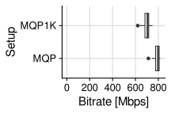<!-- -->

``` r
d <- data_iperf %>%
  filter(is.na(n))

d %>%
  select(fname) %>%
  unique()
```

    ## # A tibble: 4 × 1
    ##   fname                                
    ##   <chr>                                
    ## 1 20240224-m-baseline-d-mq2-a-iperf    
    ## 2 20240224-m-baseline-d-mq3-a-iperf    
    ## 3 20240224-m-baseline-d-mqp-a-iperf    
    ## 4 20240224-m-baseline-d-pixel6a-a-iperf

``` r
d %>%
  give_stats(Mbps, by=c("d_h"))
```

    ## Warning: Using an external vector in selections was deprecated in tidyselect 1.1.0.
    ## ℹ Please use `all_of()` or `any_of()` instead.
    ##   # Was:
    ##   data %>% select(by)
    ## 
    ##   # Now:
    ##   data %>% select(all_of(by))
    ## 
    ## See <https://tidyselect.r-lib.org/reference/faq-external-vector.html>.
    ## This warning is displayed once every 8 hours.
    ## Call `lifecycle::last_lifecycle_warnings()` to see where this warning was
    ## generated.

    ## # A tibble: 4 × 19
    ##   d_h       mean stdev   min   q25 median   q75   q90   q95   q99   max   iqr
    ##   <chr>    <dbl> <dbl> <dbl> <dbl>  <dbl> <dbl> <dbl> <dbl> <dbl> <dbl> <dbl>
    ## 1 MQ2       762.  40.3   661   744    765  789.   818  818   822.   828  44.8
    ## 2 MQ3       721.  23.8   619   713    724  734    744  744   744.   745  21  
    ## 3 MQP       722.  20.4   671   713    724  734    744  745.  755    755  21  
    ## 4 Pixel 6a  926.  20.3   870   923    933  933    944  944   948.   954  10  
    ## # ℹ 7 more variables: mean_maxd <dbl>, stdev_maxd <dbl>, min_maxd <dbl>,
    ## #   q25_maxd <dbl>, median_maxd <dbl>, q75_maxd <dbl>, max_maxd <dbl>

``` r
d %>%
  ggplot(aes(x = Mbps, y = d_h)) +
  geom_boxplot() +
  stat_summary(fun=mean, geom="point", shape=21, size=2, color="black", fill="white") +
  xlim(0,NA) +
  theme_cowplot(15) +
  background_grid() +
  labs(x = "Bitrate [Mbps]", y = "Device") +
  coord_cartesian(clip="off") +
  theme(plot.margin=margin(0,0.6,0,0, "cm"))
```

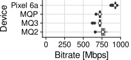<!-- -->

## Evolution of Hardware

### Frames per Second

``` r
data_logcat_vrapi %>%
  filter(is.na(b)) %>%
  filter(a == "moss" | a == "vrchat" | a == "gorillatag" | a == "explorevr") %>%
  filter(i == 1) %>%
  filter(m == "replay") %>%
  ggplot(aes(x = ts_m, y = fps_render, group = a, color = a)) +
  geom_line() +
  ylim(0, NA) +
  theme_cowplot(15) +
  background_grid() +
  labs(x="Time [m]", y="Frame rate [fps]  ") +
  coord_cartesian(clip="off") +
  theme(plot.margin=margin(0,0,0,0, "cm")) +
  facet_grid(cols = vars(fname))
```

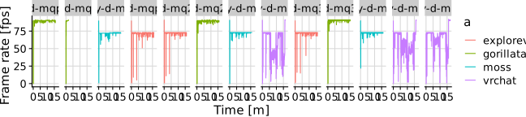<!-- -->

### Frame Time

``` r
data_logcat_vrapi %>%
  filter(a == "moss" | a == "gorillatag") %>%
  filter(i == 1) %>%
  filter(ts > 60) %>%
  filter(app > 0) %>%
  ggplot() +
  geom_vline(xintercept = 11.1, color = "orange", linetype = "dashed") +
  geom_vline(xintercept = 13.9, color = "red") +
  geom_boxplot(aes(x = app, y = d)) +
  xlim(0, NA) +
  labs(x = "Frame time [ms]", y = "Device") +
  theme_half_open() +
  background_grid() +
  theme(legend.position = c(.25,.45), legend.background = element_rect(fill=alpha("white", 0.75))) +
  facet_grid(cols = vars(a))
```

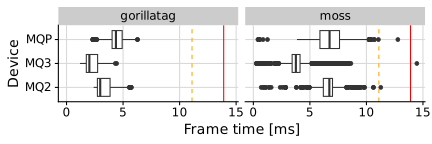<!-- -->

``` r
data_logcat_vrapi %>%
  filter(a == "moss" | a == "gorillatag") %>%
  filter(i == 1) %>%
  filter(ts > 60) %>%
  filter(app > 0) %>%
  ggplot() +
  geom_vline(xintercept = 11.1, color = "orange", linetype = "dashed") +
  geom_vline(xintercept = 13.9, color = "red") +
  stat_ecdf(aes(x = app, group = d, color = d), pad=FALSE) +
  xlim(0, NA) +
  labs(x = "Frame time [ms]", y = "Fraction", color = "Device") +
  theme_half_open() +
  background_grid() +
  theme(legend.position = c(.25,.45), legend.background = element_rect(fill=alpha("white", 0.75))) +
  facet_grid(cols = vars(a))
```

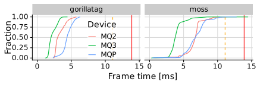<!-- -->

``` r
d <- data_logcat_vrapi %>%
  filter(a == "moss" | a == "gorillatag" | a == "explorevr" | a == "vrchat") %>%
  filter(ts > 60) %>%
  filter(app > 0) %>%
  filter(i == 1) %>%
  filter(m == "replay") %>%
  filter(l == 16)
  
d %>%
  ggplot() +
  geom_vline(xintercept = 11.1, color = "orange", linetype = "dashed") +
  geom_vline(xintercept = 13.9, color = "red") +
  stat_ecdf(aes(x = app, y = log10(1 - after_stat(y)), group = d_h, color = d_h), pad=FALSE) +
  scale_y_continuous(breaks = seq(-3, 0), 
                     labels = 10^(seq(-3, 0)),
                     limits = c(-3, 0)) +
  xlim(0, NA) +
  labs(x = "Frame time [ms]", y = "Fraction", color = "Device") +
  theme_half_open() +
  background_grid() +
  theme(legend.position = c(.65,.5), strip.background=element_rect(fill="white"), legend.background = element_rect(fill=alpha("white", 0.9))) +
  facet_grid(~factor(game_h, levels=c(g_gorillatag, g_moss, g_explorevr, g_vrchat)), scales = "free_x") +
  expand_limits(x = c(0,15)) +
  scale_color_manual(values=device_colors)
```

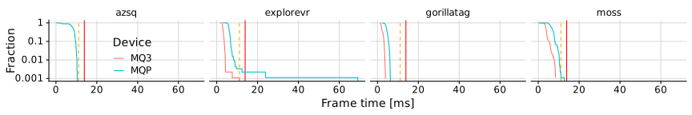<!-- -->

``` r
d %>%
  select(fname) %>%
  unique()
```

    ## # A tibble: 12 × 1
    ##    fname                                        
    ##    <chr>                                        
    ##  1 20240116-m-replay-d-mqp-a-gorillatag-l-16-i-1
    ##  2 20240116-m-replay-d-mqp-a-moss-l-16-i-1      
    ##  3 20240117-m-replay-d-mqp-a-explorevr-l-16-i-1 
    ##  4 20240118-m-replay-d-mq2-a-explorevr-l-16-i-1 
    ##  5 20240118-m-replay-d-mq2-a-gorillatag-l-16-i-1
    ##  6 20240118-m-replay-d-mq2-a-moss-l-16-i-1      
    ##  7 20240118-m-replay-d-mq2-a-vrchat-l-16-i-1    
    ##  8 20240118-m-replay-d-mq3-a-explorevr-l-16-i-1 
    ##  9 20240118-m-replay-d-mq3-a-gorillatag-l-16-i-1
    ## 10 20240118-m-replay-d-mq3-a-moss-l-16-i-1      
    ## 11 20240130-m-replay-d-mq3-a-vrchat-l-16-i-1    
    ## 12 20240130-m-replay-d-mqp-a-vrchat-l-16-i-1

``` r
d %>%
  give_stats(app)
```

    ## # A tibble: 12 × 21
    ##    game_h    d_h       i  mean  stdev   min   q25 median   q75   q90   q95   q99
    ##    <chr>     <chr> <dbl> <dbl>  <dbl> <dbl> <dbl>  <dbl> <dbl> <dbl> <dbl> <dbl>
    ##  1 Gorilla … MQP       1  4.42  0.763  2.31  4.03   4.37  4.92  5.42  5.69  6.06
    ##  2 Moss      MQP       1  6.74  1.42   0.4   5.89   6.74  7.62  8.16  9.56 10.3 
    ##  3 Nat. Geo… MQP       1  6.17  2.27   2.91  5.72   6.01  6.39  6.77  7.00  8.23
    ##  4 Nat. Geo… MQ2       1  5.12  1.15   1.19  4.49   5.02  5.58  6.06  6.29  7.14
    ##  5 Gorilla … MQ2       1  3.32  0.763  2.4   2.73   2.98  3.85  4.41  4.85  5.53
    ##  6 Moss      MQ2       1  6.57  1.20   0.69  6.19   6.72  7     7.42  8.8   9.39
    ##  7 VRChat    MQ2       1 10.3   9.89   0.18  5.96   8.38 13.7  17.0  17.8  27.9 
    ##  8 Nat. Geo… MQ3       1  3.06  0.523  1.64  2.76   2.99  3.29  3.64  3.85  4.16
    ##  9 Gorilla … MQ3       1  2.26  0.613  1.38  1.78   2.01  2.7   3.25  3.46  3.82
    ## 10 Moss      MQ3       1  3.99  0.836  0.37  3.68   3.9   4.1   4.66  5.8   7.39
    ## 11 VRChat    MQ3       1  5.60  5.44   0.02  2.4    4.04  8.46  9.75 12.0  20.6 
    ## 12 VRChat    MQP       1  8.71 18.3    0.25  5.08   6.56  9.06 11.4  13.5  25.0 
    ## # ℹ 9 more variables: max <dbl>, iqr <dbl>, mean_maxd <dbl>, stdev_maxd <dbl>,
    ## #   min_maxd <dbl>, q25_maxd <dbl>, median_maxd <dbl>, q75_maxd <dbl>,
    ## #   max_maxd <dbl>

``` r
data_logcat_vrapi %>%
  filter(a == "explorevr") %>%
  filter(ts > 60) %>%
  filter(app > 0) %>%
  ggplot() +
  geom_vline(xintercept = 11.1, color = "orange", linetype = "dashed") +
  geom_vline(xintercept = 13.9, color = "red") +
  geom_boxplot(aes(x = app, y = d)) +
  xlim(0, NA) +
  labs(x = "Frame time [ms]", y = "Device") +
  theme_half_open() +
  background_grid() +
  theme(legend.position = c(.5,.5))
```

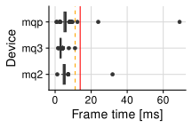<!-- -->

### CPU

``` r
d <- data_logcat_vrapi %>%
  filter(a == "moss" | a == "gorillatag" | a == "explorevr" | a == "vrchat") %>%
  filter(ts > 60) %>%
  filter(app > 0) %>%
  filter(i == 1) %>%
  filter(m == "replay") %>%
  filter(l == 16)

d %>%
  select(fname) %>%
  unique()
```

    ## # A tibble: 12 × 1
    ##    fname                                        
    ##    <chr>                                        
    ##  1 20240116-m-replay-d-mqp-a-gorillatag-l-16-i-1
    ##  2 20240116-m-replay-d-mqp-a-moss-l-16-i-1      
    ##  3 20240117-m-replay-d-mqp-a-explorevr-l-16-i-1 
    ##  4 20240118-m-replay-d-mq2-a-explorevr-l-16-i-1 
    ##  5 20240118-m-replay-d-mq2-a-gorillatag-l-16-i-1
    ##  6 20240118-m-replay-d-mq2-a-moss-l-16-i-1      
    ##  7 20240118-m-replay-d-mq2-a-vrchat-l-16-i-1    
    ##  8 20240118-m-replay-d-mq3-a-explorevr-l-16-i-1 
    ##  9 20240118-m-replay-d-mq3-a-gorillatag-l-16-i-1
    ## 10 20240118-m-replay-d-mq3-a-moss-l-16-i-1      
    ## 11 20240130-m-replay-d-mq3-a-vrchat-l-16-i-1    
    ## 12 20240130-m-replay-d-mqp-a-vrchat-l-16-i-1

``` r
d %>%
  ggplot(aes(x = cpu_util, y = d_h, fill = d_h)) +
  geom_boxplot() +
  stat_summary(fun=mean, geom="point", shape=21, size=2, color="black", fill="white") +
  xlim(0, 100) +
  labs(x = "CPU utilization [%]", y = "VR Device") +
  theme_half_open() +
  background_grid() +
  theme(legend.position="none", strip.background=element_rect(fill="white")) +
  facet_grid(~factor(game_h, levels=c(g_gorillatag, g_moss, g_explorevr, g_vrchat)), scales = "free_x") +
  scale_fill_manual(values=device_colors)
```

<!-- -->

### GPU

``` r
d <- data_logcat_vrapi %>%
  filter(a == "moss" | a == "gorillatag" | a == "explorevr" | a == "vrchat") %>%
  filter(ts > 60) %>%
  filter(app > 0) %>%
  filter(i == 1) %>%
  filter(m == "replay") %>%
  filter(l == 16)

d %>%
  give_stats(gpu_util)
```

    ## # A tibble: 12 × 21
    ##    game_h     d_h       i  mean stdev   min   q25 median   q75   q90   q95   q99
    ##    <chr>      <chr> <dbl> <dbl> <dbl> <dbl> <dbl>  <dbl> <dbl> <dbl> <dbl> <dbl>
    ##  1 Gorilla T… MQP       1  71.1  9.04    31    69   72    75.2  80    82    83  
    ##  2 Moss       MQP       1  61.9 14.5      8    50   57    77    79    81    83  
    ##  3 Nat. Geo.… MQP       1  76.2  4.70    37    74   76    79    81    82    85.0
    ##  4 Nat. Geo.… MQ2       1  58.8  5.74    19    55   58.5  62    66    68    73  
    ##  5 Gorilla T… MQ2       1  40.3  6.80    30    35   37    45    50    54    60  
    ##  6 Moss       MQ2       1  62.7  8.48    19    60   64    66    69    79    82  
    ##  7 VRChat     MQ2       1  59.9 19.7      7    47   58    69    92   100   100  
    ##  8 Nat. Geo.… MQ3       1  35.6  3.53    11    34   35    37    40    41    44  
    ##  9 Gorilla T… MQ3       1  36.8  4.96    29    33   35    40    45    46.0  50.0
    ## 10 Moss       MQ3       1  41.2  6.69    13    39   41    43    46    55    65  
    ## 11 VRChat     MQ3       1  39.4 15.7      9    28   34    52    58.4  73    81.0
    ## 12 VRChat     MQP       1  66.7 13.7     23    57   67    77.2  82    86    99  
    ## # ℹ 9 more variables: max <dbl>, iqr <dbl>, mean_maxd <dbl>, stdev_maxd <dbl>,
    ## #   min_maxd <dbl>, q25_maxd <dbl>, median_maxd <dbl>, q75_maxd <dbl>,
    ## #   max_maxd <dbl>

``` r
d %>%
  ggplot(aes(x = gpu_util, y = d_h, fill = d_h)) +
  geom_boxplot() +
  stat_summary(fun=mean, geom="point", shape=21, size=2, color="black", fill="white") +
  xlim(0, 100) +
  labs(x = "GPU utilization [%]", y = "VR Device") +
  theme_cowplot(15) +
  background_grid() +
  theme(legend.position = "none", strip.background=element_rect(fill="white")) +
  facet_grid(~factor(game_h, levels=c(g_gorillatag, g_moss, g_explorevr, g_vrchat)), scales = "free_x") +
  scale_fill_manual(values=device_colors)
```

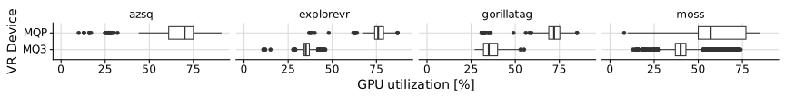<!-- -->

### Battery Usage

``` r
d <- data_batterymanager_companion %>%
  filter(a == "moss" | a == "gorillatag" | a == "explorevr" | a == "vrchat") %>%
  filter(ts > 60) %>%
  filter(i == 1) %>%
  filter(m == "replay") %>%
  filter(l == 16)

d %>%
  filter(d_h == "MQP") %>%
  give_stats(-power_w)
```

    ## # A tibble: 4 × 21
    ##   game_h      d_h       i  mean stdev   min   q25 median   q75   q90   q95   q99
    ##   <chr>       <chr> <int> <dbl> <dbl> <dbl> <dbl>  <dbl> <dbl> <dbl> <dbl> <dbl>
    ## 1 Gorilla Tag MQP       1  9.62 0.621  7.12  9.30   9.62 10.0  10.3  10.5  10.9 
    ## 2 Moss        MQP       1  7.78 0.877  6.06  7.04   7.42  8.74  8.99  9.09  9.57
    ## 3 Nat. Geo. … MQP       1  9.35 0.281  8.34  9.18   9.35  9.52  9.70  9.83 10.1 
    ## 4 VRChat      MQP       1  8.84 0.974  6.31  8.24   8.97  9.64  9.89 10.1  10.5 
    ## # ℹ 9 more variables: max <dbl>, iqr <dbl>, mean_maxd <dbl>, stdev_maxd <dbl>,
    ## #   min_maxd <dbl>, q25_maxd <dbl>, median_maxd <dbl>, q75_maxd <dbl>,
    ## #   max_maxd <dbl>

``` r
d %>%
  ggplot(aes(x=-power_w, y=d_h, fill = d_h)) +
  geom_boxplot() +
  stat_summary(fun=mean, geom="point", shape=21, size=2, color="black", fill="white") +
  theme(strip.background=element_rect(fill="white")) +
  facet_grid(~factor(game_h, levels=c(g_gorillatag, g_moss, g_explorevr, g_vrchat)), scales = "free_x") +
  theme_cowplot(15) +
  background_grid() +
  theme(legend.position="none", strip.background=element_rect(fill="white")) +
  xlim(0, 15) +
  labs(y = "VR Device", x = "Power [W]") +
  scale_fill_manual(values=device_colors)
```

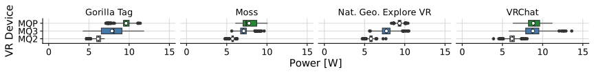<!-- -->

## Bandwidth Limits

``` r
d <- data_net_dev %>%
  # filter(ts > 5) %>%
  filter((a == "beatsaber" & i == 2) | (a == "noapp" & i == 1)) %>%
  filter(b == 70) %>%
  filter(ts > 60) %>%
  filter(ts <= 120) %>%
  group_by(a, d) %>%
  slice(2:n()) %>%
  ungroup()

d %>%
  select(fname) %>%
  unique()
```

    ## # A tibble: 2 × 1
    ##   fname                                       
    ##   <chr>                                       
    ## 1 20240222-m-replay-d-mqp-a-beatsaber-b-70-i-2
    ## 2 20240222-m-replay-d-mqp-a-noapp-b-70-i-1

``` r
d %>%
  ggplot(aes(x = ts, y = Mbps_rx, color = a)) +
  geom_line() +
  theme_cowplot(15) +
  background_grid() +
  ylim(0, NA) +
  theme(legend.position = c(0.05,0.3), legend.background = element_rect(fill=alpha("white", 0.7))) +
  labs(y = "Bandwidth [Mbps]         ", x = "Time [s]") +
  scale_color_manual("application", values=c(beatsaber=c_emph, noapp=c_norm), labels=c(beatsaber="Oculus", noapp="iperf3")) +
  coord_cartesian(clip="off") +
  theme(plot.margin=margin(0,0.2,0,0, "cm"))
```

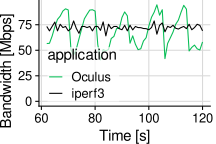<!-- -->

``` r
d <- data_net_dev %>%
  filter(ts > 5) %>%
  drop_na(b) %>%
  filter(a == "beatsaber") %>%
  filter(i == 2) %>%
  filter(b <= 100) %>%
  group_by(a, d_h) %>%
  slice(2:n()) %>%
  ungroup()

d %>%
  select(fname) %>%
  unique()
```

    ## # A tibble: 10 × 1
    ##    fname                                        
    ##    <chr>                                        
    ##  1 20240222-m-replay-d-mqp-a-beatsaber-b-10-i-2 
    ##  2 20240222-m-replay-d-mqp-a-beatsaber-b-100-i-2
    ##  3 20240222-m-replay-d-mqp-a-beatsaber-b-20-i-2 
    ##  4 20240222-m-replay-d-mqp-a-beatsaber-b-30-i-2 
    ##  5 20240222-m-replay-d-mqp-a-beatsaber-b-40-i-2 
    ##  6 20240222-m-replay-d-mqp-a-beatsaber-b-50-i-2 
    ##  7 20240222-m-replay-d-mqp-a-beatsaber-b-60-i-2 
    ##  8 20240222-m-replay-d-mqp-a-beatsaber-b-70-i-2 
    ##  9 20240222-m-replay-d-mqp-a-beatsaber-b-80-i-2 
    ## 10 20240222-m-replay-d-mqp-a-beatsaber-b-90-i-2

``` r
d %>%
  give_stats(Mbps_rx, by=c("a", "b"))
```

    ## # A tibble: 10 × 20
    ##    a             b  mean stdev   min   q25 median   q75   q90   q95   q99   max
    ##    <chr>     <int> <dbl> <dbl> <dbl> <dbl>  <dbl> <dbl> <dbl> <dbl> <dbl> <dbl>
    ##  1 beatsaber    10  18.4  4.43  7.51  16.4   20.2  21.4  22.5  23.4  25.0  26.1
    ##  2 beatsaber   100  91.7  2.25 77.5   90.7   91.8  93.0  93.9  94.6  95.5  96.6
    ##  3 beatsaber    20  21.4  2.36  5.51  20.9   21.5  21.9  22.6  23.0  28.4  35.1
    ##  4 beatsaber    30  31.9  2.83 13.3   31.1   31.9  32.5  33.6  34.4  41.9  51.1
    ##  5 beatsaber    40  42.3  5.13 16.4   39.0   42.2  45.7  48.2  49.9  55.4  58.9
    ##  6 beatsaber    50  52.7  8.87 29.2   46.4   52.2  59.7  64.2  66.0  73.2  76.9
    ##  7 beatsaber    60  62.0 14.1  29.3   51.2   61.6  73.1  80.0  85.0  88.0  89.0
    ##  8 beatsaber    70  70.4 15.5  35.1   56.9   72.2  83.9  90.0  91.0  93.9  94.5
    ##  9 beatsaber    80  81.3 14.4  39.3   71.4   89.4  92.0  93.3  93.6  94.8  96.3
    ## 10 beatsaber    90  91.5  2.99 68.1   90.9   92.0  93.0  94.0  94.9  95.7  96.1
    ## # ℹ 8 more variables: iqr <dbl>, mean_maxd <dbl>, stdev_maxd <dbl>,
    ## #   min_maxd <dbl>, q25_maxd <dbl>, median_maxd <dbl>, q75_maxd <dbl>,
    ## #   max_maxd <dbl>

``` r
d %>%
  ggplot(aes(x = Mbps_rx, y = factor(b))) +
  geom_boxplot() +
  stat_summary(fun=mean, geom="point", shape=21, size=2, color="black", fill="white") +
  annotate("rect", fill="white", xmin = 0, xmax = 100, ymin = 0.5, ymax = 1.5) +
  annotate("text", color="red", label="CRASH", x = 50, y = 1) +
  scale_x_continuous(breaks = seq(0, 100, by = 20), limits=c(0,NA)) +
  theme_cowplot(15) +
  background_grid(major = "xy", minor="x") +
  # xlim(0, NA) +
  labs(x = "BW measured [Mbps]", y = "BW limit [Mbps]   ") +
  coord_cartesian(clip="off") +
  theme(plot.margin=margin(0,0.2,0,0, "cm"))
```

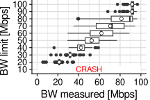<!-- -->

``` r
d <- data_logcat_vrapi %>%
  filter(ts > 5) %>%
  drop_na(b) %>%
  filter(a == "beatsaber") %>%
  filter(i == 2) %>%
  filter(b <= 100) %>%
  filter(app > 0)

d %>%
  select(fname) %>%
  unique()
```

    ## # A tibble: 10 × 1
    ##    fname                                        
    ##    <chr>                                        
    ##  1 20240222-m-replay-d-mqp-a-beatsaber-b-10-i-2 
    ##  2 20240222-m-replay-d-mqp-a-beatsaber-b-100-i-2
    ##  3 20240222-m-replay-d-mqp-a-beatsaber-b-20-i-2 
    ##  4 20240222-m-replay-d-mqp-a-beatsaber-b-30-i-2 
    ##  5 20240222-m-replay-d-mqp-a-beatsaber-b-40-i-2 
    ##  6 20240222-m-replay-d-mqp-a-beatsaber-b-50-i-2 
    ##  7 20240222-m-replay-d-mqp-a-beatsaber-b-60-i-2 
    ##  8 20240222-m-replay-d-mqp-a-beatsaber-b-70-i-2 
    ##  9 20240222-m-replay-d-mqp-a-beatsaber-b-80-i-2 
    ## 10 20240222-m-replay-d-mqp-a-beatsaber-b-90-i-2

``` r
d %>%
  ggplot(aes(x = app, y = factor(b))) +
  # geom_vline(xintercept = 11.1, color = "orange", linetype = "dashed") +
  # geom_vline(xintercept = 13.9, color = "red") +
  geom_boxplot() +
  stat_summary(fun=mean, geom="point", shape=21, size=2, color="black", fill="white") +
  xlim(0, NA) +
  labs(x = "Frame time [ms]", y = "BW limit [Mbps]  ") +
  theme_half_open() +
  background_grid() +
  theme(legend.position = c(.25,.45), legend.background = element_rect(fill=alpha("white", 0.75)))
```

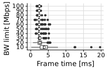<!-- -->

``` r
  # facet_grid(cols = vars(game))
```

``` r
d <- data_logcat_vrapi %>%
  filter(ts > 5) %>%
  drop_na(b) %>%
  filter(a == "beatsaber") %>%
  filter(i == 2) %>%
  filter(b <= 100) %>%
  filter(app > 0)

d %>%
  select(fname) %>%
  unique()
```

    ## # A tibble: 10 × 1
    ##    fname                                        
    ##    <chr>                                        
    ##  1 20240222-m-replay-d-mqp-a-beatsaber-b-10-i-2 
    ##  2 20240222-m-replay-d-mqp-a-beatsaber-b-100-i-2
    ##  3 20240222-m-replay-d-mqp-a-beatsaber-b-20-i-2 
    ##  4 20240222-m-replay-d-mqp-a-beatsaber-b-30-i-2 
    ##  5 20240222-m-replay-d-mqp-a-beatsaber-b-40-i-2 
    ##  6 20240222-m-replay-d-mqp-a-beatsaber-b-50-i-2 
    ##  7 20240222-m-replay-d-mqp-a-beatsaber-b-60-i-2 
    ##  8 20240222-m-replay-d-mqp-a-beatsaber-b-70-i-2 
    ##  9 20240222-m-replay-d-mqp-a-beatsaber-b-80-i-2 
    ## 10 20240222-m-replay-d-mqp-a-beatsaber-b-90-i-2

``` r
d %>%
  give_stats(fps_render, by=c("a", "b"))
```

    ## # A tibble: 10 × 20
    ##    a             b  mean stdev   min   q25 median   q75   q90   q95   q99   max
    ##    <chr>     <int> <dbl> <dbl> <int> <dbl>  <dbl> <dbl> <dbl> <dbl> <dbl> <int>
    ##  1 beatsaber    10  48.3 5.11     19    47     49    51    53    54    56    71
    ##  2 beatsaber   100  72.0 0.187    72    72     72    72    72    72    73    73
    ##  3 beatsaber    20  64.7 2.70     56    63     64    66    68    70    72    72
    ##  4 beatsaber    30  69.5 1.64     64    69     69    71    72    72    72    72
    ##  5 beatsaber    40  70.9 1.53     67    69     72    72    72    72    73    73
    ##  6 beatsaber    50  71.3 1.41     65    71     72    72    72    72    73    73
    ##  7 beatsaber    60  71.4 1.44     66    72     72    72    72    72    73    73
    ##  8 beatsaber    70  71.7 0.995    67    72     72    72    72    72    73    73
    ##  9 beatsaber    80  71.9 0.658    68    72     72    72    72    72    73    73
    ## 10 beatsaber    90  72.0 0.187    72    72     72    72    72    72    73    73
    ## # ℹ 8 more variables: iqr <dbl>, mean_maxd <dbl>, stdev_maxd <dbl>,
    ## #   min_maxd <int>, q25_maxd <dbl>, median_maxd <dbl>, q75_maxd <dbl>,
    ## #   max_maxd <int>

``` r
d %>%
  ggplot(aes(x = fps_render, y = factor(b))) +
  geom_vline(xintercept =72, color = "red") +
  geom_boxplot() +
  stat_summary(fun=mean, geom="point", shape=21, size=2, color="black", fill="white") +
  annotate("rect", fill="white", xmin = 0, xmax = 80, ymin = 0.5, ymax = 1.5) +
  annotate("text", color="red", label="CRASH", x = 38, y = 1) +
  xlim(0, NA) +
  theme_cowplot(15) +
  background_grid() +
  labs(x="Frames per second", y="Bandwidth [Mbps]       ") +
  coord_cartesian(clip="off") +
  theme(plot.margin=margin(0,0,0,0, "cm"))
```

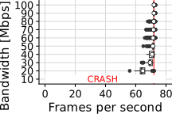<!-- -->

``` r
d <- data_logcat_vrapi %>%
  filter(ts > 5) %>%
  drop_na(b) %>%
  filter(a == "beatsaber") %>%
  filter(i == 2) %>%
  filter(b <= 100) %>%
  filter(app > 0)

d %>%
  select(fname) %>%
  unique()
```

    ## # A tibble: 10 × 1
    ##    fname                                        
    ##    <chr>                                        
    ##  1 20240222-m-replay-d-mqp-a-beatsaber-b-10-i-2 
    ##  2 20240222-m-replay-d-mqp-a-beatsaber-b-100-i-2
    ##  3 20240222-m-replay-d-mqp-a-beatsaber-b-20-i-2 
    ##  4 20240222-m-replay-d-mqp-a-beatsaber-b-30-i-2 
    ##  5 20240222-m-replay-d-mqp-a-beatsaber-b-40-i-2 
    ##  6 20240222-m-replay-d-mqp-a-beatsaber-b-50-i-2 
    ##  7 20240222-m-replay-d-mqp-a-beatsaber-b-60-i-2 
    ##  8 20240222-m-replay-d-mqp-a-beatsaber-b-70-i-2 
    ##  9 20240222-m-replay-d-mqp-a-beatsaber-b-80-i-2 
    ## 10 20240222-m-replay-d-mqp-a-beatsaber-b-90-i-2

``` r
d %>%
  ggplot(aes(x = gpu_util, y = factor(b))) +
  geom_boxplot() +
  stat_summary(fun=mean, geom="point", shape=21, size=2, color="black", fill="white") +
  annotate("rect", fill="white", xmin = 0, xmax = 100, ymin = 0.5, ymax = 1.5) +
  annotate("text", color="red", label="CRASH", x = 48, y = 1) +
  xlim(0, 100) +
  labs(x = "GPU utilization [%]", y = "Bandwidth [Mbps]       ") +
  theme_cowplot(15) +
  background_grid() +
  coord_cartesian(clip="off") +
  theme(plot.margin=margin(0,0.1,0,0, "cm"))
```

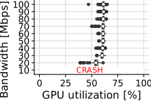<!-- -->

``` r
d <- data_batterymanager_companion %>%
  filter(ts > 5) %>%
  drop_na(b) %>%
  filter(a == "beatsaber") %>%
  filter(i == 2) %>%
  filter(b <= 100)

d %>%
  select(fname) %>%
  unique()
```

    ## # A tibble: 10 × 1
    ##    fname                                        
    ##    <chr>                                        
    ##  1 20240222-m-replay-d-mqp-a-beatsaber-b-10-i-2 
    ##  2 20240222-m-replay-d-mqp-a-beatsaber-b-100-i-2
    ##  3 20240222-m-replay-d-mqp-a-beatsaber-b-20-i-2 
    ##  4 20240222-m-replay-d-mqp-a-beatsaber-b-30-i-2 
    ##  5 20240222-m-replay-d-mqp-a-beatsaber-b-40-i-2 
    ##  6 20240222-m-replay-d-mqp-a-beatsaber-b-50-i-2 
    ##  7 20240222-m-replay-d-mqp-a-beatsaber-b-60-i-2 
    ##  8 20240222-m-replay-d-mqp-a-beatsaber-b-70-i-2 
    ##  9 20240222-m-replay-d-mqp-a-beatsaber-b-80-i-2 
    ## 10 20240222-m-replay-d-mqp-a-beatsaber-b-90-i-2

``` r
d %>%
  give_stats(-power_w, by = c("b"))
```

    ## # A tibble: 10 × 19
    ##        b  mean stdev   min   q25 median   q75   q90   q95   q99   max   iqr
    ##    <int> <dbl> <dbl> <dbl> <dbl>  <dbl> <dbl> <dbl> <dbl> <dbl> <dbl> <dbl>
    ##  1    10  8.45 0.253  7.01  8.39   8.47  8.58  8.63  8.71  8.84  8.88 0.190
    ##  2   100  9.29 0.342  7.39  9.27   9.35  9.42  9.49  9.54  9.65 10.4  0.151
    ##  3    20  8.99 0.397  7.04  8.88   9.01  9.20  9.39  9.52  9.69  9.98 0.320
    ##  4    30  9.04 0.362  6.98  8.97   9.09  9.18  9.31  9.39  9.63 10.2  0.210
    ##  5    40  8.98 0.334  7.16  8.94   9.04  9.11  9.17  9.22  9.48  9.67 0.168
    ##  6    50  9.14 0.295  7.32  9.10   9.17  9.26  9.35  9.41  9.50  9.53 0.151
    ##  7    60  9.21 0.317  7.37  9.16   9.26  9.34  9.42  9.48  9.68  9.69 0.171
    ##  8    70  9.14 0.377  6.87  9.11   9.20  9.29  9.37  9.40  9.74  9.81 0.183
    ##  9    80  9.22 0.359  7.21  9.15   9.30  9.38  9.46  9.50  9.65 10.0  0.231
    ## 10    90  9.22 0.305  7.56  9.19   9.25  9.33  9.41  9.47  9.63  9.73 0.137
    ## # ℹ 7 more variables: mean_maxd <dbl>, stdev_maxd <dbl>, min_maxd <dbl>,
    ## #   q25_maxd <dbl>, median_maxd <dbl>, q75_maxd <dbl>, max_maxd <dbl>

``` r
d %>%
  ggplot(aes(x=-power_w, y=factor(b))) +
  geom_boxplot() +
  stat_summary(fun=mean, geom="point", shape=21, size=2, color="black", fill="white") +
  annotate("rect", fill="white", xmin = 0, xmax = 10, ymin = 0.5, ymax = 1.5) +
  annotate("text", color="red", label="CRASH", x = 5, y = 1) +
  theme(strip.background=element_rect(fill="white")) +
  theme_cowplot(15) +
  background_grid() +
  theme(legend.position="none", strip.background=element_rect(fill="white")) +
  xlim(0, NA) +
  labs(y = "Bandwidth [Mbps]       ", x = "Power [W]") +
  scale_fill_manual(values=device_colors) +
  coord_cartesian(clip="off") +
  theme(plot.margin=margin(0,0.1,0,0, "cm"))
```

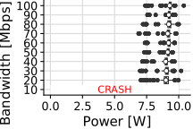<!-- -->

## Local vs Streamed

``` r
d <- data_batterymanager_companion %>%
  filter(ts > 5) %>%
  filter(fname == "20240222-m-replay-d-mqp-a-beatsaber-b-100-i-2" | fname == "20240223-m-record-d-mqp-a-beatsaber-l-4-i-1")

d %>%
  select(fname) %>%
  unique()
```

    ## # A tibble: 2 × 1
    ##   fname                                        
    ##   <chr>                                        
    ## 1 20240222-m-replay-d-mqp-a-beatsaber-b-100-i-2
    ## 2 20240223-m-record-d-mqp-a-beatsaber-l-4-i-1

``` r
d %>%
  give_stats(-power_w, by = c("fname"))
```

    ## # A tibble: 2 × 19
    ##   fname        mean stdev   min   q25 median   q75   q90   q95   q99   max   iqr
    ##   <chr>       <dbl> <dbl> <dbl> <dbl>  <dbl> <dbl> <dbl> <dbl> <dbl> <dbl> <dbl>
    ## 1 20240222-m…  9.29 0.342  7.39  9.27   9.35  9.42  9.49  9.54  9.65 10.4  0.151
    ## 2 20240223-m…  7.75 0.750  6.30  7.26   7.48  7.86  9.38  9.53  9.73  9.97 0.602
    ## # ℹ 7 more variables: mean_maxd <dbl>, stdev_maxd <dbl>, min_maxd <dbl>,
    ## #   q25_maxd <dbl>, median_maxd <dbl>, q75_maxd <dbl>, max_maxd <dbl>

``` r
d %>%
  mutate(setup = ifelse(is.na(b), "Local", "Stream")) %>%
  ggplot(aes(x=-power_w, y=setup)) +
  geom_boxplot() +
  stat_summary(fun=mean, geom="point", shape=21, size=2, color="black", fill="white") +
  theme(strip.background=element_rect(fill="white")) +
  theme_cowplot(15) +
  background_grid() +
  theme(legend.position="none", strip.background=element_rect(fill="white")) +
  xlim(0, NA) +
  labs(y = "Setup", x = "Power [W]") +
  scale_fill_manual(values=device_colors) +
  coord_cartesian(clip="off") +
  theme(plot.margin=margin(0,0.1,0,0, "cm"))
```

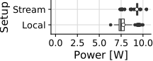<!-- -->

``` r
d <- data_logcat_vrapi %>%
  filter(ts > 5) %>%
  filter(fname == "20240222-m-replay-d-mqp-a-beatsaber-b-100-i-2" | fname == "20240223-m-record-d-mqp-a-beatsaber-l-4-i-1")


d %>%
  select(fname) %>%
  unique()
```

    ## # A tibble: 2 × 1
    ##   fname                                        
    ##   <chr>                                        
    ## 1 20240222-m-replay-d-mqp-a-beatsaber-b-100-i-2
    ## 2 20240223-m-record-d-mqp-a-beatsaber-l-4-i-1

``` r
d %>%
  give_stats(gpu_util, by = c("fname"))
```

    ## # A tibble: 2 × 19
    ##   fname        mean stdev   min   q25 median   q75   q90   q95   q99   max   iqr
    ##   <chr>       <dbl> <dbl> <dbl> <dbl>  <dbl> <dbl> <dbl> <dbl> <dbl> <dbl> <dbl>
    ## 1 20240222-m…  61.3  1.57    47    61     61  62    63      63  64      65  1   
    ## 2 20240223-m…  66.9  9.34     8    65     68  71.2  74.9    75  76.2    80  6.25
    ## # ℹ 7 more variables: mean_maxd <dbl>, stdev_maxd <dbl>, min_maxd <dbl>,
    ## #   q25_maxd <dbl>, median_maxd <dbl>, q75_maxd <dbl>, max_maxd <dbl>

``` r
d %>%
  mutate(setup = ifelse(is.na(b), "Local", "Stream")) %>%
  ggplot(aes(x = gpu_util, y = setup)) +
  geom_boxplot() +
  stat_summary(fun=mean, geom="point", shape=21, size=2, color="black", fill="white") +
  xlim(0, 100) +
  labs(x = "GPU utilization [%]", y = "Setup") +
  theme_cowplot(15) +
  background_grid() +
  coord_cartesian(clip="off") +
  theme(plot.margin=margin(0,0.2,0,0, "cm"))
```

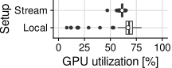<!-- -->

``` r
d <- data_logcat_vrapi %>%
  filter(ts > 5) %>%
  filter(fname == "20240222-m-replay-d-mqp-a-beatsaber-b-100-i-2" | fname == "20240223-m-record-d-mqp-a-beatsaber-l-4-i-1")


d %>%
  select(fname) %>%
  unique()
```

    ## # A tibble: 2 × 1
    ##   fname                                        
    ##   <chr>                                        
    ## 1 20240222-m-replay-d-mqp-a-beatsaber-b-100-i-2
    ## 2 20240223-m-record-d-mqp-a-beatsaber-l-4-i-1

``` r
d %>%
  give_stats(cpu_util, by = c("fname"))
```

    ## # A tibble: 2 × 19
    ##   fname        mean stdev   min   q25 median   q75   q90   q95   q99   max   iqr
    ##   <chr>       <dbl> <dbl> <dbl> <dbl>  <dbl> <dbl> <dbl> <dbl> <dbl> <dbl> <dbl>
    ## 1 20240222-m…  16.3  6.04     4    12     16    20    24  25.9  29.6    42     8
    ## 2 20240223-m…  29.2  6.54    16    26     29    32    34  37.4  49.4   100     6
    ## # ℹ 7 more variables: mean_maxd <dbl>, stdev_maxd <dbl>, min_maxd <dbl>,
    ## #   q25_maxd <dbl>, median_maxd <dbl>, q75_maxd <dbl>, max_maxd <dbl>

``` r
d %>%
  mutate(setup = ifelse(is.na(b), "Local", "Stream")) %>%
  ggplot(aes(x = cpu_util, y = setup)) +
  geom_boxplot() +
  stat_summary(fun=mean, geom="point", shape=21, size=2, color="black", fill="white") +
  xlim(0, 100) +
  labs(x = "CPU utilization [%]", y = "Setup") +
  theme_cowplot(15) +
  background_grid() +
  coord_cartesian(clip="off") +
  theme(plot.margin=margin(0,0.2,0,0, "cm"))
```

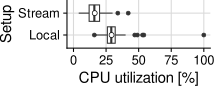<!-- -->

``` r
d <- data_logcat_vrapi %>%
  filter(ts > 5) %>%
  filter(fname == "20240222-m-replay-d-mqp-a-beatsaber-b-100-i-2" | fname == "20240223-m-record-d-mqp-a-beatsaber-l-4-i-1")


d %>%
  select(fname) %>%
  unique()
```

    ## # A tibble: 2 × 1
    ##   fname                                        
    ##   <chr>                                        
    ## 1 20240222-m-replay-d-mqp-a-beatsaber-b-100-i-2
    ## 2 20240223-m-record-d-mqp-a-beatsaber-l-4-i-1

``` r
d %>%
  give_stats(fps_render, by = c("fname"))
```

    ## # A tibble: 2 × 19
    ##   fname        mean stdev   min   q25 median   q75   q90   q95   q99   max   iqr
    ##   <chr>       <dbl> <dbl> <int> <dbl>  <dbl> <dbl> <dbl> <dbl> <dbl> <int> <dbl>
    ## 1 20240222-m…  72.0 0.187    72    72     72    72    72    72    73    73     0
    ## 2 20240223-m…  89.0 7.25     29    90     90    91    91    91    91    91     1
    ## # ℹ 7 more variables: mean_maxd <dbl>, stdev_maxd <dbl>, min_maxd <int>,
    ## #   q25_maxd <dbl>, median_maxd <dbl>, q75_maxd <dbl>, max_maxd <int>

``` r
d %>%
  mutate(setup = ifelse(is.na(b), "Local", "Stream")) %>%
  ggplot(aes(x = fps_render, y = setup)) +
  geom_boxplot() +
  stat_summary(fun=mean, geom="point", shape=21, size=2, color="black", fill="white") +
  xlim(0, NA) +
  labs(x = "Frames per second", y = "Setup") +
  theme_cowplot(15) +
  background_grid() +
  coord_cartesian(clip="off") +
  theme(plot.margin=margin(0,0.2,0,0, "cm"))
```

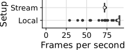<!-- -->

``` r
d <- data_net_dev %>%
  filter(ts > 5) %>%
  filter(fname == "20240222-m-replay-d-mqp-a-beatsaber-b-100-i-2" | fname == "20240223-m-record-d-mqp-a-beatsaber-l-4-i-1")

d %>%
  select(fname) %>%
  unique()
```

    ## # A tibble: 2 × 1
    ##   fname                                        
    ##   <chr>                                        
    ## 1 20240222-m-replay-d-mqp-a-beatsaber-b-100-i-2
    ## 2 20240223-m-record-d-mqp-a-beatsaber-l-4-i-1

``` r
d %>%
  give_stats(Mbps_rx, by = c("fname"))
```

    ## # A tibble: 2 × 19
    ##   fname        mean  stdev     min     q25  median     q75     q90    q95    q99
    ##   <chr>       <dbl>  <dbl>   <dbl>   <dbl>   <dbl>   <dbl>   <dbl>  <dbl>  <dbl>
    ## 1 20240222… 91.7    2.25   77.5    90.7    91.8    93.0    93.9    94.6   95.5  
    ## 2 20240223…  0.0383 0.0310  0.0233  0.0244  0.0259  0.0373  0.0618  0.112  0.178
    ## # ℹ 9 more variables: max <dbl>, iqr <dbl>, mean_maxd <dbl>, stdev_maxd <dbl>,
    ## #   min_maxd <dbl>, q25_maxd <dbl>, median_maxd <dbl>, q75_maxd <dbl>,
    ## #   max_maxd <dbl>

``` r
d %>%
  mutate(setup = ifelse(is.na(b), "Local", "Stream")) %>%
  ggplot(aes(x = Mbps_rx, y = setup)) +
  geom_boxplot() +
  stat_summary(fun=mean, geom="point", shape=21, size=2, color="black", fill="white") +
  scale_x_continuous(breaks = seq(0, 100, by = 20), limits=c(0,NA)) +
  theme_cowplot(15) +
  background_grid(major = "xy", minor="x") +
  # xlim(0, NA) +
  labs(x = "Bandwidth [Mbps]", y = "Setup") +
  coord_cartesian(clip="off") +
  theme(plot.margin=margin(0,0.4,0,0, "cm"))
```

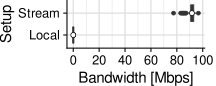<!-- -->

## Hand Tracking

``` r
d <- data_logcat_vrapi %>%
  filter(ts > 5) %>%
  filter(ts <= 600) %>%
  filter(a == "wordle") %>%
  filter(i == 2)

d %>%
  select(fname) %>%
  unique()
```

    ## # A tibble: 2 × 1
    ##   fname                                              
    ##   <chr>                                              
    ## 1 20240224-m-baseline-d-mqp-a-wordle-i-2-n-controller
    ## 2 20240224-m-baseline-d-mqp-a-wordle-i-2-n-hand

``` r
d %>%
  give_stats(cpu_util, by = c("fname"))
```

    ## # A tibble: 2 × 19
    ##   fname        mean stdev   min   q25 median   q75   q90   q95   q99   max   iqr
    ##   <chr>       <dbl> <dbl> <dbl> <dbl>  <dbl> <dbl> <dbl> <dbl> <dbl> <dbl> <dbl>
    ## 1 20240224-m…  48.6  17.3    21    34     46    63    71    75  93.1   100    29
    ## 2 20240224-m…  41.0  16.4    17    28     36    53    66    71  82.2    97    25
    ## # ℹ 7 more variables: mean_maxd <dbl>, stdev_maxd <dbl>, min_maxd <dbl>,
    ## #   q25_maxd <dbl>, median_maxd <dbl>, q75_maxd <dbl>, max_maxd <dbl>

``` r
d %>%
  mutate(setup = ifelse(is.na(b), "Local", "Stream")) %>%
  ggplot(aes(x = fps_render, y = n)) +
  geom_vline(xintercept = 90, color = "red") +
  geom_boxplot() +
  stat_summary(fun=mean, geom="point", shape=21, size=2, color="black", fill="white") +
  xlim(0, 100) +
  labs(x = "Frames per second", y = "Setup    ") +
  theme_cowplot(15) +
  background_grid() +
  coord_cartesian(clip="off") +
  theme(plot.margin=margin(0,0.3,0,0, "cm"))
```

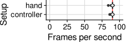<!-- -->

``` r
d <- data_logcat_vrapi %>%
  filter(ts > 5) %>%
  filter(ts <= 600) %>%
  filter(a == "wordle") %>%
  filter(i == 2)

d %>%
  select(fname) %>%
  unique()
```

    ## # A tibble: 2 × 1
    ##   fname                                              
    ##   <chr>                                              
    ## 1 20240224-m-baseline-d-mqp-a-wordle-i-2-n-controller
    ## 2 20240224-m-baseline-d-mqp-a-wordle-i-2-n-hand

``` r
d %>%
  give_stats(cpu_util, by = c("fname"))
```

    ## # A tibble: 2 × 19
    ##   fname        mean stdev   min   q25 median   q75   q90   q95   q99   max   iqr
    ##   <chr>       <dbl> <dbl> <dbl> <dbl>  <dbl> <dbl> <dbl> <dbl> <dbl> <dbl> <dbl>
    ## 1 20240224-m…  48.6  17.3    21    34     46    63    71    75  93.1   100    29
    ## 2 20240224-m…  41.0  16.4    17    28     36    53    66    71  82.2    97    25
    ## # ℹ 7 more variables: mean_maxd <dbl>, stdev_maxd <dbl>, min_maxd <dbl>,
    ## #   q25_maxd <dbl>, median_maxd <dbl>, q75_maxd <dbl>, max_maxd <dbl>

``` r
d %>%
  mutate(setup = ifelse(is.na(b), "Local", "Stream")) %>%
  ggplot(aes(x = cpu_util, y = n)) +
  geom_boxplot() +
  stat_summary(fun=mean, geom="point", shape=21, size=2, color="black", fill="white") +
  xlim(0, 100) +
  labs(x = "CPU utilization [%]", y = "Setup    ") +
  theme_cowplot(15) +
  background_grid() +
  coord_cartesian(clip="off") +
  theme(plot.margin=margin(0,0.3,0,0, "cm"))
```

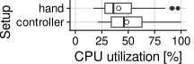<!-- -->

``` r
d <- data_logcat_vrapi %>%
  filter(ts > 5) %>%
  filter(ts <= 600) %>%
  filter(a == "wordle") %>%
  filter(i == 2)

d %>%
  select(fname) %>%
  unique()
```

    ## # A tibble: 2 × 1
    ##   fname                                              
    ##   <chr>                                              
    ## 1 20240224-m-baseline-d-mqp-a-wordle-i-2-n-controller
    ## 2 20240224-m-baseline-d-mqp-a-wordle-i-2-n-hand

``` r
d %>%
  give_stats(cpu_level, by = c("fname"))
```

    ## # A tibble: 2 × 19
    ##   fname        mean stdev   min   q25 median   q75   q90   q95   q99   max   iqr
    ##   <chr>       <dbl> <dbl> <int> <dbl>  <dbl> <dbl> <dbl> <dbl> <dbl> <int> <dbl>
    ## 1 20240224-m…  2.20 0.617     2     2      2     2     3     3     5     5     0
    ## 2 20240224-m…  2.09 0.395     2     2      2     2     2     3     5     5     0
    ## # ℹ 7 more variables: mean_maxd <dbl>, stdev_maxd <dbl>, min_maxd <int>,
    ## #   q25_maxd <dbl>, median_maxd <dbl>, q75_maxd <dbl>, max_maxd <int>

``` r
d %>%
  mutate(setup = ifelse(is.na(b), "Local", "Stream")) %>%
  ggplot(aes(x = cpu_level, y = n)) +
  geom_boxplot() +
  stat_summary(fun=mean, geom="point", shape=21, size=2, color="black", fill="white") +
  xlim(0, NA) +
  labs(x = "CPU level", y = "Setup    ") +
  theme_cowplot(15) +
  background_grid() +
  coord_cartesian(clip="off") +
  theme(plot.margin=margin(0,0.2,0,0, "cm"))
```

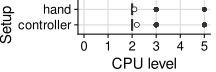<!-- -->

``` r
d <- data_logcat_vrapi %>%
  filter(ts > 5) %>%
  filter(ts <= 600) %>%
  filter(a == "wordle") %>%
  filter(i == 2)

d %>%
  select(fname) %>%
  unique()
```

    ## # A tibble: 2 × 1
    ##   fname                                              
    ##   <chr>                                              
    ## 1 20240224-m-baseline-d-mqp-a-wordle-i-2-n-controller
    ## 2 20240224-m-baseline-d-mqp-a-wordle-i-2-n-hand

``` r
d %>%
  give_stats(cpu_util, by = c("fname"))
```

    ## # A tibble: 2 × 19
    ##   fname        mean stdev   min   q25 median   q75   q90   q95   q99   max   iqr
    ##   <chr>       <dbl> <dbl> <dbl> <dbl>  <dbl> <dbl> <dbl> <dbl> <dbl> <dbl> <dbl>
    ## 1 20240224-m…  48.6  17.3    21    34     46    63    71    75  93.1   100    29
    ## 2 20240224-m…  41.0  16.4    17    28     36    53    66    71  82.2    97    25
    ## # ℹ 7 more variables: mean_maxd <dbl>, stdev_maxd <dbl>, min_maxd <dbl>,
    ## #   q25_maxd <dbl>, median_maxd <dbl>, q75_maxd <dbl>, max_maxd <dbl>

``` r
d %>%
  mutate(setup = ifelse(is.na(b), "Local", "Stream")) %>%
  ggplot(aes(x = gpu_util, y = n)) +
  geom_boxplot() +
  stat_summary(fun=mean, geom="point", shape=21, size=2, color="black", fill="white") +
  xlim(0, 100) +
  labs(x = "GPU utilization [%] ", y = "Setup    ") +
  theme_cowplot(15) +
  background_grid() +
  coord_cartesian(clip="off") +
  theme(plot.margin=margin(0,0.2,0,0, "cm"))
```

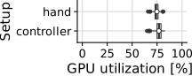<!-- -->

``` r
d <- data_logcat_vrapi %>%
  filter(ts > 5) %>%
  filter(ts <= 600) %>%
  filter(a == "wordle") %>%
  filter(i == 2)

d %>%
  select(fname) %>%
  unique()
```

    ## # A tibble: 2 × 1
    ##   fname                                              
    ##   <chr>                                              
    ## 1 20240224-m-baseline-d-mqp-a-wordle-i-2-n-controller
    ## 2 20240224-m-baseline-d-mqp-a-wordle-i-2-n-hand

``` r
d %>%
  give_stats(gpu_level, by = c("fname"))
```

    ## # A tibble: 2 × 19
    ##   fname        mean stdev   min   q25 median   q75   q90   q95   q99   max   iqr
    ##   <chr>       <dbl> <dbl> <int> <dbl>  <dbl> <dbl> <dbl> <dbl> <dbl> <int> <dbl>
    ## 1 20240224-m…  3.06 0.242     3     3      3     3     3     4     4     4     0
    ## 2 20240224-m…  3.02 0.129     3     3      3     3     3     3     4     4     0
    ## # ℹ 7 more variables: mean_maxd <dbl>, stdev_maxd <dbl>, min_maxd <int>,
    ## #   q25_maxd <dbl>, median_maxd <dbl>, q75_maxd <dbl>, max_maxd <int>

``` r
d %>%
  mutate(setup = ifelse(is.na(b), "Local", "Stream")) %>%
  ggplot(aes(x = gpu_level, y = n)) +
  geom_boxplot() +
  stat_summary(fun=mean, geom="point", shape=21, size=2, color="black", fill="white") +
  xlim(0, NA) +
  labs(x = "CPU level", y = "Setup    ") +
  theme_cowplot(15) +
  background_grid() +
  coord_cartesian(clip="off") +
  theme(plot.margin=margin(0,0.2,0,0, "cm"))
```

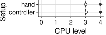<!-- -->

``` r
d <- data_batterymanager_companion %>%
  filter(ts > 5) %>%
  filter(ts <= 600) %>%
  filter(a == "wordle") %>%
  filter(i == 2)

d %>%
  select(fname) %>%
  unique()
```

    ## # A tibble: 2 × 1
    ##   fname                                              
    ##   <chr>                                              
    ## 1 20240224-m-baseline-d-mqp-a-wordle-i-2-n-controller
    ## 2 20240224-m-baseline-d-mqp-a-wordle-i-2-n-hand

``` r
d %>%
  give_stats(-power_w, by = c("fname"))
```

    ## # A tibble: 2 × 19
    ##   fname        mean stdev   min   q25 median   q75   q90   q95   q99   max   iqr
    ##   <chr>       <dbl> <dbl> <dbl> <dbl>  <dbl> <dbl> <dbl> <dbl> <dbl> <dbl> <dbl>
    ## 1 20240224-m…  8.89 0.386  8.13  8.62   8.82  9.11  9.40  9.62 10.1   10.5 0.490
    ## 2 20240224-m…  8.89 0.306  8.31  8.67   8.84  9.08  9.30  9.40  9.94  10.8 0.404
    ## # ℹ 7 more variables: mean_maxd <dbl>, stdev_maxd <dbl>, min_maxd <dbl>,
    ## #   q25_maxd <dbl>, median_maxd <dbl>, q75_maxd <dbl>, max_maxd <dbl>

``` r
d %>%
  mutate(setup = ifelse(is.na(b), "Local", "Stream")) %>%
  ggplot(aes(x=-power_w, y=n)) +
  geom_boxplot() +
  stat_summary(fun=mean, geom="point", shape=21, size=2, color="black", fill="white") +
  theme(strip.background=element_rect(fill="white")) +
  theme_cowplot(15) +
  background_grid() +
  theme(legend.position="none", strip.background=element_rect(fill="white")) +
  xlim(0, NA) +
  labs(y = "Setup    ", x = "Power [W]") +
  scale_fill_manual(values=device_colors) +
  coord_cartesian(clip="off") +
  theme(plot.margin=margin(0,0.1,0,0, "cm"))
```

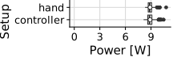<!-- -->

## Performance Variability

### Local Apps

#### Gorilla Tag

##### Frames

The plot below clearly shows the initialization phase of the experiment
run. Every shade of blue is one run. In each run, the number of frames
per second drops to zero for a brief moment, before maintaining constant
good performance These first few seconds are typically spent in a
loading screen, and do not reflect the performance of the system as
experienced by the user. Therefore, it makes sense to cut out the first
few seconds of the experiments in most plots.

``` r
d <- data_logcat_vrapi %>%
  filter(a == "gorillatag") %>%
  filter(d_h == "MQ3") %>%
  filter(ts < 60)

d %>%
  ggplot(aes(x = ts, y = fps_render, group = i, color = i)) +
  geom_line() +
  ylim(0, NA) +
  theme_half_open() +
  background_grid() +
  theme(legend.position = "none") +
  labs(x = "Time [s]", y = "Frame time [ms]  ")
```

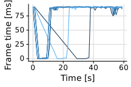<!-- -->

``` r
d <- data_logcat_vrapi %>%
  filter(a == "gorillatag") %>%
  filter(d_h == "MQ3") %>%
  filter(i <= 8) %>%
  filter(ts > 60)

d %>%
  select(fname) %>%
  unique()
```

    ## # A tibble: 8 × 1
    ##   fname                                        
    ##   <chr>                                        
    ## 1 20240118-m-replay-d-mq3-a-gorillatag-l-16-i-1
    ## 2 20240118-m-replay-d-mq3-a-gorillatag-l-16-i-2
    ## 3 20240118-m-replay-d-mq3-a-gorillatag-l-16-i-3
    ## 4 20240118-m-replay-d-mq3-a-gorillatag-l-16-i-4
    ## 5 20240118-m-replay-d-mq3-a-gorillatag-l-16-i-5
    ## 6 20240118-m-replay-d-mq3-a-gorillatag-l-16-i-6
    ## 7 20240118-m-replay-d-mq3-a-gorillatag-l-16-i-7
    ## 8 20240118-m-replay-d-mq3-a-gorillatag-l-16-i-8

``` r
d %>%
  ggplot(aes(x = fps_render, group = i, y = i)) +
  geom_boxplot() +
  xlim(0, NA) +
  labs(x = "Frames per second", y = "Iteration") +
  theme_cowplot(15) +
  background_grid() +
  coord_cartesian(clip="off") +
  theme(plot.margin=margin(0,0,0,0, "cm"))
```

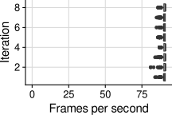<!-- -->

``` r
d <- data_logcat_vrapi %>%
  filter(a == "gorillatag") %>%
  filter(d_h == "MQ3") %>%
  filter(i <= 8) %>%
  filter(ts > 60)

d %>%
  select(fname) %>%
  unique()
```

    ## # A tibble: 8 × 1
    ##   fname                                        
    ##   <chr>                                        
    ## 1 20240118-m-replay-d-mq3-a-gorillatag-l-16-i-1
    ## 2 20240118-m-replay-d-mq3-a-gorillatag-l-16-i-2
    ## 3 20240118-m-replay-d-mq3-a-gorillatag-l-16-i-3
    ## 4 20240118-m-replay-d-mq3-a-gorillatag-l-16-i-4
    ## 5 20240118-m-replay-d-mq3-a-gorillatag-l-16-i-5
    ## 6 20240118-m-replay-d-mq3-a-gorillatag-l-16-i-6
    ## 7 20240118-m-replay-d-mq3-a-gorillatag-l-16-i-7
    ## 8 20240118-m-replay-d-mq3-a-gorillatag-l-16-i-8

``` r
d %>%
  ggplot(aes(x = app, group = i, y = i)) +
  geom_boxplot() +
  geom_vline(xintercept = 11.1, color = "orange", linetype = "dashed") +
  geom_vline(xintercept = 13.9, color = "red") +
  xlim(0, NA) +
  theme_cowplot(15) +
  background_grid() +
  labs(x="Frame time [ms]", y="Iteration") +
  coord_cartesian(clip="off") +
  theme(plot.margin=margin(0,0,0,0, "cm"))
```

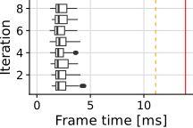<!-- -->

##### GPU

``` r
d <- data_logcat_vrapi %>%
  filter(a == "gorillatag") %>%
  filter(d_h == "MQ3") %>%
  filter(i <= 8) %>%
  filter(ts > 60)

d %>%
  select(fname) %>%
  unique()
```

    ## # A tibble: 8 × 1
    ##   fname                                        
    ##   <chr>                                        
    ## 1 20240118-m-replay-d-mq3-a-gorillatag-l-16-i-1
    ## 2 20240118-m-replay-d-mq3-a-gorillatag-l-16-i-2
    ## 3 20240118-m-replay-d-mq3-a-gorillatag-l-16-i-3
    ## 4 20240118-m-replay-d-mq3-a-gorillatag-l-16-i-4
    ## 5 20240118-m-replay-d-mq3-a-gorillatag-l-16-i-5
    ## 6 20240118-m-replay-d-mq3-a-gorillatag-l-16-i-6
    ## 7 20240118-m-replay-d-mq3-a-gorillatag-l-16-i-7
    ## 8 20240118-m-replay-d-mq3-a-gorillatag-l-16-i-8

``` r
d %>%
  give_stats(gpu_util)
```

    ## # A tibble: 8 × 21
    ##   game_h      d_h       i  mean stdev   min   q25 median   q75   q90   q95   q99
    ##   <chr>       <chr> <dbl> <dbl> <dbl> <dbl> <dbl>  <dbl> <dbl> <dbl> <dbl> <dbl>
    ## 1 Gorilla Tag MQ3       1  36.8  4.96    29    33     35    40    45  46.0  50.0
    ## 2 Gorilla Tag MQ3       2  36.5  5.09    28    32     35    40    45  46    49  
    ## 3 Gorilla Tag MQ3       3  36.1  5.17    28    32     34    41    44  45    48  
    ## 4 Gorilla Tag MQ3       4  36.0  4.62    28    32     35    39    43  45    47.0
    ## 5 Gorilla Tag MQ3       5  36.7  4.56    28    33     36    40    43  45    48  
    ## 6 Gorilla Tag MQ3       6  35.4  4.83    27    31     34    39    42  44    48  
    ## 7 Gorilla Tag MQ3       7  36.6  5.04    29    32     35    41    44  46    48  
    ## 8 Gorilla Tag MQ3       8  36.7  4.69    28    33     36    40    43  45    49  
    ## # ℹ 9 more variables: max <dbl>, iqr <dbl>, mean_maxd <dbl>, stdev_maxd <dbl>,
    ## #   min_maxd <dbl>, q25_maxd <dbl>, median_maxd <dbl>, q75_maxd <dbl>,
    ## #   max_maxd <dbl>

``` r
d %>%  
  ggplot(aes(x = gpu_util, group = i, y = i)) +
  geom_boxplot() +
  xlim(0, 100) +
  labs(x = "GPU utilization [%]", y = "Iteration") +
  theme_cowplot(15) +
  background_grid() +
  coord_cartesian(clip="off") +
  theme(plot.margin=margin(0,0.2,0,0, "cm"))
```

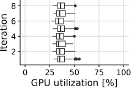<!-- -->

##### CPU

``` r
d <- data_logcat_vrapi %>%
  filter(a == "gorillatag") %>%
  filter(d_h == "MQ3") %>%
  filter(i <= 8) %>%
  filter(ts > 60)

d %>%
  select(fname) %>%
  unique()
```

    ## # A tibble: 8 × 1
    ##   fname                                        
    ##   <chr>                                        
    ## 1 20240118-m-replay-d-mq3-a-gorillatag-l-16-i-1
    ## 2 20240118-m-replay-d-mq3-a-gorillatag-l-16-i-2
    ## 3 20240118-m-replay-d-mq3-a-gorillatag-l-16-i-3
    ## 4 20240118-m-replay-d-mq3-a-gorillatag-l-16-i-4
    ## 5 20240118-m-replay-d-mq3-a-gorillatag-l-16-i-5
    ## 6 20240118-m-replay-d-mq3-a-gorillatag-l-16-i-6
    ## 7 20240118-m-replay-d-mq3-a-gorillatag-l-16-i-7
    ## 8 20240118-m-replay-d-mq3-a-gorillatag-l-16-i-8

``` r
d %>%
  give_stats(cpu_util)
```

    ## # A tibble: 8 × 21
    ##   game_h      d_h       i  mean stdev   min   q25 median   q75   q90   q95   q99
    ##   <chr>       <chr> <dbl> <dbl> <dbl> <dbl> <dbl>  <dbl> <dbl> <dbl> <dbl> <dbl>
    ## 1 Gorilla Tag MQ3       1  51.2  5.41    37    47     51    55    58    60  64.0
    ## 2 Gorilla Tag MQ3       2  56.0  5.23    39    53     56    59    63    65  69  
    ## 3 Gorilla Tag MQ3       3  48.9  5.27    36    45     49    52    56    57  62  
    ## 4 Gorilla Tag MQ3       4  51.5  5.10    37    48     52    55    58    60  63.0
    ## 5 Gorilla Tag MQ3       5  58.3  4.59    43    55     58    61    64    65  71  
    ## 6 Gorilla Tag MQ3       6  53.7  4.27    42    51     54    56    59    61  64  
    ## 7 Gorilla Tag MQ3       7  59.3  4.50    47    56     59    62    65    67  71  
    ## 8 Gorilla Tag MQ3       8  54.3  4.21    44    51     54    57    60    61  66  
    ## # ℹ 9 more variables: max <dbl>, iqr <dbl>, mean_maxd <dbl>, stdev_maxd <dbl>,
    ## #   min_maxd <dbl>, q25_maxd <dbl>, median_maxd <dbl>, q75_maxd <dbl>,
    ## #   max_maxd <dbl>

``` r
d %>%
  ggplot(aes(x = cpu_util, group = i, y = i)) +
  geom_boxplot() +
  xlim(0, 100) +
  labs(x = "CPU utilization [%]", y = "Iteration") +
  theme_cowplot(15) +
  background_grid() +
  coord_cartesian(clip="off") +
  theme(legend.position = "none", plot.margin=margin(0,0.2,0,0, "cm"))
```

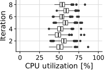<!-- -->

##### Network

Variability of network usage.

``` r
d <- data_net_dev %>%
  filter(a == "gorillatag") %>%
  filter(d_h == "MQ3") %>%
  filter(i <= 8) %>%
  filter(ts > 60)

d %>%
  select(fname) %>%
  unique()
```

    ## # A tibble: 8 × 1
    ##   fname                                        
    ##   <chr>                                        
    ## 1 20240118-m-replay-d-mq3-a-gorillatag-l-16-i-1
    ## 2 20240118-m-replay-d-mq3-a-gorillatag-l-16-i-2
    ## 3 20240118-m-replay-d-mq3-a-gorillatag-l-16-i-3
    ## 4 20240118-m-replay-d-mq3-a-gorillatag-l-16-i-4
    ## 5 20240118-m-replay-d-mq3-a-gorillatag-l-16-i-5
    ## 6 20240118-m-replay-d-mq3-a-gorillatag-l-16-i-6
    ## 7 20240118-m-replay-d-mq3-a-gorillatag-l-16-i-7
    ## 8 20240118-m-replay-d-mq3-a-gorillatag-l-16-i-8

``` r
d %>%
  give_stats(Mbps_rx)
```

    ## # A tibble: 8 × 21
    ##   game_h    d_h       i  mean  stdev    min   q25 median   q75   q90   q95   q99
    ##   <chr>     <chr> <dbl> <dbl>  <dbl>  <dbl> <dbl>  <dbl> <dbl> <dbl> <dbl> <dbl>
    ## 1 Gorilla … MQ3       1 0.204 0.0304 0.137  0.185  0.201 0.219 0.237 0.249 0.301
    ## 2 Gorilla … MQ3       2 0.190 0.0384 0.0294 0.171  0.189 0.205 0.223 0.242 0.341
    ## 3 Gorilla … MQ3       3 0.213 0.0363 0.132  0.191  0.208 0.229 0.252 0.270 0.373
    ## 4 Gorilla … MQ3       4 0.168 0.0358 0.0708 0.149  0.167 0.183 0.204 0.217 0.301
    ## 5 Gorilla … MQ3       5 0.199 0.0463 0.136  0.177  0.192 0.212 0.231 0.251 0.362
    ## 6 Gorilla … MQ3       6 0.210 0.0341 0.142  0.189  0.205 0.225 0.246 0.264 0.356
    ## 7 Gorilla … MQ3       7 0.218 0.0384 0.131  0.193  0.214 0.237 0.261 0.278 0.355
    ## 8 Gorilla … MQ3       8 0.217 0.0466 0.161  0.196  0.212 0.229 0.248 0.263 0.343
    ## # ℹ 9 more variables: max <dbl>, iqr <dbl>, mean_maxd <dbl>, stdev_maxd <dbl>,
    ## #   min_maxd <dbl>, q25_maxd <dbl>, median_maxd <dbl>, q75_maxd <dbl>,
    ## #   max_maxd <dbl>

``` r
d %>%
  ggplot(aes(x = Mbps_rx, y = i, group = i)) +
  geom_boxplot() +
  labs(x = "Bytes received [Mbps]", y = "Iteration") +
  theme_cowplot(15) +
  background_grid() +
  coord_cartesian(clip="off") +
  theme(legend.position = "none", plot.margin=margin(0,0.2,0,0, "cm"))
```

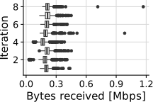<!-- -->

``` r
data_net_dev %>%
  filter(a == "gorillatag") %>%
  filter(d_h == "MQ3") %>%
  filter(i <= 8) %>%
  filter(ts > 60)
```

    ## # A tibble: 7,193 × 44
    ##       ts  rx_bytes rx_packets rx_errs rx_drop rx_fifo rx_frame rx_compressed
    ##    <int>     <dbl>      <int>   <int>   <int>   <int>    <int>         <int>
    ##  1    61 238625176     281557       0       0       0        0             0
    ##  2    62 238655057     281693       0       0       0        0             0
    ##  3    63 238680691     281826       0       0       0        0             0
    ##  4    64 238706651     281962       0       0       0        0             0
    ##  5    65 238729432     282080       0       0       0        0             0
    ##  6    66 238773500     282296       0       0       0        0             0
    ##  7    67 238806906     282446       0       0       0        0             0
    ##  8    68 238839091     282602       0       0       0        0             0
    ##  9    69 238866916     282744       0       0       0        0             0
    ## 10    70 238895136     282881       0       0       0        0             0
    ## # ℹ 7,183 more rows
    ## # ℹ 36 more variables: rx_multicast <int>, tx_bytes <dbl>, tx_packets <int>,
    ## #   tx_errs <int>, tx_drop <int>, tx_fifo <int>, tx_colls <int>,
    ## #   tx_carrier <int>, tx_compressed <int>, date <int>, a <chr>, n <chr>,
    ## #   e <chr>, src <chr>, dst <chr>, airline <chr>, fname <chr>, ts_m <dbl>,
    ## #   m <chr>, d <chr>, l <int>, i <dbl>, song <chr>, diff <chr>, b <int>,
    ## #   p <dbl>, d_h <chr>, game_h <chr>, bps_tx <dbl>, kbps_tx <dbl>, …

``` r
d %>%
  select(fname) %>%
  unique()
```

    ## # A tibble: 8 × 1
    ##   fname                                        
    ##   <chr>                                        
    ## 1 20240118-m-replay-d-mq3-a-gorillatag-l-16-i-1
    ## 2 20240118-m-replay-d-mq3-a-gorillatag-l-16-i-2
    ## 3 20240118-m-replay-d-mq3-a-gorillatag-l-16-i-3
    ## 4 20240118-m-replay-d-mq3-a-gorillatag-l-16-i-4
    ## 5 20240118-m-replay-d-mq3-a-gorillatag-l-16-i-5
    ## 6 20240118-m-replay-d-mq3-a-gorillatag-l-16-i-6
    ## 7 20240118-m-replay-d-mq3-a-gorillatag-l-16-i-7
    ## 8 20240118-m-replay-d-mq3-a-gorillatag-l-16-i-8

``` r
d %>%
  ggplot() +
  stat_ecdf(aes(x = Mbps_rx, y = log10(1 - after_stat(y)), group = i, color = i), pad=FALSE) +
  scale_y_continuous(breaks = seq(-3, 0), 
                     labels = 10^(seq(-3, 0)),
                     limits = c(-3, 0)) +
  labs(x = "Bytes received [Mbps]   ", y = "Fraction") +
  theme_cowplot(15) +
  background_grid() +
  coord_cartesian(clip="off") +
  theme(legend.position = "none", plot.margin=margin(0,0.2,0,0, "cm"))
```

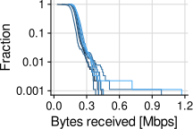<!-- -->

``` r
data_net_dev %>%
  filter(a == "gorillatag") %>%
  filter(d_h == "MQ3") %>%
  filter(i <= 8) %>%
  filter(ts > 60)
```

    ## # A tibble: 7,193 × 44
    ##       ts  rx_bytes rx_packets rx_errs rx_drop rx_fifo rx_frame rx_compressed
    ##    <int>     <dbl>      <int>   <int>   <int>   <int>    <int>         <int>
    ##  1    61 238625176     281557       0       0       0        0             0
    ##  2    62 238655057     281693       0       0       0        0             0
    ##  3    63 238680691     281826       0       0       0        0             0
    ##  4    64 238706651     281962       0       0       0        0             0
    ##  5    65 238729432     282080       0       0       0        0             0
    ##  6    66 238773500     282296       0       0       0        0             0
    ##  7    67 238806906     282446       0       0       0        0             0
    ##  8    68 238839091     282602       0       0       0        0             0
    ##  9    69 238866916     282744       0       0       0        0             0
    ## 10    70 238895136     282881       0       0       0        0             0
    ## # ℹ 7,183 more rows
    ## # ℹ 36 more variables: rx_multicast <int>, tx_bytes <dbl>, tx_packets <int>,
    ## #   tx_errs <int>, tx_drop <int>, tx_fifo <int>, tx_colls <int>,
    ## #   tx_carrier <int>, tx_compressed <int>, date <int>, a <chr>, n <chr>,
    ## #   e <chr>, src <chr>, dst <chr>, airline <chr>, fname <chr>, ts_m <dbl>,
    ## #   m <chr>, d <chr>, l <int>, i <dbl>, song <chr>, diff <chr>, b <int>,
    ## #   p <dbl>, d_h <chr>, game_h <chr>, bps_tx <dbl>, kbps_tx <dbl>, …

``` r
d %>%
  select(fname) %>%
  unique()
```

    ## # A tibble: 8 × 1
    ##   fname                                        
    ##   <chr>                                        
    ## 1 20240118-m-replay-d-mq3-a-gorillatag-l-16-i-1
    ## 2 20240118-m-replay-d-mq3-a-gorillatag-l-16-i-2
    ## 3 20240118-m-replay-d-mq3-a-gorillatag-l-16-i-3
    ## 4 20240118-m-replay-d-mq3-a-gorillatag-l-16-i-4
    ## 5 20240118-m-replay-d-mq3-a-gorillatag-l-16-i-5
    ## 6 20240118-m-replay-d-mq3-a-gorillatag-l-16-i-6
    ## 7 20240118-m-replay-d-mq3-a-gorillatag-l-16-i-7
    ## 8 20240118-m-replay-d-mq3-a-gorillatag-l-16-i-8

``` r
d %>%
  ggplot() +
  stat_ecdf(aes(x = Mbps_tx, y = log10(1 - after_stat(y)), group = i, color = i), pad=FALSE) +
  scale_y_continuous(breaks = seq(-3, 0), 
                     labels = 10^(seq(-3, 0)),
                     limits = c(-3, 0)) +
  labs(x = "Bytes sent [Mbps]", y = "Fraction") +
  theme_cowplot(15) +
  background_grid() +
  coord_cartesian(clip="off") +
  theme(legend.position = "none", plot.margin=margin(0,0,0,0, "cm"))
```

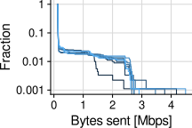<!-- -->

Unexpected result: while replaying a trace using wired ADB (so we’re
sure metrics are not being sent to the host PC over wireless network),
there is still significant wireless network activity while playing
Gorilla Tag. Much larger than what I would expect for a game such as
this. Why the \>1Mbps network spikes?S

``` r
data_net_dev %>%
  filter(a == "gorillatag") %>%
  filter(d_h == "MQ3") %>%
  filter(i <= 8) %>%
  filter(ts > 60)
```

    ## # A tibble: 7,193 × 44
    ##       ts  rx_bytes rx_packets rx_errs rx_drop rx_fifo rx_frame rx_compressed
    ##    <int>     <dbl>      <int>   <int>   <int>   <int>    <int>         <int>
    ##  1    61 238625176     281557       0       0       0        0             0
    ##  2    62 238655057     281693       0       0       0        0             0
    ##  3    63 238680691     281826       0       0       0        0             0
    ##  4    64 238706651     281962       0       0       0        0             0
    ##  5    65 238729432     282080       0       0       0        0             0
    ##  6    66 238773500     282296       0       0       0        0             0
    ##  7    67 238806906     282446       0       0       0        0             0
    ##  8    68 238839091     282602       0       0       0        0             0
    ##  9    69 238866916     282744       0       0       0        0             0
    ## 10    70 238895136     282881       0       0       0        0             0
    ## # ℹ 7,183 more rows
    ## # ℹ 36 more variables: rx_multicast <int>, tx_bytes <dbl>, tx_packets <int>,
    ## #   tx_errs <int>, tx_drop <int>, tx_fifo <int>, tx_colls <int>,
    ## #   tx_carrier <int>, tx_compressed <int>, date <int>, a <chr>, n <chr>,
    ## #   e <chr>, src <chr>, dst <chr>, airline <chr>, fname <chr>, ts_m <dbl>,
    ## #   m <chr>, d <chr>, l <int>, i <dbl>, song <chr>, diff <chr>, b <int>,
    ## #   p <dbl>, d_h <chr>, game_h <chr>, bps_tx <dbl>, kbps_tx <dbl>, …

``` r
d %>%
  select(fname) %>%
  unique()
```

    ## # A tibble: 8 × 1
    ##   fname                                        
    ##   <chr>                                        
    ## 1 20240118-m-replay-d-mq3-a-gorillatag-l-16-i-1
    ## 2 20240118-m-replay-d-mq3-a-gorillatag-l-16-i-2
    ## 3 20240118-m-replay-d-mq3-a-gorillatag-l-16-i-3
    ## 4 20240118-m-replay-d-mq3-a-gorillatag-l-16-i-4
    ## 5 20240118-m-replay-d-mq3-a-gorillatag-l-16-i-5
    ## 6 20240118-m-replay-d-mq3-a-gorillatag-l-16-i-6
    ## 7 20240118-m-replay-d-mq3-a-gorillatag-l-16-i-7
    ## 8 20240118-m-replay-d-mq3-a-gorillatag-l-16-i-8

``` r
d %>%
  ggplot(aes(x = ts_m, y = Mbps_tx, group = i, color = i)) +
  geom_line() +
  ylim(0, NA) +
  labs(x = "Time [m]", y = "Bytes sent [Mbps]      ") +
  theme_cowplot(15) +
  background_grid() +
  coord_cartesian(clip="off") +
  theme(legend.position = "none", plot.margin=margin(0,0,0,0, "cm"))
```

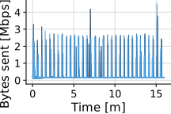<!-- -->
