Experiment
================

- [Description](#description)
- [Results](#results)

# Description

# Results

``` r
library(tidyverse)
theme_set(theme_bw())
library(knitr)
library(forcats)
library(data.table)
library(cowplot)
library(gghighlight)
library(zoo)
library(RColorBrewer)
library(stringr)
library(here)
here::i_am("./Results.rmd")

saveplot <- function(filename, ...) {
  ggsave2(filename, ...)
  knitr::plot_crop(filename)
}

traces_replays <- list.files(".", pattern="[0-9]+-trace-[a-z]+-mq[23p]-16m-replay-n[0-9]")

to_human_name <- function(name) {
  if (str_split_i(name, "-", 4) == "mq3") {
    "MQ3"
  } else if (str_split_i(name, "-", 4) == "mqp") {
    "MQP"
  } else if (str_split_i(name, "-", 4) == "mq2") {
    "MQ2"
  } else {
    name
  }
}
```

## Evolution of Hardware

### Frames per Second

``` r
pattern <- c(month="-?\\d+", "-", day="-?\\d+", "\\s+", hour="-?\\d+", ":", minute="-?\\d+", ":", second="-?\\d+", "\\.", millisecond="-?\\d+", "\\s+", pid="-?\\d+", "\\s+", tid="-?\\d+", "\\s+", level="\\w", "\\s+VrApi\\s+:\\s+FPS=",fps_render="-?\\d+", "/", fps_refresh="-?\\d+", ",Prd=", prd="-?\\d+", "ms,Tear=", tear="-?\\d+", ",Early=", early="-?\\d+", ",Stale=", stale="-?\\d+", ",Stale2/5/10/max=", stale2="-?\\d+", "/", stale5="-?\\d+", "/", stale10="-?\\d+", "/", stalemax="-?\\d+", ",VSnc=", vsnc="-?\\d+", ",Lat=", lat="-?-?\\d+", ",Fov=", fov="-?\\d+\\w*", ",CPU", cpun="\\d", "/GPU=", cpu_level="-?\\d+", "/", gpu_level="-?\\d+", ",", cpu_freq="-?\\d+", "/", gpu_freq="-?\\d+", "MHz,OC=", oc=".+", ",TA=", ta_atw="-?\\d+\\w*", "/", ta_main="-?\\d+\\w*", "/", ta_render="-?\\d+\\w*", ",SP=", sp_atw="\\w", "/", sp_main="\\w", "/", sp_render="\\w", ",Mem=", mem="-?\\d+", "MHz,Free=", free="-?\\d+", "MB,PLS=", pls="-?\\d+", ",Temp=", temp_bat="-?\\d+\\.\\d+", "C/", temp_sens="-?\\d+\\.\\d+", "C,TW=", tw="-?\\d+\\.\\d+", "ms,App=", app="-?\\d+\\.\\d+", "ms,GD=", gd="-?\\d+\\.\\d+", "ms,CPU&GPU=", cpu_gpu="-?\\d+\\.\\d+", "ms,LCnt=", lcnt="-?\\d+", "\\(DR", dr="-?\\d+", ",LM", lm="-?\\d+", "\\),GPU%=", gpu_percent="-?\\d+\\.\\d+", ",CPU%=", cpu_percent="-?\\d+\\.\\d+", "\\(W", cpu_percent_worst="-?\\d+\\.\\d+", "\\),DSF=", dsf="-?\\d+\\.\\d+", ",CFL=", cfl_min="-?\\d+\\.\\d+", "/", cfl_max="-?\\d+\\.\\d+", ",ICFLp95=", icflp95="-?\\d+\\.\\d+", ",LD=", ld="-?\\d+", ",SF=", sf="-?\\d+\\.\\d+", ",LP=", lp="-?\\d+", ",DVFS=", dvfs="-?\\d+")
```

``` r
data_logcat_vrapi <- NULL
for (f in traces_replays) {
  data_logcat_vrapi <- readLines(here(f, "logcat_VrApi.log")) %>%
    tibble(line = .) %>%
    mutate(game = str_split_i(f, "-", 3)) %>%
    filter(grepl("^.+\\s+VrApi\\s+:\\s+FPS=", line)) %>%
    separate_wider_regex(line, pattern) %>%
    mutate(ts = as.numeric(second) + (60*as.numeric(minute)) + (60*60*as.numeric(hour))) %>%
    mutate(ts = ts - min(ts)) %>%
    mutate(cpu_util = 100 * as.numeric(cpu_percent)) %>%
    mutate(cpu_usage_ltp = as.numeric(cpu_level) * as.numeric(cpu_percent)) %>%
    mutate(cpu_usage_ftp = as.numeric(cpu_freq) * as.numeric(cpu_percent)) %>%
    mutate(cpu_util_worst = 100 * as.numeric(cpu_percent_worst)) %>%
    mutate(gpu_util = 100 * as.numeric(gpu_percent)) %>%
    mutate(gpu_usage_ltp = as.numeric(gpu_level) * as.numeric(gpu_percent)) %>%
    mutate(gpu_usage_ftp = as.numeric(gpu_freq) * as.numeric(gpu_percent)) %>%
    mutate(config = f) %>%
    bind_rows(data_logcat_vrapi, .)
}
data_logcat_vrapi <- data_logcat_vrapi %>%
  type.convert(as.is = TRUE) %>%
  mutate(config = map_chr(config, to_human_name))
```

``` r
data_logcat_vrapi %>%
  ggplot(aes(x = ts, y = fps_render, color = config)) +
  # geom_vline(xintercept = start_time, color = "black") +
  # geom_vline(xintercept = end_time, color = "black") +
  geom_line() +
  ylim(0, NA) +
  theme_half_open() +
  background_grid() +
  theme(legend.position = "bottom") +
  scale_color_viridis_d(begin = 0.3, direction = -1)
```

<!-- -->

``` r
data_logcat_vrapi %>%
  # filter(ts >= start_time & ts <= end_time) %>%
  ggplot(aes(x = fps_render, y = config)) +
  geom_boxplot() +
  xlim(0, NA) +
  labs(x = "Frames per second", y = "VR Device") +
  theme_half_open() +
  background_grid() +
  theme(legend.position = "bottom") +
  scale_color_viridis_d(begin = 0.3, direction = -1)
```

<!-- -->

### CPU

``` r
p <- data_logcat_vrapi %>%
  # filter(ts >= start_time & ts <= end_time) %>%
  ggplot(aes(x = cpu_util, y = config)) +
  geom_boxplot() +
  xlim(0, NA) +
  labs(x = "CPU utilization [%]", y = "VR Device") +
  theme_half_open() +
  background_grid()
```

``` r
p
```

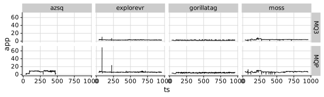<!-- -->

``` r
p + facet_grid(cols = vars(game))
```

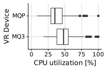<!-- -->

``` r
p <- data_logcat_vrapi %>%
  ggplot(aes(x = ts, y = cpu_level, color = config)) +
  # geom_vline(xintercept = start_time, color = "black") +
  # geom_vline(xintercept = end_time, color = "black") +
  geom_line() +
  ylim(0, NA) +
  theme_half_open() +
  background_grid() +
  theme(legend.position = "bottom") +
  scale_color_viridis_d(begin = 0.3, direction = -1)
```

``` r
p
```

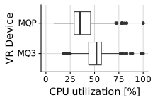<!-- -->

``` r
p + facet_grid(cols = vars(game))
```

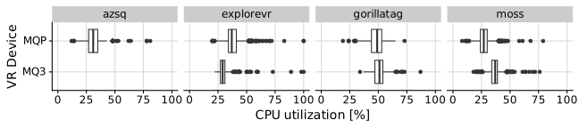<!-- -->

``` r
p <- data_logcat_vrapi %>%
  # filter(ts >= start_time & ts <= end_time) %>%
  ggplot(aes(x = cpu_usage_ftp, y = config)) +
  geom_boxplot() +
  xlim(0, NA) +
  labs(x = "CPU usage [fxp]", y = "VR Device") +
  theme_half_open() +
  background_grid()
```

``` r
p
```

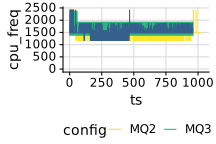<!-- -->

``` r
p + facet_grid(cols = vars(game))
```

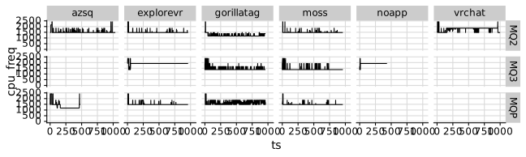<!-- -->

``` r
p <- data_logcat_vrapi %>%
  # filter(ts >= start_time & ts <= end_time) %>%
  ggplot(aes(x = cpu_usage_ltp, y = config)) +
  geom_boxplot() +
  xlim(0, NA) +
  labs(x = "CPU usage [lxp]", y = "VR Device") +
  theme_half_open() +
  background_grid()
```

``` r
p
```

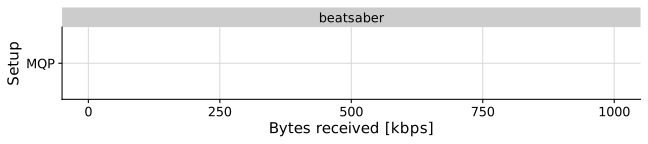<!-- -->

``` r
p + facet_grid(cols = vars(game))
```

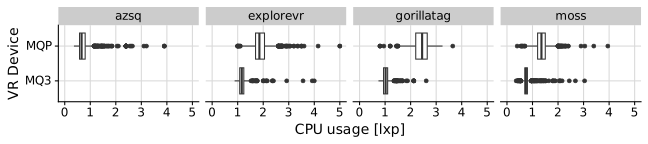<!-- -->

### GPU

``` r
p <- data_logcat_vrapi %>%
  # filter(ts >= start_time & ts <= end_time) %>%
  ggplot(aes(x = gpu_util, y = config)) +
  geom_boxplot() +
  xlim(0, NA) +
  labs(x = "GPU utilization [%]", y = "VR Device") +
  theme_half_open() +
  background_grid()
```

``` r
p
```

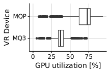<!-- -->

``` r
p + facet_grid(cols = vars(game))
```

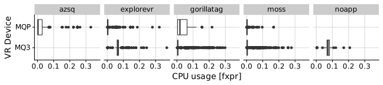<!-- -->

``` r
p <- data_logcat_vrapi %>%
  ggplot(aes(x = ts, y = gpu_level, color = config)) +
  # geom_vline(xintercept = start_time, color = "black") +
  # geom_vline(xintercept = end_time, color = "black") +
  geom_line() +
  ylim(0, NA) +
  theme_half_open() +
  background_grid() +
  theme(legend.position = "bottom") +
  scale_color_viridis_d(begin = 0.3, direction = -1)
```

``` r
p
```

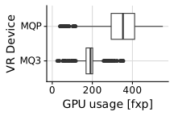<!-- -->

``` r
p + facet_grid(cols = vars(game))
```

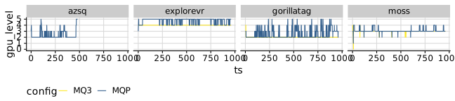<!-- -->

``` r
p <- data_logcat_vrapi %>%
  ggplot(aes(x = gpu_usage_ftp, y = config)) +
  geom_boxplot() +
  xlim(0, NA) +
  labs(x = "GPU usage [fxp]", y = "VR Device") +
  theme_half_open() +
  background_grid()
```

``` r
p
```

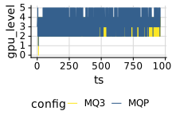<!-- -->

``` r
p + facet_grid(cols = vars(game))
```

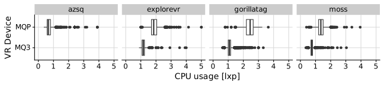<!-- -->

``` r
p <- data_logcat_vrapi %>%
  ggplot(aes(x = gpu_usage_ltp, y = config)) +
  geom_boxplot() +
  xlim(0, NA) +
  labs(x = "GPU usage [lxp]", y = "VR Device") +
  theme_half_open() +
  background_grid()
```

``` r
p
```

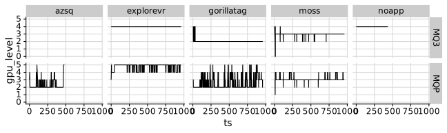<!-- -->

``` r
p + facet_grid(cols = vars(game))
```

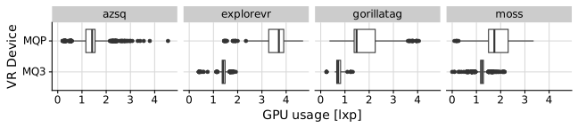<!-- -->

### Battery Usage

``` r
data_battery <- NULL
for (f in traces_replays) {
  data_battery <- system(paste('grep -Po "(?<=level: )[0-9]+"', here(f, "battery.log")), intern = TRUE) %>%
    tibble(battery = .) %>%
    mutate(game = str_split_i(f, "-", 3)) %>%
    mutate(battery = as.numeric(battery)) %>%
    mutate(ts = 0:(n() - 1)) %>%
    select(ts, everything()) %>%
    mutate(config = f) %>%
    bind_rows(data_battery, .)
}
data_battery <- data_battery %>%
  mutate(config = map_chr(config, to_human_name))
```

``` r
colors <- RColorBrewer::brewer.pal(3, "Greens")[2:3]
tmax <- 1500
tmin <- 500
data_battery %>%
  group_by(config) %>%
  filter(ts > tmin & ts < tmax) %>%
  mutate(ts = ts - min(ts)) %>%
  mutate(ts = ts / 60) %>%
  filter(config != "Wired") %>%
  # mutate(rel_battery = battery + 100 - max(battery)) %>%
  ggplot(aes(x = ts, y = battery, color = config)) +
  geom_line() +
  theme_half_open() +
  background_grid() +
  theme(legend.position = c(0.05, 0.40)) +
  ylim(0, NA) +
  labs(x = "Time [m]", y = "Battery charge") +
  scale_color_manual(name = "Config", values = colors)
```

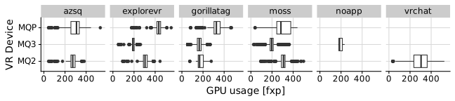<!-- -->
